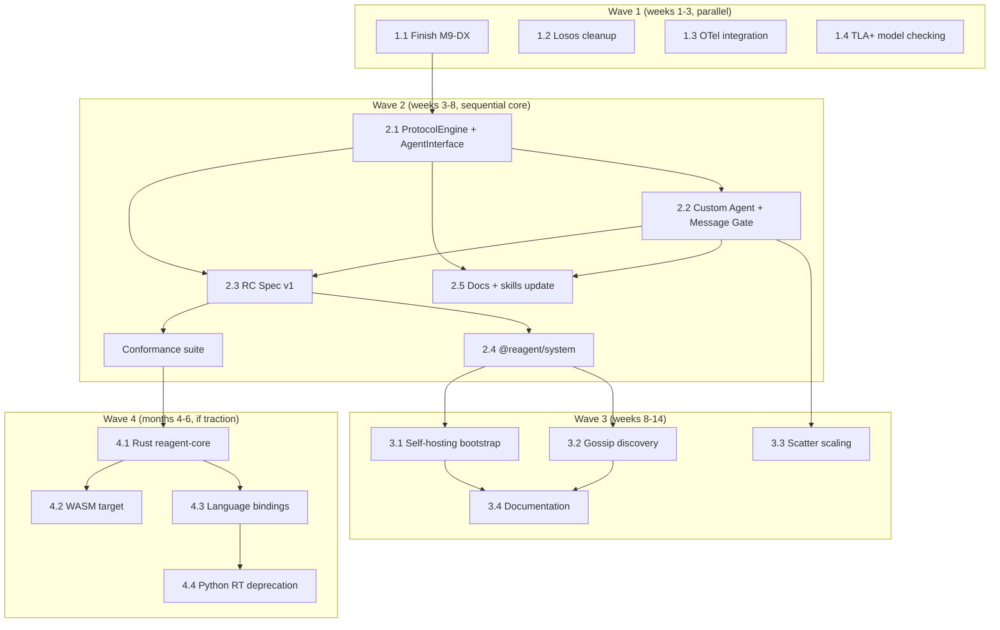

# Reagent v2: целевая архитектура и план эволюции

Дата: 2026-02-25

> **Note (v0.0.11)**: `$flow` was removed from the language. All references to `$flow` below are historical or need updating. `$ctx` is the sole per-role working memory; inter-role data travels via message payloads.

---

## Часть I. Целевая архитектура

### Позиционирование

Reagent — не агентский фреймворк. Reagent — **protocol controller**: инфраструктурный слой, который владеет протокольной логикой (хореография, стейт-машины, маршрутизация) и обеспечивает формально-верифицированное взаимодействие между любыми агентами — от встроенных Python-функций до внешних LLM через HTTP.

Ключевое свойство: **плавающая граница** между контроллером и агентом. Reagent не диктует, как устроен агент. Он предоставляет спектр интеграции — от полного управления до чистого message gate.

### Системная диаграмма

```
                        ┌─────────────────────────────────┐
                        │        Reagent Compiler          │
                        │  .rg → AST → IR → fingerprints   │
                        │  TLA+ generator (verify)         │
                        │  diagram model (visualize)        │
                        └──────────────┬──────────────────┘
                                       │ IR JSON
                                       ▼
┌──────────────────────────────────────────────────────────────────────┐
│                    Reagent Controller (RC)                            │
│                                                                      │
│  ┌────────────────────────────────────────────────────────────────┐  │
│  │                    Protocol Core                                │  │
│  │                                                                │  │
│  │  ProtocolEngine          ProtocolInstance (per-run)             │  │
│  │  ├─ IR loader            ├─ FSM walker (state transitions)     │  │
│  │  ├─ protocol registry    ├─ $ctx (per-role, owned by RC)       │  │
│  │  ├─ fingerprint checker  ├─ message inbox/routing              │  │
│  │  └─ dependency resolver  ├─ message inbox/resolver             │  │
│  │                          ├─ fork/join/scatter coordinator      │  │
│  │                          └─ trace emitter                      │  │
│  └────────────────────────────────────────────────────────────────┘  │
│                                                                      │
│  ┌────────────────────────────────────────────────────────────────┐  │
│  │                    Agent Integration Layer                      │  │
│  │                                                                │  │
│  │  ┌──────────────┐  ┌───────────────┐  ┌────────────────────┐  │  │
│  │  │ Managed Mode │  │  Hook Mode    │  │  Message Gate Mode │  │  │
│  │  │              │  │               │  │                    │  │  │
│  │  │ Zone exec    │  │ on_action()   │  │ WS/gRPC/HTTP      │  │  │
│  │  │ $agent inject│  │ on_send()     │  │ FSM validation     │  │  │
│  │  │ InprocNode   │  │ on_receive()  │  │ accept/reject      │  │  │
│  │  └──────────────┘  └───────────────┘  └────────────────────┘  │  │
│  └────────────────────────────────────────────────────────────────┘  │
│                                                                      │
│  ┌────────────────────────────────────────────────────────────────┐  │
│  │                    Infrastructure Layer                          │  │
│  │                                                                │  │
│  │  Routing table ─── Interceptor chain ─── NodeLink (transport)  │  │
│  │  OTel exporter ─── Trace hooks ─── Address resolution          │  │
│  └────────────────────────────────────────────────────────────────┘  │
└──────────────────────────────────────────────────────────────────────┘
                          │              │               │
                  ┌───────┘       ┌──────┘        ┌──────┘
                  ▼               ▼               ▼
           Managed agents    Hook agents     External agents
           (Python/TS,       (any lang,      (LLM APIs,
            zone code)       callbacks)       microservices,
                                              A2A, browser)
```

### State ownership

| State | Owner | Видимость для RC |
|-------|-------|-----------------|
| Protocol FSM (current state, transitions) | RC | Полная. RC — единственный интерпретатор IR. |
| `$ctx` (per-role, per-instance working memory) | RC | Полная. RC создаёт, изолирует, передаёт в хуки. |
| ~~`$flow`~~ | — | Removed in v0.0.11. Data flows via message payloads. |
| `$self` (persistent agent state) | Agent | **Opaque**. RC не видит, не сериализует, не инспектирует. |
| `$agent` (native I/O module) | Agent | Не существует в hook/gate mode. В managed mode — инжектится RC. |

Следствие: RC может дебажить, визуализировать, верифицировать протокольный прогресс целиком — не зная ничего о внутренностях агента.

### Единый Agent Interface и три стратегии реализации

Вместо трёх разных API — **один generic интерфейс**, который используют все:

```python
class AgentInterface:
    async def handle(self, event: ProtocolEvent) -> AgentResponse: ...
```

`ProtocolEvent` — union:

```python
ProtocolEvent = (
    ReceiveEvent     # {"type": "receive", "message": "Bid", "payload": {...}, "ctx": {...}, "flow": {...}}
  | SendRequired     # {"type": "send_required", "message": "Bid", "ctx": {...}, "flow": {...}}
  | ActionRequired   # {"type": "action", "stateId": "s3", "ctx": {...}, "flow": {...}}
  | ProtocolComplete # {"type": "protocol_completed", "ctx": {...}, "flow": {...}}
  | StateUpdate      # {"type": "state", "expecting": [...], "awaiting": [...], "protocolStatus": "running"}
  | ProtocolUpgraded # {"type": "protocol_upgraded", "oldVersion": "1.0.0", "newVersion": "1.1.0", "compatible": false}
)
```

`AgentResponse` — что агент возвращает:

```python
AgentResponse = (
    CtxUpdate   # {"ctx": {...}}  — updated context after action/receive
  | SendPayload # {"payload": {...}}  — message payload for send_required
  | Noop        # {}  — acknowledge, no state change
)
```

Это **тот же протокол что и Message Gate wire format**, только in-process. Три "режима" — это три стратегии реализации одного интерфейса:

**Strategy 1: Managed Agent** (RC implements AgentInterface internally)

RC реализует `AgentInterface` сам: при `ActionRequired` выполняет zone code (eval/exec), инжектит `$ctx`/`$self`/`$agent`. Агент = native module. Агент даже не знает про `AgentInterface` — RC делает всё за него.

```python
node = InprocAgentNode(role_to_agent={...})  # RC executes zones
rc = ReagentController(node_id="sim", agent_node=node)
```

Hot deploy: RC может перезапустить managed agent при обновлении протокола (полный контроль lifecycle).

**Strategy 2: Custom Agent** (user implements AgentInterface in-process)

Пользователь реализует `AgentInterface` напрямую. Switch на `event.type` + `event.message` внутри. RC вызывает `handle()` в нужный момент.

```python
class BuyerAgent(AgentInterface):
    async def handle(self, event):
        if event["type"] == "receive" and event["message"] == "AuctionStart":
            return {"ctx": {"bid": self.decide_bid(event["payload"]["reservePrice"])}}
        if event["type"] == "send_required" and event["message"] == "Bid":
            return {"payload": {"amount": event["ctx"]["bid"]}}
        return {}
```

Hot deploy: RC присылает `ProtocolUpgraded` event. Агент решает сам — адаптироваться или отключиться.

**Strategy 3: Message Gate** (AgentInterface over network)

`AgentInterface` реализован через WS/gRPC/HTTP transport. Тот же event/response JSON — но по сети. Внешний агент (LLM, микросервис, браузер) получает events и шлёт responses.

```
RC ──[WS]──► {"type": "receive", "message": "AuctionStart", "payload": {...}}
            ◄── {"ctx": {"bid": 75}}

RC ──[WS]──► {"type": "send_required", "message": "Bid", ...}
            ◄── {"payload": {"amount": 75}}
```

Hot deploy: RC шлёт `protocol_upgraded` event. Если агент несовместим и шлёт невалидное сообщение — Gate reject'ит.

**Message Gate: FSM introspection**

Gate-connected агенты дополнительно получают `state` events (при подключении, после каждого перехода FSM, по запросу):

```json
{
  "type": "state",
  "expecting": [{"direction": "send", "message": "Bid", "to": "seller"}],
  "awaiting": [{"direction": "receive", "message": "BidResult", "from": "seller"}],
  "protocolStatus": "running",
  "protocolVersion": "1.2.0"
}
```

- `expecting` — что RC ждёт от агента (сообщения, которые агент должен отправить)
- `awaiting` — что RC доставит агенту (сообщения от других ролей)
- Оба пустые — протокол завершён

HTTP fallback (stateless): `POST /handle` + `GET /events?since=<seq>` + `GET /state`.

**Hot deploy compatibility matrix**

| Strategy | Hot deploy behaviour |
|----------|---------------------|
| Managed | RC перезапускает агента с новым протоколом. Полный контроль. |
| Custom | RC шлёт `ProtocolUpgraded` event. Агент адаптируется или disconnects. |
| Message Gate | RC шлёт `protocol_upgraded` frame + новый `state`. Невалидные сообщения — reject. |

Подходит для: LLM-агенты через API, микросервисы, A2A, legacy-системы, browser-based agents. Позволяет строить надёжные агентские сети поверх ненадёжных участников — протокольная оболочка RC гарантирует корректность взаимодействия на уровне хореографии.

### Формальная верификация

```
.rg ──→ IR (per-role FSMs) ──→ TLA+ generator ──→ TLC model checker
                                                       │
                                             deadlock-free? ✓/✗
                                             all-roles-complete? ✓/✗
                                             message safety? ✓/✗
                                             scatter convergence? ✓/✗
```

CLI: `reagent verify protocol.rg` — формальное доказательство корректности до запуска.

### Self-hosting

Системная инфраструктура (оркестрация, отладка, деплой, discovery) описывается как Reagent протоколы и работает через обычных Reagent-агентов:

```
@reagent/system project:
  agent ROS          runs OrchestratorRole   — manages cluster
  agent Debugger     runs DebugRole          — protocol-level debug
  agent Reconciler   runs ReconcilerRole     — desired-state convergence
  agent Discovery    runs DiscoveryRole      — SWIM gossip
```

Reagent управляет собой через свои же протоколы. Системные протоколы версионируются, тестируются и визуализируются как пользовательские.

### Observability

TraceEvent → OpenTelemetry spans. Каждый protocol instance — OTel trace, каждое сообщение — span. Включается одной строкой: `interceptors=[OTelInterceptor()]`.

### Multi-RC и Conformance

RC формализован как **спецификация** (интерфейсы + поведенческий контракт + wire protocol). Conformance test suite на IR fixtures — любая реализация, прошедшая тесты, гарантированно совместима.

Реализации:
- **TS RC** — текущая, адаптируется к spec (transition)
- **Python RC** — текущая, адаптируется к spec (симуляции)
- **Rust RC** (`reagent-core`) — production, компилируется в WASM (браузер), PyO3 (Python), napi-rs (Node)

---

## Часть II. План рефакторинга

### Карта компонентов и стратегия

| Компонент | LOC | Стратегия | Когда |
|-----------|-----|-----------|-------|
| Compiler (`lang/src/`) | ~5,500 | Не трогать. Добавлять модули: `tla-generator.ts`, gate metadata в IR | Аддитивно |
| `ProtocolInstance` (TS: 1,236, Py: 929) | ~2,200 | **Расслоить**: выделить ProtocolEngine (FSM) + AgentInterface (pluggable) | Wave 2 |
| `AgentRunner` (TS: 276, Py: 333) | ~600 | Упростить до ManagedAgentAdapter impl of AgentInterface | Wave 2 |
| `ReagentController` (TS: 421, Py: 382) | ~800 | Итерировать: добавить CustomAgentNode + MessageGate, migrate state ownership | Wave 2 |
| ROS (`ros.ts`: 1,278) | 1,278 | Итерировать сейчас, переформулировать как agent позже | Wave 3 |
| Debug infra (500 LOC total) | 500 | Мигрировать хуки на ProtocolEngine | Wave 2 |
| VSCode Extension (~5,400) | 5,400 | **Не трогать**. Общается через RAP/WS, не зависит от RC internals | — |
| Python Runtime (~3,500) | 3,500 | Заморозить. Заменить через Rust+PyO3 | Wave 4 |
| **Новое: AgentInterface + ManagedAdapter** | ~300 | Написать с нуля (types + managed wrapper) | Wave 2 |
| **Новое: CustomAgentNode** | ~150 | Написать с нуля | Wave 2 |
| **Новое: Message Gate** | ~500 | Написать с нуля (WS + FSM validation + state frames) | Wave 2 |
| **Новое: TLA+ generator** | ~500 | Написать с нуля | Wave 1 |
| **Новое: OTel interceptor** | ~150 | Написать с нуля | Wave 1 |

### Документы и скиллы — что обновить

| Документ / скилл | Действие | Когда |
|------------------|----------|-------|
| `docs/backlog.md` | Убрать все упоминания Losos. Обновить overview: "Reagent RC is the production engine" | Wave 1 |
| `docs/ir-losos-mapping.md` | **Удалить** | Wave 1 |
| `docs/lang-spec.md` | Без изменений (язык не меняется) | — |
| `docs/connectivity.md` | Добавить секцию про Message Gate и Hook Interface | Wave 2 |
| `docs/orchestrator.md` | Обновить: ROS → self-hosted agent, добавить bootstrap flow | Wave 3 |
| `docs/user-guide.md` | Добавить: Hook mode, Message Gate mode, `reagent verify` | Wave 2-3 |
| `docs/rc-spec.md` | **Новый документ**: RC спецификация (core, 3 modes, wire protocol, conformance) | Wave 2 |
| `docs/protocol-versioning.md` | Без изменений | — |
| `docs/dx-tooling.md` | Добавить: Gate UI в cluster panel, OTel dashboard | Wave 3 |
| `.cursor/skills/reagent-developer/SKILL.md` | Обновить: три режима интеграции, state ownership, `run.py` для hook/gate mode | Wave 2 |
| `.cursor/skills/reagent-language-evolution/SKILL.md` | Добавить: TLA+ generator в project layout, `reagent verify` в CLI section | Wave 1 |
| `.cursor/project-metadata.md` | Убрать Losos, добавить RC Spec, Message Gate | Wave 1 |
| `examples/projects/` | Добавить: `hook-agent-demo/`, `message-gate-demo/` | Wave 2 |

---

### Wave 1: Foundation (недели 1-3)

Четыре параллельных трека, не блокирующих друг друга.

#### 1.1 Finish M9-DX (phases 4-R..7-R) — ~15 дней

Текущий DX milestone. Topology view, Python sim bridge, multi-node deployment, Mermaid export. Завершить как запланировано в `backlog.md`.

#### 1.2 Losos cleanup — 1 день

- [ ] Удалить `docs/ir-losos-mapping.md`
- [ ] Убрать упоминания Losos из `docs/backlog.md` (overview, §Future work, reference runner matrix)
- [ ] Убрать из `.cursor/project-metadata.md`
- [ ] Проверить `.cursor/skills/` на ссылки
- [ ] Обновить `backlog.md` overview: "Reagent RC is the production engine"

#### 1.3 OTel integration — 2 дня

- [ ] `runtime/ts/src/otel-interceptor.ts` — `OTelInterceptor` (InterceptorFn), TraceEvent → OTel span mapping
- [ ] `runtime/ts/src/otel-trace-hook.ts` — `OTelTraceHook` для agent-level events
- [ ] `runtime/py/reagent_runtime/otel_interceptor.py` — Python mirror
- [ ] Wire into RC: `interceptors=[OTelInterceptor(endpoint)]`
- [ ] Test: run auction-sim with OTel → verify traces in Jaeger

#### 1.4 TLA+ model checking prototype — 5 дней

- [ ] `lang/src/tla-generator.ts` — IR → TLA+ spec generation (per-role FSM → TLA+ process, composition → system spec)
- [ ] Start with linear + alt protocols (examples 00-03)
- [ ] Properties: deadlock freedom, protocol completion
- [ ] CLI: `reagent verify <file.rg>` — compile → generate TLA+ → invoke TLC → report pass/fail + counterexample
- [ ] Test: verify all 24 examples, expect pass. Inject a deadlock, expect fail with trace.
- [ ] Update `reagent-language-evolution` skill: add TLA+ generator to project layout

---

### Wave 2: RC Redesign (недели 3-8)

Sequential dependency chain. This is the architectural pivot.

#### 2.1 ProtocolEngine + AgentInterface — 1.5 недели

Extract the FSM walker from `ProtocolInstance` into a pure `ProtocolEngine` and define the unified `AgentInterface`.

**ProtocolEngine** (new, ~600 LOC extracted from ProtocolInstance):
- Owns: IR graph, current state, $ctx, message inbox, fork/join state, scatter state
- Pure logic: `advance()` walks FSM, emits `ProtocolEvent` (receive, send_required, action, state, protocol_completed, protocol_upgraded)
- Consumes `AgentResponse` (ctx_update, send_payload, noop)
- No side effects: doesn't call zone executor, doesn't send messages, doesn't know about transport

**AgentInterface** (new, core abstraction):
- Single method: `handle(event: ProtocolEvent) -> AgentResponse`
- Same event/response types as Message Gate wire format (JSON-serializable)
- Three implementations: ManagedAgentAdapter (zones), CustomAgent (user code), GateTransport (WS/HTTP)

**ProtocolInstance** (refactored, thinner):
- Wraps ProtocolEngine + AgentInterface impl
- Routes EngineEvents to AgentInterface, feeds responses back to Engine
- Handles transport (sending messages between roles via RC routing)
- Backwards compatible: existing tests pass unchanged

```
Before:  ProtocolInstance = FSM + zones + transport + trace
After:   ProtocolEngine   = FSM + $ctx (pure, emits events)
         AgentInterface    = handle(event) -> response (pluggable)
         ProtocolInstance  = Engine + Interface + transport (wiring)
```

Files:
- [ ] New: `runtime/ts/src/protocol-engine.ts` — FSM core + ProtocolEvent/AgentResponse types
- [ ] New: `runtime/ts/src/agent-interface.ts` — `AgentInterface` type + `ManagedAgentAdapter` (wraps zone execution)
- [ ] Refactor: `runtime/ts/src/protocol-instance.ts` (delegate FSM to engine, zones to adapter)
- [ ] All existing tests pass (T1-T36, C1-C12) via ManagedAgentAdapter

#### 2.2 Custom Agent + Message Gate — 1.5 недели

Two AgentInterface implementations on top of 2.1.

**Custom Agent** (in-process):
- [ ] New: `runtime/ts/src/custom-agent-node.ts` — `CustomAgentNode` implements `AgentNode`
- [ ] User provides class implementing `AgentInterface.handle(event)`
- [ ] Python mirror: `runtime/py/reagent_runtime/custom_agent_node.py`
- [ ] Test: auction-sim buyer as custom agent (switch on event.type + event.message)
- [ ] Example: `examples/projects/custom-agent-demo/`

**Message Gate** (network):
- [ ] New: `runtime/ts/src/message-gate.ts` — `MessageGate` class
- [ ] WS endpoint: accept connections, authenticate agent identity, bind to role
- [ ] Serializes ProtocolEvents as JSON frames to agent, deserializes AgentResponses
- [ ] FSM validation on agent-initiated sends: check if `messageName` is allowed in current state
- [ ] Accept → feed to ProtocolEngine. Reject → error response with diagnostics.
- [ ] `state` frames: on connect, after each FSM transition, on `get_state` request
- [ ] `protocol_upgraded` frame on hot deploy (version + compatible flag + detail)
- [ ] HTTP fallback: `POST /handle` + `GET /events?since=<seq>` + `GET /state`
- [ ] Test: auction-sim with buyer agents via WebSocket Message Gate
- [ ] Example: `examples/projects/message-gate-demo/`

#### 2.4 RC Spec v1 — 2 недели (partially parallel with 2.2-2.3)

- [ ] New: `docs/rc-spec.md`
  - §1 Core model: ProtocolEngine, state ownership, envelope format
  - §2 Managed mode: AgentNode, AgentHandle, zone execution contract
  - §3 Hook mode: AgentHooks interface, callback contract, ctx mutability rules
  - §4 Message Gate mode: WS/HTTP API, FSM validation semantics, error codes
  - §5 Infrastructure: routing table, interceptor chain, NodeLink, AddressPage
  - §6 Wire protocol: envelope JSON schema, NodeLink frame format, Gate API schema
  - §7 Protocol registry: register, query, canDeploy, protocolVersion
- [ ] New: `spec/conformance/` — test fixtures (IR JSON + expected trace files)
- [ ] Conformance runner: loads fixtures, runs through each mode, compares traces
- [ ] TS RC passes conformance. Python RC passes conformance.

#### 2.5 @reagent/system project — 1 неделя

- [ ] `reagent init packages/reagent-system`
- [ ] Move `tools/rap/*.rg` → `packages/reagent-system/protocols/rap/`
- [ ] Define system roles in `packages/reagent-system/roles/system-roles.rg`:
  - `OrchestratorRole [*]` — plays Handshake, DeployProtocol, ClusterStatus, SubmitDeploySpec
  - `DebugRole [*]` — plays DebugSession, SetBreakpoints, InspectState
  - `ReconcilerRole [*]` — plays ReconciliationLoop
  - `DiscoveryRole [*]` — plays NodeGossip (placeholder)
- [ ] Define agents: `agent ROS runs OrchestratorRole`, etc.
- [ ] `reagent build packages/reagent-system` — verify compilation
- [ ] Update ROS to load system protocols from `@reagent/system` instead of hardcoded paths

#### 2.6 Documentation + skills update

- [ ] Update `docs/connectivity.md` — add §Message Gate, §Hook Interface
- [ ] Update `docs/user-guide.md` — add hook mode and gate mode sections
- [ ] Update `.cursor/skills/reagent-developer/SKILL.md`:
  - State ownership table
  - Three integration modes with code examples
  - run.py patterns for hook/gate
  - New examples reference
- [ ] Update `.cursor/project-metadata.md` — reflect new architecture

---

### Wave 3: Self-hosting + Scaling (недели 8-14)

#### 3.1 Self-hosting bootstrap — 2 недели

- [ ] Refactor ROS to use its own RC for system protocols
- [ ] On startup: ROS creates RC, registers system agents (Orchestrator, Debugger, Reconciler)
- [ ] RAP handlers → become zone code of system agents (or hook implementations)
- [ ] External clients (VSCode, CLI) interact with ROS via Message Gate
- [ ] System protocols visible in debug, diagrams, traces — like any user protocol
- [ ] Update `docs/orchestrator.md` — document bootstrap flow

#### 3.2 Gossip node discovery — 1 неделя

- [ ] Write `packages/reagent-system/protocols/discovery/gossip.rg` — SWIM-like protocol
- [ ] `DiscoveryRole` agent: periodic heartbeat, agent list exchange, failure detection
- [ ] Replace static `AddressPage` with gossip-populated routing table
- [ ] RC auto-joins gossip on startup if configured: `rc = ReagentController(gossip=True)`

#### 3.3 Scatter scaling — 2 недели

**Layer 1: Streaming scatter**
- [ ] ProtocolEngine: scatter emits per-branch results immediately (no await-all join)
- [ ] Coordinator's onReceive fires per result, $ctx accumulates incrementally
- [ ] Backwards compatible: existing scatter semantics preserved when branch count < threshold

**Layer 2: Partitioned scatter**
- [ ] RC auto-partitions scatter when N > configurable threshold
- [ ] Each partition → separate AgentNode (process via IpcAgentNode)
- [ ] RC coordinates partitions via routing table
- [ ] Test: scatter with 100+ agents across 4 partitions

#### 3.4 Documentation

- [ ] Update `docs/dx-tooling.md` — Gate UI in cluster panel, OTel dashboard link
- [ ] Update `docs/orchestrator.md` — self-hosting architecture
- [ ] Update `docs/connectivity.md` — gossip discovery section

---

### Wave 4: Rust core (месяцы 4-6)

Only if there is traction. Current TS/Python RCs are sufficient for development.

#### 4.1 reagent-core crate

- [ ] Rust implementation of ProtocolEngine (FSM walker, $ctx, message routing)
- [ ] Rust implementation of interceptor chain, protocol registry
- [ ] Conformance suite passes

#### 4.2 WASM target

- [ ] `wasm-bindgen` wrapper: ProtocolEngine runs in Web Worker
- [ ] JS/TS zones execute natively in browser
- [ ] NodeLink via WebSocket to server-side RC
- [ ] Demo: browser-based agent participating in auction protocol via Message Gate

#### 4.3 Language bindings

- [ ] PyO3 binding: drop-in replacement for Python RC (10-100x faster for large scatter)
- [ ] napi-rs binding: drop-in replacement for TS RC

#### 4.4 Python runtime deprecation

- [ ] Freeze `runtime/py/` — no new features
- [ ] Migrate users to Rust+PyO3 binding
- [ ] Archive Python runtime

---

### Dependency graph



### Effort summary

| Wave | Calendar | Work days | Gate |
|------|----------|-----------|------|
| Wave 1: Foundation | Weeks 1-3 | ~20 days | M9-DX done, OTel works, TLA+ prototype, Losos gone |
| Wave 2: RC Redesign | Weeks 3-8 | ~25 days | ProtocolEngine extracted, Hook + Gate work, RC Spec written, conformance passes, @reagent/system compiles |
| Wave 3: Self-hosting + Scaling | Weeks 8-14 | ~25 days | ROS self-hosted, gossip works, scatter scales to 100+ |
| Wave 4: Rust core | Months 4-6 | ~40 days | Rust RC passes conformance, WASM demo in browser |

**Critical path**: M9-DX → ProtocolEngine → Hook + Gate → RC Spec → Self-hosting.

**Highest ROI items** (do first within each wave):
1. **ProtocolEngine + AgentInterface** — architectural foundation; единый интерфейс вместо трёх API
2. **Message Gate** — transforms Reagent from "agent DSL" to "protocol enforcement infrastructure"
3. **TLA+ model checking** — unique differentiator, low effort, high wow-factor
4. **@reagent/system** — "Reagent on Reagent" validates the entire model
