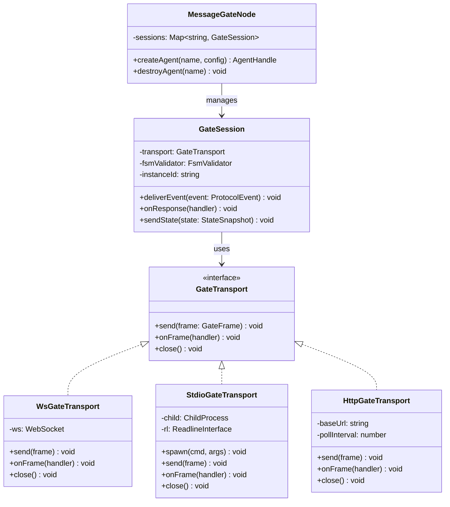
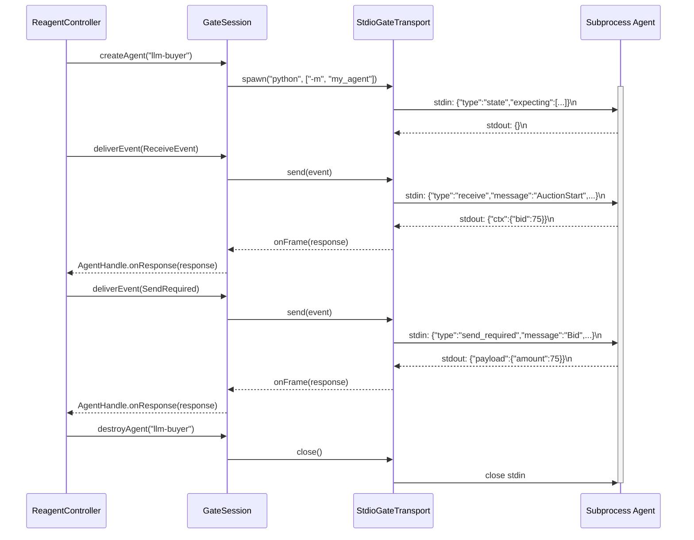
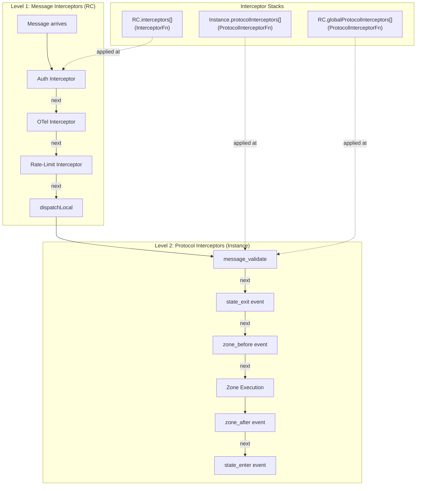
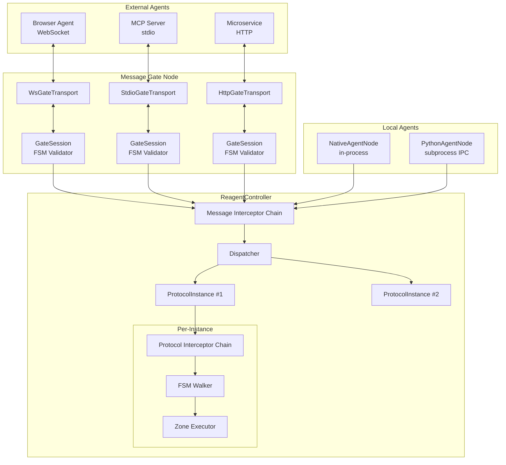
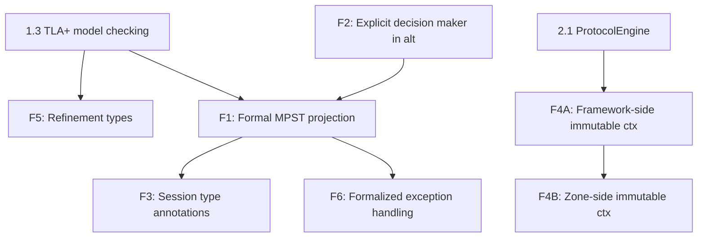

# Reagent v2: целевая архитектура и план эволюции

Дата: 2026-02-25

> **Note (v0.0.11)**: `$flow` was removed from the language. All references to `$flow` below are historical or need updating. `$ctx` is the sole per-role working memory; inter-role data travels via message payloads.

---

## Часть I. Целевая архитектура

### Позиционирование

Reagent — не агентский фреймворк. Reagent — **protocol controller**: инфраструктурный слой, который владеет протокольной логикой (хореография, стейт-машины, маршрутизация) и обеспечивает формально-верифицированное взаимодействие между любыми агентами — от встроенных Python-функций до внешних LLM через HTTP.

Ключевое свойство: **плавающая граница** между контроллером и агентом. Reagent не диктует, как устроен агент. Он предоставляет спектр интеграции — от полного управления до чистого message gate.

### Системная диаграмма

```
                        ┌─────────────────────────────────┐
                        │        Reagent Compiler          │
                        │  .rg → AST → IR → fingerprints   │
                        │  TLA+ generator (verify)         │
                        │  diagram model (visualize)        │
                        └──────────────┬──────────────────┘
                                       │ IR JSON
                                       ▼
┌──────────────────────────────────────────────────────────────────────┐
│                    Reagent Controller (RC)                            │
│                                                                      │
│  ┌────────────────────────────────────────────────────────────────┐  │
│  │                    Protocol Core                                │  │
│  │                                                                │  │
│  │  ProtocolInstance (per-run)                                     │  │
│  │  ├─ ProtocolEngine (FSM walker, $ctx, state transitions)       │  │
│  │  ├─ AgentInterface impl (managed / custom / gate)              │  │
│  │  ├─ message inbox/routing                                      │  │
│  │  ├─ fork/join/scatter coordinator                              │  │
│  │  └─ trace emitter                                              │  │
│  │                                                                │  │
│  │  Protocol Registry (IR loader, fingerprints, dependencies)      │  │
│  └────────────────────────────────────────────────────────────────┘  │
│                                                                      │
│  ┌────────────────────────────────────────────────────────────────┐  │
│  │                    Agent Integration Layer                      │  │
│  │                                                                │  │
│  │  ┌──────────────┐  ┌───────────────┐  ┌────────────────────┐  │  │
│  │  │ Managed Mode │  │ Custom Agent  │  │  Message Gate Mode │  │  │
│  │  │              │  │               │  │                    │  │  │
│  │  │ Zone exec    │  │ handle(event) │  │ WS/stdio/HTTP      │  │  │
│  │  │ $agent inject│  │ → response    │  │ FSM validation     │  │  │
│  │  │ InprocNode   │  │ CustomNode    │  │ accept/reject      │  │  │
│  │  └──────────────┘  └───────────────┘  └────────────────────┘  │  │
│  └────────────────────────────────────────────────────────────────┘  │
│                                                                      │
│  ┌────────────────────────────────────────────────────────────────┐  │
│  │                    Infrastructure Layer                          │  │
│  │                                                                │  │
│  │  Routing table ─── Interceptor chain ─── NodeLink (transport)  │  │
│  │  OTel exporter ─── Trace hooks ─── Address resolution          │  │
│  └────────────────────────────────────────────────────────────────┘  │
└──────────────────────────────────────────────────────────────────────┘
                          │              │               │
                  ┌───────┘       ┌──────┘        ┌──────┘
                  ▼               ▼               ▼
           Managed agents    Custom agents   External agents
           (Python/TS,       (any lang,      (LLM APIs, MCP,
            zone code)        handle())       microservices,
                                              A2A, browser)
```

### State ownership

| State | Owner | Видимость для RC |
|-------|-------|-----------------|
| Protocol FSM (current state, transitions) | RC | Полная. RC — единственный интерпретатор IR. |
| `$ctx` (per-role, per-instance working memory) | RC | Полная. RC создаёт, изолирует, передаёт в хуки. **Caveat**: scatter branches get isolated `$ctx` via `Object.create()` (v0.0.11), but mutations to inherited collection properties (e.g. `push()`) still affect the parent. Needs explicit gather/reduce semantics (see 1.4 scatter RFC, F4). |
| ~~`$flow`~~ | — | Removed in v0.0.11. Data flows via message payloads. |
| `$self` (persistent agent state) | Agent | **Opaque**. RC не видит, не сериализует, не инспектирует. |
| `$agent` (native I/O module) | Agent | Не существует в hook/gate mode. В managed mode — инжектится RC. |

Следствие: RC может дебажить, визуализировать, верифицировать протокольный прогресс целиком — не зная ничего о внутренностях агента.

### Единый Agent Interface и три стратегии реализации

Вместо трёх разных API — **один generic интерфейс**, который используют все:

```python
class AgentInterface:
    async def handle(self, event: ProtocolEvent) -> AgentResponse: ...
```

`ProtocolEvent` — union:

```python
ProtocolEvent = (
    ReceiveEvent     # {"type": "receive", "message": "Bid", "payload": {...}, "ctx": {...}}
  | SendRequired     # {"type": "send_required", "message": "Bid", "ctx": {...}}
  | ActionRequired   # {"type": "action", "stateId": "s3", "ctx": {...}}
  | ProtocolComplete # {"type": "protocol_completed", "ctx": {...}}
  | StateUpdate      # {"type": "state", "expecting": [...], "awaiting": [...], "protocolStatus": "running"}
  | ProtocolUpgraded # {"type": "protocol_upgraded", "oldVersion": "1.0.0", "newVersion": "1.1.0", "compatible": false}
)
```

`AgentResponse` — что агент возвращает:

```python
AgentResponse = (
    CtxUpdate   # {"ctx": {...}}  — updated context after action/receive
  | SendPayload # {"payload": {...}}  — message payload for send_required
  | Noop        # {}  — acknowledge, no state change
)
```

Это **тот же протокол что и Message Gate wire format**, только in-process. Три "режима" — это три стратегии реализации одного интерфейса:

**Strategy 1: Managed Agent** (RC implements AgentInterface internally)

RC реализует `AgentInterface` сам: при `ActionRequired` выполняет zone code (eval/exec), инжектит `$ctx`/`$self`/`$agent`. Агент = native module. Агент даже не знает про `AgentInterface` — RC делает всё за него.

```python
node = InprocAgentNode(role_to_agent={...})  # RC executes zones
rc = ReagentController(node_id="sim", agent_node=node)
```

Hot deploy: RC может перезапустить managed agent при обновлении протокола (полный контроль lifecycle).

**Strategy 2: Custom Agent** (user implements AgentInterface in-process)

Пользователь реализует `AgentInterface` напрямую. Switch на `event.type` + `event.message` внутри. RC вызывает `handle()` в нужный момент.

```python
class BuyerAgent(AgentInterface):
    async def handle(self, event):
        if event["type"] == "receive" and event["message"] == "AuctionStart":
            return {"ctx": {"bid": self.decide_bid(event["payload"]["reservePrice"])}}
        if event["type"] == "send_required" and event["message"] == "Bid":
            return {"payload": {"amount": event["ctx"]["bid"]}}
        return {}
```

Hot deploy: RC присылает `ProtocolUpgraded` event. Агент решает сам — адаптироваться или отключиться.

**Strategy 3: Message Gate** (AgentInterface over transport)

`AgentInterface` реализован через внешний транспорт. Тот же event/response JSON — но по каналу связи. Внешний агент получает events и шлёт responses. Gate = `AgentInterface` impl + transport + FSM validation.

**Gate — transport-агностичный.** Один `GateSession` (FSM validation + event/response framing) работает поверх любого `GateTransport`:

| Transport | Use case | Framing |
|-----------|----------|---------|
| **WebSocket** | Browser agents, remote LLM APIs, A2A, microservices | JSON text frames |
| **stdio** (JSON-line) | MCP servers, subprocess agents, CLI tools, language runtimes | `\n`-delimited JSON on stdin/stdout |
| **HTTP** (stateless) | Serverless functions, webhooks, legacy REST | `POST /handle` + `GET /events?since=<seq>` + `GET /state` |

```
GateTransport interface:
  send(frame: GateFrame): void
  onFrame(handler: (frame: GateFrame) => void): void
  close(): void

Implementations:
  WsGateTransport    — WebSocket (server accepts, or client connects)
  StdioGateTransport — spawn child process, bridge stdin/stdout JSON lines
  HttpGateTransport  — stateless poll/push over HTTP
```

Пример WS:
```
RC ──[WS]──► {"type": "receive", "message": "AuctionStart", "payload": {...}}
            ◄── {"ctx": {"bid": 75}}
```

Пример stdio (MCP server или subprocess agent):
```
RC ──[stdin]──► {"type": "send_required", "message": "Bid", ...}\n
   [stdout]◄── {"payload": {"amount": 75}}\n
```

`StdioGateTransport` — RC запускает дочерний процесс, пишет JSON lines в stdin, читает JSON lines из stdout. Это тот же паттерн, что у существующего `PythonAgentNode` (JSON-line IPC), но обобщённый: любой процесс, понимающий Gate wire format, подключается без SDK. Работает для MCP stdio servers, Python/Ruby/Go агентов, CLI инструментов.

Hot deploy: RC шлёт `protocol_upgraded` event через тот же транспорт. Если агент несовместим и шлёт невалидное сообщение — Gate reject'ит.

**Message Gate: FSM introspection**

Gate-connected агенты дополнительно получают `state` events (при подключении, после каждого перехода FSM, по запросу):

```json
{
  "type": "state",
  "expecting": [{"direction": "send", "message": "Bid", "to": "seller"}],
  "awaiting": [{"direction": "receive", "message": "BidResult", "from": "seller"}],
  "protocolStatus": "running",
  "protocolVersion": "1.2.0"
}
```

- `expecting` — что RC ждёт от агента (сообщения, которые агент должен отправить)
- `awaiting` — что RC доставит агенту (сообщения от других ролей)
- Оба пустые — протокол завершён

**Hot deploy compatibility matrix**

| Strategy | Hot deploy behaviour |
|----------|---------------------|
| Managed | RC перезапускает агента с новым протоколом. Полный контроль. |
| Custom | RC шлёт `ProtocolUpgraded` event. Агент адаптируется или disconnects. |
| Message Gate | RC шлёт `protocol_upgraded` frame + новый `state`. Невалидные сообщения — reject. |

Подходит для: LLM-агенты через API, MCP серверы (stdio), микросервисы, A2A, legacy-системы, browser-based agents. Позволяет строить надёжные агентские сети поверх ненадёжных участников — протокольная оболочка RC гарантирует корректность взаимодействия на уровне хореографии.

### Двухуровневые перехватчики (Interceptor architecture)

Interceptor-ы работают на **двух уровнях**: message routing (RC) и protocol instance lifecycle. Это позволяет реализовать cross-cutting concerns (logging, auth, rate-limiting) на правильном слое абстракции.

**Level 1: Message interceptors** (существующие, на RC)

Перехватывают каждый `MessageEnvelope`, проходящий через RC — inbound, outbound, loopback. Работают на уровне маршрутизации, не зная о protocol state.

```typescript
type InterceptorFn = (ctx: InterceptorContext, next: () => void) => void;

interface InterceptorContext {
  envelope: MessageEnvelope;
  direction: "outbound" | "inbound" | "loopback";
  nodeId: string;
}
```

Use cases: tracing, OTel spans, message logging, rate-limiting, auth envelope headers, message filtering.

**Level 2: Protocol instance interceptors** (новые, на ProtocolInstance)

Перехватывают **события жизненного цикла** protocol instance: переход FSM, вход/выход из zone, завершение протокола, ошибки. Имеют доступ к protocol state — `$ctx`, `$self`, stateId, instanceId.

```typescript
type ProtocolInterceptorFn = (
  ctx: ProtocolInterceptorContext,
  next: () => Promise<void>,
) => Promise<void>;

type ProtocolEventKind =
  | "state_enter"      // FSM перешёл в новое состояние
  | "state_exit"       // FSM покидает состояние
  | "zone_before"      // перед выполнением zone code
  | "zone_after"       // после выполнения zone code
  | "message_validate" // валидация входящего сообщения по FSM
  | "instance_complete"// protocol instance завершён
  | "instance_error";  // ошибка в protocol instance

interface ProtocolInterceptorContext {
  event: ProtocolEventKind;
  instanceId: string;
  agentName: string;
  stateId: string;
  protocolName: string;
  protocolVersion: string;
  ctx: Record<string, unknown>;       // read-only view of $ctx
  self: Record<string, unknown>;      // read-only view of $self
  envelope?: MessageEnvelope;         // present for message_validate
  error?: Error;                      // present for instance_error
}
```

Use cases: protocol-level audit log, per-instance metrics, zone execution profiling, $ctx validation, business rule enforcement, conformance testing.

**Конфигурация:**

```typescript
// Message interceptors — на RC (как сейчас)
const rc = new ReagentController({
  nodeId: "node-1",
  agentNode: node,
  interceptors: [otelMessageInterceptor, authInterceptor],
});

// Protocol interceptors — при создании instance
rc.instantiate({
  protocolName: "auction",
  instanceId: "auction-42",
  roleToAgent: { buyer: "buyer-agent", seller: "seller-agent" },
  protocolInterceptors: [auditInterceptor, metricsInterceptor],
});

// Или глобально на RC — применяются ко всем instances
rc.addProtocolInterceptor(globalAuditInterceptor);
```

**Порядок вызова:**

Входящее сообщение проходит: message interceptors → dispatch → protocol instance interceptors → zone execution.

```
Message arrives
  │
  ▼
┌─────────────────────────────┐
│  Message Interceptor Chain  │  ← RC level: auth, tracing, filtering
│  (InterceptorFn[])          │
└─────────────┬───────────────┘
              │ next()
              ▼
         dispatchLocal()
              │
              ▼
┌─────────────────────────────┐
│  Protocol Interceptor Chain │  ← Instance level: audit, metrics, validation
│  (ProtocolInterceptorFn[])  │
└─────────────┬───────────────┘
              │ next()
              ▼
         zone execution
```

**Существующий `AdvanceHook` → миграция:**

Текущий `AdvanceHook` — это частный случай protocol interceptor (`zone_after` event). При реализации `ProtocolInterceptorFn` — `AdvanceHook` становится sugar:

```typescript
function advanceHookToInterceptor(hook: AdvanceHook): ProtocolInterceptorFn {
  return async (ctx, next) => {
    await next();
    if (ctx.event === "zone_after") {
      await hook({ instanceId: ctx.instanceId, agentName: ctx.agentName, ... });
    }
  };
}
```

### Формальная верификация

```
.rg ──→ IR (per-role FSMs) ──→ TLA+ generator ──→ TLC model checker
                                                       │
                                             deadlock-free? ✓/✗
                                             all-roles-complete? ✓/✗
                                             message safety? ✓/✗
                                             scatter convergence? ✓/✗
```

CLI: `reagent verify protocol.rg` — формальное доказательство корректности до запуска.

### Self-hosting

Системная инфраструктура (оркестрация, отладка, деплой, discovery) описывается как Reagent протоколы и работает через обычных Reagent-агентов:

```
@reagent/system project:
  agent ROS          runs OrchestratorRole   — manages cluster
  agent Debugger     runs DebugRole          — protocol-level debug
  agent Reconciler   runs ReconcilerRole     — desired-state convergence
  agent Discovery    runs DiscoveryRole      — SWIM gossip
```

Reagent управляет собой через свои же протоколы. Системные протоколы версионируются, тестируются и визуализируются как пользовательские.

### Observability

TraceEvent → OpenTelemetry spans. Каждый protocol instance — OTel trace, каждое сообщение — span. Включается одной строкой: `interceptors=[OTelInterceptor()]`.

### Multi-RC и Conformance

RC формализован как **спецификация** (интерфейсы + поведенческий контракт + wire protocol). Conformance test suite на IR fixtures — любая реализация, прошедшая тесты, гарантированно совместима.

Реализации:
- **TS RC** — текущая, адаптируется к spec (transition)
- **Python RC** — текущая, адаптируется к spec (симуляции)
- **Rust RC** (`reagent-core`) — production, компилируется в WASM (браузер), PyO3 (Python), napi-rs (Node)

### Архитектурные диаграммы

#### Message Gate: multi-transport architecture



#### Message Gate: stdio agent lifecycle



#### Two-level interceptor pipeline



#### Combined architecture: Gate + Interceptors + RC



---

## Часть II. Execution plan

Waves 1–3 (Foundation, RC Redesign, Self-hosting + Scaling) have been moved to the active backlog: [backlog.md](backlog.md).

### Wave 4: Rust core

Only if there is traction. Current TS/Python RCs are sufficient for development.

#### 4.1 reagent-core crate

- [ ] Rust implementation of ProtocolEngine (FSM walker, $ctx, message routing)
- [ ] Rust implementation of interceptor chain, protocol registry
- [ ] Conformance suite passes

#### 4.2 WASM target

- [ ] `wasm-bindgen` wrapper: ProtocolEngine runs in Web Worker
- [ ] JS/TS zones execute natively in browser
- [ ] NodeLink via WebSocket to server-side RC
- [ ] Demo: browser-based agent participating in auction protocol via Message Gate

#### 4.3 Language bindings

- [ ] PyO3 binding: drop-in replacement for Python RC (10-100x faster for large scatter)
- [ ] napi-rs binding: drop-in replacement for TS RC

#### 4.4 Python runtime deprecation

- [ ] Freeze `runtime/py/` — no new features
- [ ] Migrate users to Rust+PyO3 binding
- [ ] Archive Python runtime

---

## Часть III. Formal Foundations

Derived from comparison with choreography-focused languages (Scribble, Effpi, Links, ATS). Reagent occupies a unique niche — the only system combining choreography-level description with embedded computation (zones) and an executable runtime. These items close the formal-guarantees gap without sacrificing that practicality.

Items are numbered F1–F6. Dependencies on existing waves are noted; suggested placement is **Wave 2–5**, interleaved with the refactoring plan above.

### F1. Formal MPST Projection (from Scribble)

**Problem.** The IR emitter (`lang/src/ir-emitter.ts`, `GraphBuilder`) does ad hoc per-role projection: it walks the global AST and skips irrelevant constructs per role. Known gaps:

- No cross-role consistency check — sender's `send` and receiver's `receive` are never verified to match.
- Non-involved roles get no visibility of messages (no synchronization barrier).
- Alt branches for non-involved roles use passthrough guards with no mechanism for branch-choice propagation.
- Par/fork emitted per-role without verifying all roles agree on the same parallelism structure.

**Goal.** Reformulate the IR emitter as MPST projection: global type → per-role local types, with a mechanized check that the projection preserves deadlock freedom and session fidelity.

**Approach:**

- Define a "global type" intermediate representation derived from the AST (the current AST is close but not formally a global type).
- Implement projection as a well-defined algorithm (Yoshida/Honda/Vasconcelos style) rather than syntactic filtering.
- After projection, verify: (a) all roles' local types compose back to the original global type, (b) no unmatched sends/receives.
- This gives deadlock freedom **by construction** without TLA+.

**Relationship to 1.3 (TLA+).** Complementary. MPST projection gives structural safety cheaply (compile-time, O(n) in protocol size). TLA+ gives behavioral properties that require state-space exploration (liveness, fairness, domain invariants). Both are useful.

**Scope.** Wave 4–5 (research-grade). Start with a prototype on linear + alt protocols (examples 00–05), then extend to loop, scatter, par.

**References:** Scribble Protocol Language (Yoshida et al.); Honda/Yoshida/Carbone "Multiparty Asynchronous Session Types" (POPL 2008).

---

### F2. Explicit Decision Maker in Alt (from Scribble)

**Problem.** Scribble requires `choice at A` — always explicit who decides. Reagent `alt` has two modes:

- Message-based: decision maker is the sender of the distinguishing message (implicit).
- Expression-based: decision maker is the role evaluating `$ctx` (implicit from which role owns the ctx).

The decision maker is inferred, not declared. This works but makes formal reasoning harder and is a source of subtle bugs when the guard expression could be evaluated by multiple roles.

**Proposal.** Add optional `at <role>` annotation:

```
alt at buyer ($ctx.budget > 100) {
  ...
} else {
  ...
}
```

- If `at <role>` is present, compiler verifies the guard expression is evaluable by that role.
- If absent, current inference continues (backwards compatible).
- For message-based alt, `at` is redundant (the sender is always the decision maker) but allowed for documentation.

**Scope.** Small language change, additive. Parser + IR emitter + validator. Wave 2–3. Prereq for F1 (MPST projection needs an unambiguous decision maker per branch).

---

### F3. Optional Session Type Annotations (from Effpi)

**Problem.** Reagent message definitions are payload schemas only — no way to express the full interaction pattern of a role as a type. Session types describe the entire communication behavior: `!Claim.?Objection.(!Revision + !Accept).end`.

**Proposal.** Add optional `session:` annotation to role declarations:

```
role BuyerRole [ts] {
  session: !Bid.?BidResult.(+{won: ?Invoice.!Payment, lost: end})
  plays Auction as buyer
}
```

- Compiler checks that the protocol body (as projected to this role) conforms to the declared session type.
- Opt-in: existing roles without `session:` work unchanged.
- Session type syntax: `!Msg` (send), `?Msg` (receive), `.` (sequence), `+{label: ...}` (internal choice), `&{label: ...}` (external choice), `rec X. ... X` (recursion), `end` (termination).
- This is a **verification annotation**, not a runtime enforcement mechanism.

**Scope.** Medium language change. Requires a session type parser + a conformance checker (session type vs projected FSM). Wave 4+. Benefits from F1 (formal projection makes conformance checking well-defined).

---

### F4. Immutable `$ctx` Between Steps (from Links)

**Problem.** `$ctx` is mutated in-place by zones via `new Function(...)`. Consequences:

- No guarantee that `$ctx.msg` isn't read after it should be "consumed".
- Stale state after send.
- Parallel branches mutate shared nested objects (`$ctx.results.push(...)` in scatter) — fragile.
- Makes formal reasoning about state impossible.

**Current state.** Zone executor (`runtime/ts/src/zone-executor.ts`) passes `$ctx` by reference. ~15 call sites in `protocol-instance.ts` rely on mutation. `Object.create(this.ctx)` used for par/scatter branch isolation (prototype-chain trick).

**Proposal (two phases):**

Phase A — Framework-side immutability (non-breaking):

- After each zone execution, snapshot `$ctx` (deep clone or structural sharing).
- Framework code uses the snapshot; the zone still mutates, but the old reference is discarded.
- `$ctx.msg` explicitly removed from snapshot after send/receive (already done, but now formally guaranteed).
- Scope: Wave 2–3 (runtime change only, no language change).

Phase B — Zone-side immutability (breaking):

- Zones receive a `Proxy`-wrapped `$ctx` that traps writes and builds a diff/new object.
- Zone code syntax unchanged (`$ctx.foo = bar` still works) but semantically produces a new ctx.
- Alternative: compile `$ctx.x = y` to `return { x: y }` via a source transform.
- Scatter gather needs a new accumulator pattern (e.g., `reagent.collect(value)` instead of `$ctx.results.push(...)`).
- Scope: Wave 4+ (language + runtime change, breaking for scatter patterns).

---

### F5. Refinement Types for Protocol Invariants (from ATS)

**Problem.** Loop guards, scatter collections, and alt conditions are runtime expressions with no static bounds. The compiler cannot verify:

- A loop terminates (or has a max iteration count).
- Scatter collection has a known size range.
- Alt branches are exhaustive.

**Proposal.** Add optional refinement annotations:

```
loop (max: 5) ($ctx.attempt < 5) { ... }
scatter (size: 1..100) ($ctx.workers as worker) { ... }
alt (exhaustive) { ... }
```

- `max: N` on loop — compiler/verifier can bound the state space.
- `size: range` on scatter — compiler knows branch cardinality for verification.
- `exhaustive` on alt — compiler checks all possible cases are covered.
- These are **hints for the verifier** (TLA+ generator, MPST projection), not runtime enforcement.
- If annotation is absent, current behavior unchanged.

**Scope.** Small language additions. Wave 3–4. Most value when combined with 1.3 (TLA+ generator) — refinements bound the state space that TLC must explore.

---

### F6. Formalized Exception Handling (from Links)

**Problem.** Reagent `try/catch` is ad hoc. The IR emitter adds an error edge only from `tryEntry` to `catch` (not from every state within the try body). There is no formal relationship between exception handling and the session type / FSM.

**Current state.** The error edge in `ir-emitter.ts` (line ~637) connects `tryEntry` → `catchEntry`, underrepresenting the error surface.

**Proposal:**

- Model `try/catch` as a session type construct: `try { S } catch { S' }` means "execute session S; on failure at any point, switch to session S'".
- Error edges should connect from **every state within the try body** to the catch entry, or use a hierarchical FSM model where the try block is a sub-FSM with a global error transition.
- Define which messages are "in flight" when an error occurs and what happens to them (compensation protocol).
- Formal treatment: follow Fowler et al., "Exceptional Asynchronous Session Types" (POPL 2019).

**Scope.** Medium. IR emitter change + session type extension. Wave 4+.

---

### Formal Foundations: priority and dependencies

| Item | Effort | Value | Wave | Depends on |
|------|--------|-------|------|------------|
| F2: Explicit decision maker in alt | Small | Medium — clarity + formal foundation | 2–3 | — |
| F5: Refinement types | Small | Medium — verifier hints | 3–4 | 1.3 (TLA+) |
| F4 Phase A: Framework-side immutable $ctx | Medium | Medium — safety, debugging | 2–3 | 2.1 (ProtocolEngine) |
| F6: Formalized exception handling | Medium | Medium — correctness | 4+ | F1 (projection) |
| F1: Formal MPST projection | Large | High — deadlock freedom by construction | 4–5 | F2 (decision maker), 1.3 (TLA+) |
| F3: Optional session type annotations | Medium | High — formal verification | 4+ | F1 (projection) |
| F4 Phase B: Zone-side immutable $ctx | Large | High — linearity | 4+ | F4A, 2.1 (ProtocolEngine) |


