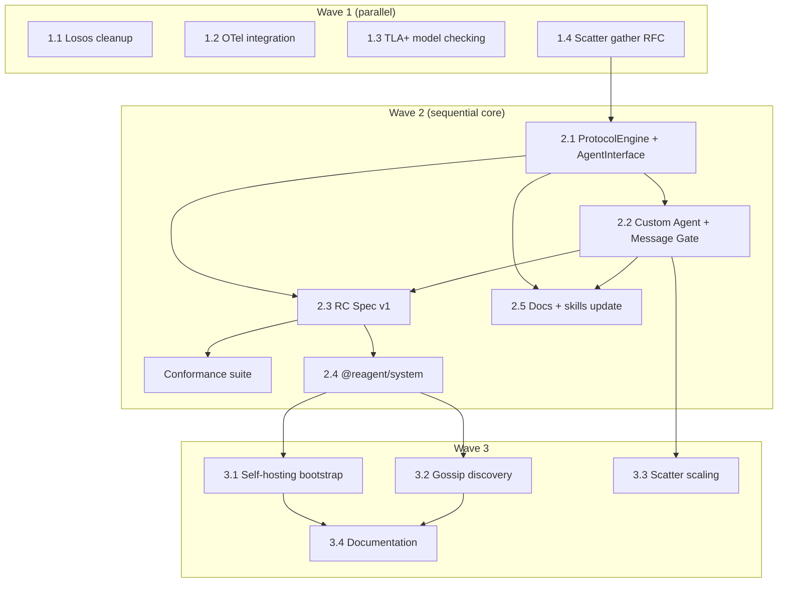

## Reagent backlog

> Migrated from `backlog-far.md` Waves 1–3 on 2026-02-25. Previous milestone history: [backlog-old.md](backlog-old.md). Target architecture and vision: [backlog-far.md](backlog-far.md).

Goal: evolve Reagent from a **language + reference runtimes** into a **protocol controller** with formal verification, pluggable agent integration (managed / custom / message gate), self-hosting, and production-grade scaling.

---

## Карта компонентов и стратегия

| Компонент | LOC | Стратегия | Когда |
|-----------|-----|-----------|-------|
| Compiler (`lang/src/`) | ~5,500 | Не трогать. Добавлять модули: `tla-generator.ts`, gate metadata в IR | Аддитивно |
| `ProtocolInstance` (TS: 1,236, Py: 929) | ~2,200 | **Расслоить**: выделить ProtocolEngine (FSM) + AgentInterface (pluggable) | Wave 2 |
| `AgentRunner` (TS: 276, Py: 333) | ~600 | Упростить до ManagedAgentAdapter impl of AgentInterface | Wave 2 |
| `ReagentController` (TS: 421, Py: 382) | ~800 | Итерировать: добавить CustomAgentNode + MessageGate, migrate state ownership | Wave 2 |
| ROS (`ros.ts`: 1,278) | 1,278 | Итерировать сейчас, переформулировать как agent позже | Wave 3 |
| Debug infra (500 LOC total) | 500 | Мигрировать хуки на ProtocolEngine | Wave 2 |
| VSCode Extension (~5,400) | 5,400 | **Не трогать**. Общается через RAP/WS, не зависит от RC internals | — |
| Python Runtime (~3,500) | 3,500 | Full parity: extract ProtocolEngine, add AgentInterface/CustomAgent/Gate mirrors. Replace with Rust+PyO3 in Wave 4 | Wave 1-2 (parity), Wave 4 (replace) |
| **Новое: AgentInterface + ManagedAdapter** | ~800+500 | Написать с нуля. ProtocolEngine (~800 LOC extracted from PI's 1,210-line monolith + 125-line BranchRunner). ManagedAdapter (~500 LOC): zone execution, $agent injection, invoke/spawn sentinel handling, BreakRequest processing | Wave 2 |
| **Новое: CustomAgentNode** | ~150 | Написать с нуля | Wave 2 |
| **Новое: Message Gate** | ~500 | Написать с нуля (GateSession + GateTransport: WS/stdio/HTTP + FSM validation + state frames) | Wave 2 |
| **Новое: TLA+ generator** | ~500 | Написать с нуля | Wave 1 |
| **Новое: OTel interceptor** | ~150 | Написать с нуля | Wave 1 |

---

## Wave 1: Foundation

Three parallel tracks.

### 1.1 Losos cleanup

- [ ] Удалить `docs/ir-losos-mapping.md`
- [ ] Убрать упоминания Losos из `docs/backlog-old.md` (overview, §Future work, reference runner matrix)
- [ ] Убрать из `.cursor/project-metadata.md` (diagram, doc index, AgentNode mention)
- [ ] Убрать ссылку на `ir-losos-mapping.md` из `.cursor/skills/reagent-developer/SKILL.md` (doc index row)
- [ ] Убрать `ir-losos-mapping.md` из project layout в `.cursor/skills/reagent-language-evolution/SKILL.md`
- [ ] Убрать `LososAgentNode` из `docs/connectivity.md` (AgentNode implementations list)
- [ ] Убрать ссылку на `ir-losos-mapping.md` из `docs/lang-spec.md` (bottom reference)
- [ ] Убрать упоминание `ir-losos-mapping.md` из `docs/tooling-audit.md`
- [ ] Убрать JSDoc mention `LososAgentNode` из `runtime/ts/src/agent-node.ts`
- [ ] Обновить overview в backlog: "Reagent RC is the production engine"

> **Scope note**: workspace-level files (`.cursor/meta/agent-metadata.json`, `.cursor/README.md`, `.cursor/rules/agent-context.mdc`) list "losos" as a separate project under `projects/` — that is correct and should NOT be changed here.

### 1.2 OTel integration

> **Dependencies**: `@opentelemetry/api`, `@opentelemetry/sdk-trace-node` (peer deps in `runtime/ts/`, not bundled into extension). Python: `opentelemetry-api`, `opentelemetry-sdk`.

- [ ] `runtime/ts/src/otel-interceptor.ts` — `OTelInterceptor` (InterceptorFn), TraceEvent → OTel span mapping
- [ ] `runtime/ts/src/otel-trace-hook.ts` — `OTelTraceHook` для agent-level events
- [ ] `runtime/py/reagent_runtime/otel_interceptor.py` — Python mirror
- [ ] Wire into RC: `interceptors=[OTelInterceptor(endpoint)]`
- [ ] Test: run auction-sim with OTel → verify traces in Jaeger

### 1.3 TLA+ model checking prototype

- [ ] `lang/src/tla-generator.ts` — IR → TLA+ spec generation (per-role FSM → TLA+ process, composition → system spec)
- [ ] Start with linear + alt protocols (examples 00-03)
- [ ] Properties: deadlock freedom, protocol completion
- [ ] CLI: `reagent verify <file.rg>` — compile → generate TLA+ → invoke TLC → report pass/fail + counterexample
- [ ] Test: verify all example protocols, expect pass. Inject a deadlock, expect fail with trace.
- [ ] Update `reagent-language-evolution` skill: add TLA+ generator to project layout

### 1.4 Scatter gather semantics RFC

Prerequisite for 2.1 ProtocolEngine extraction. Must be defined before starting the architectural pivot.

Current impl uses `Object.create(this.ctx)` prototype-chain trick for par/scatter isolation (v0.0.11). `$ctx.bids.push()` in scatter branches mutates the shared parent array — works only because JS is single-threaded and branches run sequentially. Breaks under partitioned scatter (Wave 3.3) and Custom Agent / Gate mode (async responses in arbitrary order).

- [ ] Define who merges scatter branch results (ProtocolEngine emits `ScatterGather` event, orchestrating layer merges)
- [ ] Define immutable `$ctx` per branch with explicit gather/reduce semantics (cf. F4 in backlog-far)
- [ ] Define migration path for `$ctx.bids.push()` pattern → `reagent.collect(value)` or coordinator-side reduce
- [ ] Produce RFC doc: `docs/scatter-gather-semantics.md`

---

## Wave 2: RC Redesign

Sequential dependency chain. This is the architectural pivot.

### 2.1 ProtocolEngine + AgentInterface

> **Prerequisite**: 1.4 Scatter gather semantics RFC must be completed before starting extraction.

Extract the FSM walker from `ProtocolInstance` into a pure `ProtocolEngine` and define the unified `AgentInterface`.

**ProtocolEngine** (new, ~800 LOC extracted from ProtocolInstance + BranchRunner):
- Owns: IR graph, current state, $ctx, message inbox, fork/join state, scatter state
- Core logic: `advance()` walks FSM, emits `ProtocolEvent` (receive, send_required, action, state, protocol_completed, protocol_upgraded)
- Consumes `AgentResponse` (ctx_update, send_payload, noop)
- Transport-agnostic: doesn't call zone executor, doesn't send messages, doesn't know about transport
- **Not 100% pure**: scatter and invoke require coordination. Engine emits `ScatterRequired { items, bodyGraph }` and `InvokeRequired { targetProtocol, args }` events. The orchestrating layer (ProtocolInstance) handles these by creating sub-instances (scatter) or child protocols (invoke) and feeding results back into the engine. Engine's `advance()` yields and resumes — it doesn't execute side effects itself, but it cannot be a simple pure function because scatter/invoke require multi-step async coordination with re-entry.

**AgentInterface** (new, core abstraction):
- Single method: `handle(event: ProtocolEvent) -> AgentResponse`
- Same event/response types as Message Gate wire format (JSON-serializable)
- Three implementations: ManagedAgentAdapter (zones), CustomAgent (user code), GateTransport (WS/HTTP)

**ProtocolInstance** (refactored, thinner):
- Wraps ProtocolEngine + AgentInterface impl
- Routes EngineEvents to AgentInterface, feeds responses back to Engine
- Handles transport (sending messages between roles via RC routing)
- Backwards compatible: existing tests pass unchanged

```
Before:  ProtocolInstance = FSM + zones + transport + trace
After:   ProtocolEngine   = FSM + $ctx (pure, emits events)
         AgentInterface    = handle(event) -> response (pluggable)
         ProtocolInstance  = Engine + Interface + transport (wiring)
```

Files:
- [ ] New: `runtime/ts/src/protocol-engine.ts` — FSM core + ProtocolEvent/AgentResponse types
- [ ] New: `runtime/ts/src/agent-interface.ts` — `AgentInterface` type + `ManagedAgentAdapter` (wraps zone execution)
- [ ] Refactor: `runtime/ts/src/protocol-instance.ts` (delegate FSM to engine, zones to adapter)
- [ ] Python mirror: `runtime/py/reagent_runtime/protocol_engine.py`, `agent_interface.py`, refactor `protocol_instance.py`
- [ ] All existing tests pass (T1-T36, C1-C12, Python tests) via ManagedAgentAdapter
- [ ] **Gate criterion**: `auction-sim` runs unchanged on new architecture (scatter, async zones, $agent, agent.json)
- [ ] Create `examples/projects/auction-sim/test.sh` — starts RC, deploys, triggers, asserts expected traces

### 2.2 Custom Agent + Message Gate

Two AgentInterface implementations on top of 2.1.

**Custom Agent** (in-process):
- [ ] New: `runtime/ts/src/custom-agent-node.ts` — `CustomAgentNode` implements `AgentNode`
- [ ] User provides class implementing `AgentInterface.handle(event)`
- [ ] Python mirror: `runtime/py/reagent_runtime/custom_agent_node.py`
- [ ] Test: auction-sim buyer as custom agent (switch on event.type + event.message)
- [ ] Example: `examples/projects/custom-agent-demo/`

**Message Gate** (network):
- [ ] New: `runtime/ts/src/message-gate.ts` — `MessageGate` class
- [ ] WS endpoint: accept connections, authenticate agent identity, bind to role
- [ ] Serializes ProtocolEvents as JSON frames to agent, deserializes AgentResponses
- [ ] FSM validation on agent-initiated sends: check if `messageName` is allowed in current state
- [ ] Accept → feed to ProtocolEngine. Reject → error response with diagnostics.
- [ ] `state` frames: on connect, after each FSM transition, on `get_state` request
- [ ] `protocol_upgraded` frame on hot deploy (version + compatible flag + detail)
- [ ] HTTP fallback: `POST /handle` + `GET /events?since=<seq>` + `GET /state`
- [ ] Test: auction-sim with buyer agents via WebSocket Message Gate
- [ ] Test: auction-sim with buyer agent via stdio Gate (subprocess)
- [ ] **Gate criterion**: `auction-sim` still runs in managed mode after 2.2 changes
- [ ] Example: `examples/projects/message-gate-demo/`

### 2.3 RC Spec v1 (two phases)

**Phase A: Spec draft** (parallel with 2.2):
- [ ] New: `docs/rc-spec.md`
  - §1 Core model: ProtocolEngine, state ownership, envelope format
  - §2 Managed mode: AgentNode, AgentHandle, zone execution contract
  - §3 Custom mode: AgentInterface, handle() contract, ctx mutability rules
  - §4 _(reserved for Message Gate mode — defined in Phase B)_
  - §5 Infrastructure: routing table, interceptor chain (two-level), NodeLink, AddressPage
  - §6 Wire protocol: envelope JSON schema, NodeLink frame format
  - §7 Protocol registry: register, query, canDeploy, protocolVersion

**Phase B: Spec finalization** (after 2.2 is implemented):
- [ ] §4 Message Gate mode: WS/stdio/HTTP API, FSM validation semantics, error codes, GateTransport contract
- [ ] §6 addendum: Gate API schema (finalized from implementation experience)
- [ ] New: `spec/conformance/` — test fixtures (IR JSON + expected trace files)
- [ ] Conformance runner: loads fixtures, runs through each mode, compares traces
- [ ] TS RC passes conformance. Python RC passes conformance.

### 2.4 @reagent/system project

> `reagent init` and `reagent build` already exist in CLI (M8a). Package import resolution (`@scope/pkg/...` → `reagent_packages/`) is implemented in `lang/src/project.ts`. No blocker.

- [ ] `reagent init packages/reagent-system`
- [ ] Move `tools/rap/*.rg` → `packages/reagent-system/protocols/rap/`
- [ ] Define system roles in `packages/reagent-system/roles/system-roles.rg`:
  - `OrchestratorRole [*]` — plays Handshake, DeployProtocol, ClusterStatus, SubmitDeploySpec
  - `DebugRole [*]` — plays DebugSession, SetBreakpoints, InspectState
  - `ReconcilerRole [*]` — plays ReconciliationLoop
  - `DiscoveryRole [*]` — plays NodeGossip (placeholder)
- [ ] Define agents: `agent ROS runs OrchestratorRole`, etc.
- [ ] `reagent build packages/reagent-system` — verify compilation
- [ ] Update ROS to load system protocols from `@reagent/system` instead of hardcoded paths

### 2.5 Documentation + skills update

- [ ] Update `docs/connectivity.md` — add §Message Gate, §Custom Agent Interface
- [ ] Update `docs/user-guide.md` — add custom agent mode and gate mode sections
- [ ] Update `.cursor/skills/reagent-developer/SKILL.md`:
  - State ownership table
  - Three integration modes with code examples
  - run.py patterns for custom/gate
  - New examples reference
- [ ] Update `.cursor/project-metadata.md` — reflect new architecture

---

## Wave 3: Self-hosting + Scaling

### 3.1 Self-hosting bootstrap

- [ ] Refactor ROS to use its own RC for system protocols
- [ ] On startup: ROS creates RC, registers system agents (Orchestrator, Debugger, Reconciler)
- [ ] RAP handlers → become zone code of system agents (or custom agent implementations)
- [ ] External clients (VSCode, CLI) interact with ROS via Message Gate
- [ ] System protocols visible in debug, diagrams, traces — like any user protocol
- [ ] Update `docs/orchestrator.md` — document bootstrap flow

### 3.2 Gossip node discovery

- [ ] Write `packages/reagent-system/protocols/discovery/gossip.rg` — SWIM-like protocol
- [ ] `DiscoveryRole` agent: periodic heartbeat, agent list exchange, failure detection
- [ ] Replace static `AddressPage` with gossip-populated routing table
- [ ] RC auto-joins gossip on startup if configured: `rc = ReagentController(gossip=True)`

### 3.3 Scatter scaling

**Layer 1: Streaming scatter**
- [ ] ProtocolEngine: scatter emits per-branch results immediately (no await-all join)
- [ ] Coordinator's onReceive fires per result, $ctx accumulates incrementally
- [ ] Backwards compatible: existing scatter semantics preserved when branch count < threshold

**Layer 2: Partitioned scatter**
- [ ] RC auto-partitions scatter when N > configurable threshold
- [ ] Each partition → separate AgentNode (process via IpcAgentNode)
- [ ] RC coordinates partitions via routing table
- [ ] Test: scatter with 100+ agents across 4 partitions

### 3.4 Documentation

- [ ] Update `docs/dx-tooling.md` — Gate UI in cluster panel, OTel dashboard link
- [ ] Update `docs/orchestrator.md` — self-hosting architecture
- [ ] Update `docs/connectivity.md` — gossip discovery section

---

## Документы и скиллы — что обновить (сводка)

| Документ / скилл | Действие | Когда |
|------------------|----------|-------|
| `docs/backlog-old.md` | Убрать все упоминания Losos | Wave 1 |
| `docs/ir-losos-mapping.md` | **Удалить** | Wave 1 |
| `docs/lang-spec.md` | Без изменений (язык не меняется) | — |
| `docs/connectivity.md` | Добавить секцию про Message Gate и Custom Agent | Wave 2 |
| `docs/orchestrator.md` | Обновить: ROS → self-hosted agent, добавить bootstrap flow | Wave 3 |
| `docs/user-guide.md` | Добавить: Custom Agent mode, Message Gate mode, `reagent verify` | Wave 2-3 |
| `docs/scatter-gather-semantics.md` | **Новый документ**: scatter gather RFC (merge strategy, immutable branch $ctx, migration) | Wave 1 |
| `docs/rc-spec.md` | **Новый документ**: RC спецификация (core, 3 modes, wire protocol, conformance) | Wave 2 |
| `docs/protocol-versioning.md` | Без изменений | — |
| `docs/dx-tooling.md` | Добавить: Gate UI в cluster panel, OTel dashboard | Wave 3 |
| `.cursor/skills/reagent-developer/SKILL.md` | Обновить: три режима интеграции, state ownership | Wave 2 |
| `.cursor/skills/reagent-language-evolution/SKILL.md` | Добавить: TLA+ generator в project layout, `reagent verify` в CLI section | Wave 1 |
| `.cursor/project-metadata.md` | Убрать Losos, добавить RC Spec, Message Gate | Wave 1 |
| `examples/projects/` | Добавить: `custom-agent-demo/`, `message-gate-demo/` | Wave 2 |

---

## Dependency graph



## Completion gates

| Wave | Gate |
|------|------|
| Wave 1: Foundation | OTel works, TLA+ prototype, Losos gone, scatter gather RFC done |
| Wave 2: RC Redesign | ProtocolEngine extracted, Custom + Gate (WS/stdio/HTTP) work, auction-sim passes on new arch, RC Spec written (draft + finalized), conformance passes, @reagent/system compiles |
| Wave 3: Self-hosting + Scaling | ROS self-hosted, gossip works, scatter scales to 100+ |

**Critical path**: ProtocolEngine → Custom + Gate → RC Spec → Self-hosting.

**Highest ROI items** (do first within each wave):
1. **ProtocolEngine + AgentInterface** — architectural foundation; единый интерфейс вместо трёх API
2. **Message Gate** — transforms Reagent from "agent DSL" to "protocol enforcement infrastructure"
3. **TLA+ model checking** — unique differentiator, low effort, high wow-factor
4. **@reagent/system** — "Reagent on Reagent" validates the entire model
