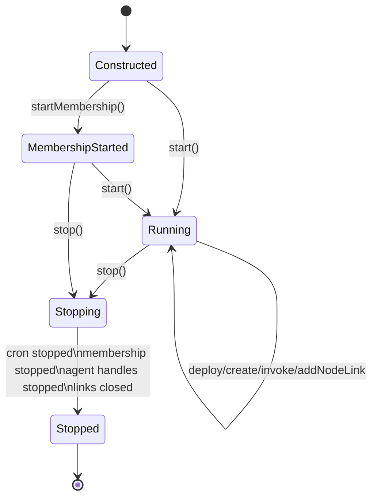
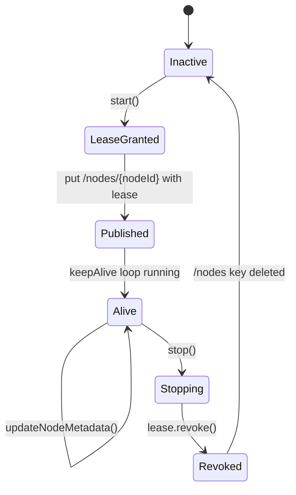
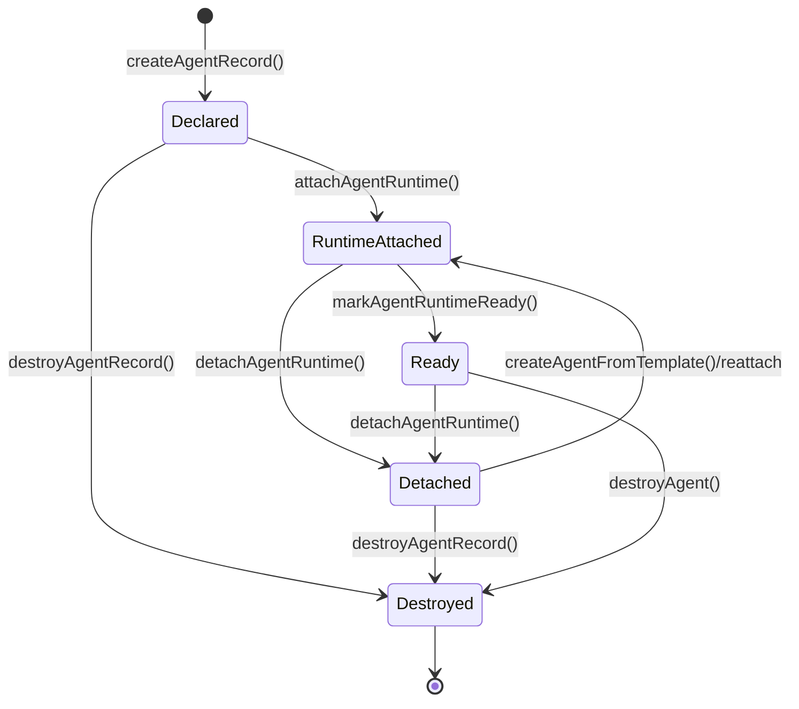
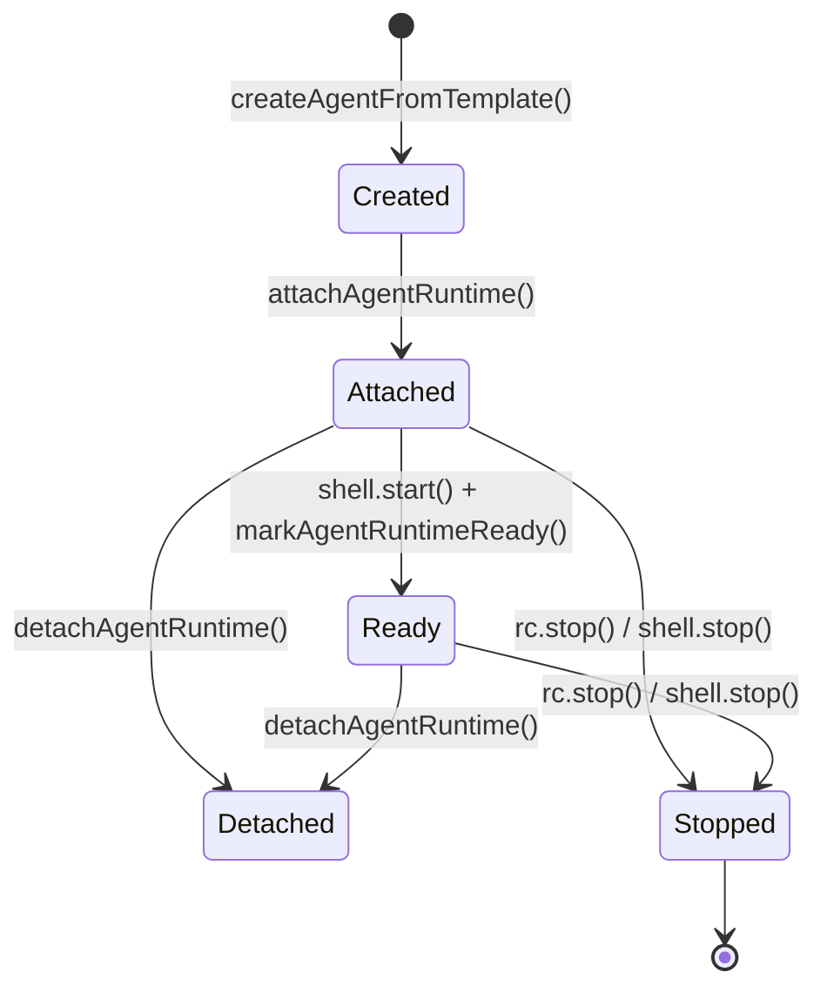
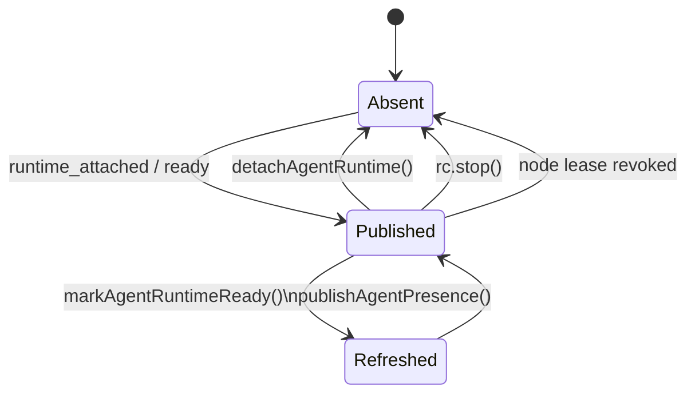
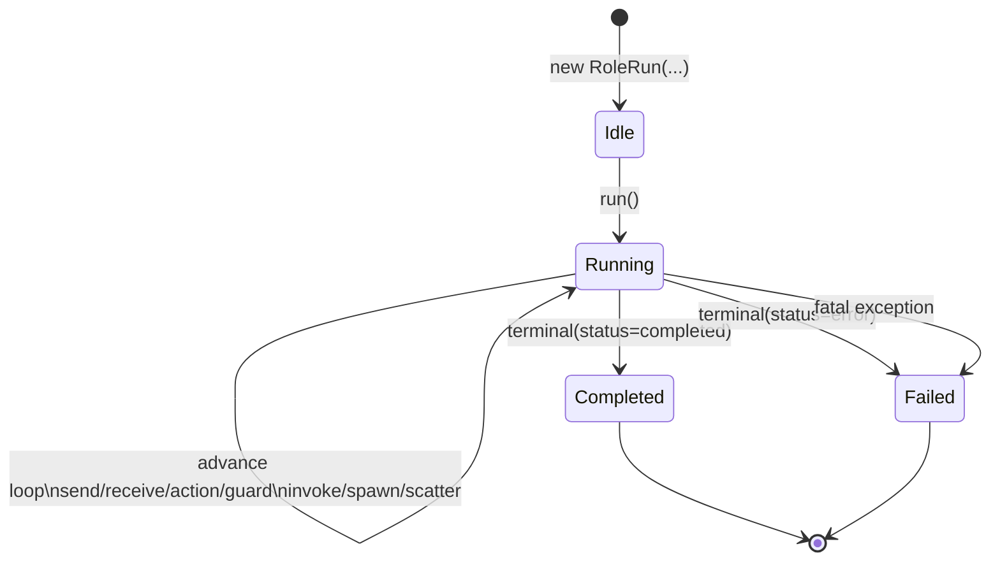

# Runtime Core

This document describes the current TypeScript runtime core and its public execution model.
It replaces the older split between `rc-spec.md`, runtime parts of `connectivity.md`, and the standalone runtime-layering note.

## 1. Runtime Boundary

The runtime core is the node-local execution layer.
It owns protocol execution, local agent lifecycle, routing, trigger evaluation, and cluster-backed resolution.

It may depend on abstractions such as `StateStore`, `NodeLink`, trace hooks, and interceptors, but it should remain usable without the control plane.

## 2. Current Source Layout

The TypeScript runtime core is now reflected directly in `runtime/ts/src`:

| Layer | Path | Responsibility |
|---|---|---|
| Contracts | `runtime/ts/src/contracts/` | Shared runtime interfaces, R1 ontology types, and wire-level types |
| Core | `runtime/ts/src/core/` | Protocol execution (`RoleEngine`, `RoleRun`, `AgentShell`), zone execution, agent behavior model |
| Controller | `runtime/ts/src/controller/` | `ReagentController`, protocol registry, local bus, role bindings |
| Nodes | `runtime/ts/src/nodes/` | `BehaviorFactory` implementations for managed, custom, Python, and gate-backed agents |
| Triggers | `runtime/ts/src/triggers/` | Trigger matching, trigger policy, cron, resolve policy |
| Network | `runtime/ts/src/network/` | `NodeLink` implementations and transport compatibility |
| Cluster | `runtime/ts/src/cluster/` | State store, membership, leader election, runtime bootstrap |

## 3. Main Runtime Objects

### `ReagentController`

`ReagentController` is the per-node runtime core.

Responsibilities:

- register local agents and their graphs
- maintain the local routing table
- create per-agent transports
- route envelopes through loopback or `NodeLink`
- manage message interceptors
- expose protocol registry and node inspection
- host the trigger subsystem
- use cluster-backed agent state to resolve initiators and role bindings

Important current properties:

- One RC per node process.
- RC startup loads agent state from the configured `StateStore` when present.
- `invokeProtocol()` is a node-local runtime entry point.
- distributed runtime startup is handled by each node's RC, not a centralized server.

### `ProtocolRegistry`

The registry is the node-local knowledge plane for deployed protocols.

It tracks:

- protocol name and version
- fingerprints and dependencies
- role graphs
- trigger metadata
- reverse bindings from protocol to agent names

The registry is used by:

- trigger matching
- compatibility checks
- local introspection
- local protocol invocation

### R1 Ontology: `RoleEngine`, `RoleRun`, `AgentShell`, `AgentBehavior`

The R1 Runtime Antientropy redesign introduces a unified execution model that replaces the old split between managed (`ProtocolInstance` + `AgentRunner`) and custom (`ProtocolEngine` + `CustomAgentHandle`) paths.

**`RoleEngine`** is the unified passive FSM that drives one local role execution. It extends `ProtocolEngine` with first-class message dispatch (inbox + resolvers), eliminating the monkey-patching pattern previously used by `CustomAgentHandle`.

**`RoleRun`** is the shared orchestration wrapper that walks the state machine using a `RoleEngine` and delegates to an `AgentBehavior`. It handles the full advance loop: action, send, receive, guard, fork/join, scatter, invoke, spawn, timer, try/catch. It replaces both `ProtocolInstance` (managed path) and the `CustomAgentHandle.runEngine()` loop (custom path).

**`AgentShell`** is the primary live runtime object for one agent identity. It owns persistent `$self`, the active/completed run registry, and an optional attached `AgentBehavior`. Its lifecycle is `detached` (no behavior) / `attached` (behavior present). It replaces `AgentRunner`, `CustomAgentHandle`, and `MessageGateHandle`.

**`AgentBehavior`** is the pluggable executable object that handles `ProtocolEvent`s and returns `AgentResponse`s. It replaces the old `AgentInterface` contract.

**`BehaviorFactory`** is the runtime-kind-specific factory for creating `AgentBehavior` objects. It replaces `AgentNode`. Current implementations:

- `ManagedBehaviorFactory` — creates `ManagedAgentBehavior` instances (zone executor)
- `CustomBehaviorFactory` — wraps user-supplied `AgentBehavior` implementations
- `GateBehaviorFactory` — creates gate-backed proxy behaviors
- `PythonBehaviorFactory` — bridges to the Python runtime (stub, deferred)

**`AgentRecord`** is a DTO/projection of `AgentShell` state for cluster publication. It is not a peer runtime entity.

### Removed types

The following types have been fully removed (R1 cleanup):

- `ProtocolInstance` — replaced by `RoleRun`
- `AgentRunner` — replaced by `AgentShellImpl`
- `AgentNode` / `AgentHandle` — replaced by `BehaviorFactory` / `AgentShell`
- `NativeAgentNode` / `NativeAgentHandle` — replaced by `ManagedBehaviorFactory` / `AgentShellImpl`
- `CustomAgentNode` / `CustomAgentHandle` — replaced by `CustomBehaviorFactory` / `AgentShellImpl`
- `MessageGateNode` / `MessageGateHandle` — replaced by `GateBehaviorFactory` / `AgentShellImpl`
- `PythonAgentNode` / `PythonAgentHandle` — replaced by `PythonBehaviorFactory` (stub, Python deferred)

## 4. Routing Model

### Core types

The routing contract lives in `runtime/ts/src/contracts/`:

- `types.ts`
- `transport.ts`
- `interceptor.ts`

Key abstractions:

- `MessageEnvelope`
- `NodeRef`
- `AgentRef`
- `ReagentTransport`
- `NodeLink`

### Delivery rules

- Local agents route through RC loopback.
- Remote agents route through a `NodeRef` backed by a `NodeLink`.
- Every message passes through interceptors with direction `loopback`, `outbound`, or `inbound`.
- RC routes by target agent name, not by subjects or topics.

## 5. Role Binding And Resolution

Role binding support now lives explicitly in `runtime/ts/src/controller/role-bindings.ts`.

Supported forms:

- flat maps
- protocol-qualified role bindings
- resolver functions

Current runtime consequences:

- RC can resolve a protocol initiator from cluster-backed registry state
- RC can synthesize a `roleToAgent` map for local invocation
- nodes can override or merge role bindings locally without a cluster-global map

This is a key architectural change from the older model.

## 6. Trigger Subsystem

The trigger subsystem is part of the runtime core, not the control plane.

Current parts:

- `LocalEventBus`
- `CronAgent`
- `TriggerMatcher`
- `ResolvePolicyEvaluator`
- `TriggerPolicy`

Location:

- `runtime/ts/src/controller/local-event-bus.ts`
- `runtime/ts/src/triggers/cron-agent.ts`
- `runtime/ts/src/triggers/trigger-matcher.ts`
- `runtime/ts/src/triggers/resolve-policy-evaluator.ts`
- `runtime/ts/src/triggers/trigger-policy.ts`

Current behavior:

- invoke, event, and cron triggers are registered from protocol metadata
- trigger firing can use cluster-backed dedup and leader coordination when the state store provides it
- participant resolution is no longer implicitly "first matching local agent only"

## 7. Cluster-Aware Runtime State

The runtime core can operate without cluster infrastructure, but it is now designed to benefit from it directly.

Current cluster-facing runtime pieces:

- `StateStore`
- `InMemoryStateStore`
- `EtcdStateStore`
- `StateStoreAgentRegistry`
- `EtcdMembership`
- `LeaderElection`

They live in `runtime/ts/src/cluster/`.

### What cluster state changes

With a configured cluster state backend, RC can:

- learn existing agent registrations on startup
- resolve protocol roles against node-local and remote registrations
- support cron singleton leadership
- support membership-driven remote agent discovery

Protocol launch is a node-local RC responsibility, not a centralized server concern.

## 8. Managed, Custom, Python, And Gate Hosts

### R1 unified model

All agent modes now share a single execution path: `AgentShell` + `BehaviorFactory` + `RoleRun` + `RoleEngine`. The factory creates an `AgentBehavior`, the shell hosts it, and `RoleRun` drives the state machine.

### Managed agents

`ManagedBehaviorFactory` creates `ManagedAgentBehavior` instances that execute .rg zone code.

### Custom agents

`CustomBehaviorFactory` wraps a user-supplied `AgentBehavior`.

### Python agents

`PythonBehaviorFactory` is a stub for Python-backed agents (deferred per backlog).

### Message Gate and MCP Gate

- `GateBehaviorFactory` creates gate-backed proxy behaviors
- Message Gate host logic lives in `nodes/` plus `gate/`
- MCP-facing pieces live in `mcp/`
- `mcp-gate.ts` remains a root entrypoint because it is a runnable host, not just a library file

### RC ontology

The runtime distinguishes several layers:

- `ProtocolArtifacts` — compiled protocol/role payload loaded into the node
- `AgentTemplate` — create-spec that describes how an agent can be materialized
- `AgentRecord` — DTO projection of `AgentShell` state for cluster publication
- `AgentShell` — live runtime session container with attachable `AgentBehavior`
- `RoleRun` — one live execution of one role graph (replaces `ProtocolInstance`)

This distinction matters for cluster behavior:

- deploy can install `ProtocolArtifacts` and `AgentTemplate` without creating a live runtime
- an `AgentRecord` can exist before an agent is actually attached and ready
- routing and trigger resolution should only target records that currently have attached runtime presence
- `spawnRoleInstance()` should mean live spawn of a ready agent runtime; pure logical-slot creation belongs to lower-level record APIs

### Lifecycle entities around RC

The runtime model is easier to reason about if we separate logical records,
live runtimes, and cluster-visible presence.

The main lifecycle-bearing entities around `ReagentController` are:

- `ReagentController` itself as the node-local orchestrator
- `EtcdMembership` and the leased `/nodes/{nodeId}` presence record
- `AgentRecord` as logical agent identity tracked by the controller
- `AgentShellImpl` as the live attached executor
- leased `/agents/{agentName}` as live cluster-visible presence
- `RoleRun` as one execution of one role graph

Secondary operational lifecycle entities also exist:

- `CronAgent`
- `NodeLink`
- spawned-agent sets tracked per protocol instance

#### `ReagentController`

`ReagentController` has an operational lifecycle even though it does not expose a
formal status enum. The important transitions are `startMembership()`,
`start()`, and `stop()`.

#### Node presence: `EtcdMembership` and `/nodes/{nodeId}`

Cluster-visible node presence is lease-based. A node is considered live only
while its membership lease is alive.

#### Logical agent identity: `AgentRecord`

`AgentRecord` is the controller's logical view of an agent slot. It can exist
before any live runtime is attached.

This is intentionally distinct from cluster-visible liveness. A declared or
detached `AgentRecord` does not imply that `/agents/{agentName}` exists.

#### Live runtime: `AgentShellImpl`

The runtime embodiment of an agent is an `AgentShellImpl` created by the RC
via `createAgentFromTemplate()`. The RC uses a `BehaviorFactory` to create an
`AgentBehavior` and attaches it to the shell.

#### Live cluster-visible presence: `/agents/{agentName}`

The `/agents/` keyspace is live presence, not durable inventory. Presence is
published only for addressable attached/ready runtimes and is tied to the node
lease.

This is the cluster-facing lifecycle that remote resolution and membership
watches care about.

#### `RoleRun`

`RoleRun` is the lifecycle of one concrete execution of one role graph.

Runs are created by `AgentShellImpl` either from an explicit
trigger/invocation or by receive-side lazy materialization when the first
message arrives.

#### Secondary operational entities

These have real lifecycle too, but they are supporting infrastructure rather
than the primary RC ontology:

- `CronAgent`: idle -> started -> ticking -> stopped
- `NodeLink`: added -> connected -> active routing -> closed
- spawned agents: requested -> declared -> attached -> ready -> cleaned up or persisted

Together these layers explain why the runtime distinguishes:

- logical declaration (`AgentRecord`)
- live execution (`AgentShellImpl`)
- cluster-visible liveness (`/agents/*`)
- node-visible liveness (`/nodes/*`)
- per-run execution (`RoleRun`)

## 9. Runtime Config Boundary

The runtime config boundary is now explicit.

Declarative runtime config should describe:

- node identity
- state store backend
- membership settings
- message-plane backend
- telemetry settings
- trigger policy defaults

In code, this boundary lives in:

- `runtime/ts/src/cluster/runtime-config.ts`
- `runtime/ts/src/cluster/runtime-bootstrap.ts`

This config is intentionally about the node-local RC host only.
It should not be extended with Claude-specific or other external agent
settings.

Imperative host code should provide:

- concrete `BehaviorFactory` instances
- host-specific callbacks
- control-plane transport connections
- process lifecycle integration

When a node is launched through an external live-agent wrapper, the wrapper
config should embed `RuntimeConfig` rather than mutate its meaning. In the
current Claude path, the UX-facing launch file is a wrapper config of the form:

- `kind: "claude_live_agent_node"`
- `runtime: RuntimeConfig`
- `agent: { name, roles }`
- `claude: { ...Claude SDK settings... }`

That wrapper is a launch artifact for a specific node kind. It is not part of
the core RC runtime model itself.

## 10. What Changed Relative To Older Docs

- RC now owns local protocol invocation through `invokeProtocol()`.
- cluster state is part of runtime behavior, not just an orchestration side-channel.
- receive-side instance materialization is implemented in both managed and custom paths.
- `AgentRecord` and `AgentShellImpl` are now separate concepts in the TS runtime model.
- the TS runtime filesystem now matches the architecture described here.
- the Python runtime remains implemented but structurally asymmetric relative to TS.

## 11. Primary Files

For the current runtime core, start with:

**R1 ontology (new):**
- `runtime/ts/src/contracts/agent-behavior.ts` — `AgentBehavior` interface
- `runtime/ts/src/contracts/behavior-factory.ts` — `BehaviorFactory` interface
- `runtime/ts/src/contracts/agent-shell.ts` — `AgentShell` interface and related types
- `runtime/ts/src/contracts/protocol-run.ts` — `ProtocolRunRef`, `RoleRunIdentity`, `RoleRunStatus`
- `runtime/ts/src/core/role-engine.ts` — `RoleEngine` class (extends `ProtocolEngine`)
- `runtime/ts/src/core/role-run.ts` — `RoleRun` class (unified orchestration)
- `runtime/ts/src/core/agent-shell-impl.ts` — `AgentShellImpl` class (unified shell)
- `runtime/ts/src/nodes/managed-behavior-factory.ts` — `ManagedBehaviorFactory`
- `runtime/ts/src/nodes/custom-behavior-factory.ts` — `CustomBehaviorFactory`
- `runtime/ts/src/nodes/gate-behavior-factory.ts` — `GateBehaviorFactory`

**Controller and infrastructure:**
- `runtime/ts/src/controller/reagent-controller.ts`
- `runtime/ts/src/controller/protocol-registry.ts`
- `runtime/ts/src/controller/role-bindings.ts`
- `runtime/ts/src/triggers/trigger-matcher.ts`
- `runtime/ts/src/cluster/runtime-config.ts`
- `runtime/ts/src/cluster/runtime-bootstrap.ts`

**Engine (internal, used by RoleRun):**
- `runtime/ts/src/core/protocol-engine.ts`
