# Runtime Core

This document describes the current TypeScript runtime core and its public execution model.
It replaces the older split between `rc-spec.md`, runtime parts of `connectivity.md`, and the standalone runtime-layering note.

## 1. Runtime Boundary

The runtime core is the node-local execution layer.
It owns protocol execution, local agent lifecycle, routing, trigger evaluation, and cluster-backed resolution.

It may depend on abstractions such as `StateStore`, `NodeLink`, trace hooks, and interceptors, but it should remain usable without the control plane.

## 2. Current Source Layout

The TypeScript runtime core is now reflected directly in `runtime/ts/src`:

| Layer | Path | Responsibility |
|---|---|---|
| Contracts | `runtime/ts/src/contracts/` | Shared runtime interfaces, R1 ontology types, and wire-level types |
| Core | `runtime/ts/src/core/` | Protocol execution (`RoleEngine`, `RoleRun`, `AgentShell`), zone execution, agent behavior model |
| Controller | `runtime/ts/src/controller/` | `ReagentController`, protocol registry, local bus, role bindings |
| Nodes | `runtime/ts/src/nodes/` | `BehaviorFactory` implementations for managed, custom, Python, and gate-backed agents |
| Triggers | `runtime/ts/src/triggers/` | Trigger matching, trigger policy, cron, resolve policy |
| Network | `runtime/ts/src/network/` | `NodeLink` implementations and transport compatibility |
| Cluster | `runtime/ts/src/cluster/` | State store, membership, leader election, runtime bootstrap |

## 3. Main Runtime Objects

### `ReagentController`

`ReagentController` is the per-node runtime core.

Responsibilities:

- register local agents and their graphs
- maintain the local routing table
- create per-agent transports
- route envelopes through loopback or `NodeLink`
- manage message interceptors
- expose protocol registry and node inspection
- host the trigger subsystem
- use cluster-backed agent state to resolve initiators and role bindings

Important current properties:

- One RC per node process.
- RC startup loads agent state from the configured `StateStore` when present.
- `invokeProtocol()` is a node-local runtime entry point.
- distributed runtime startup is handled by each node's RC, not a centralized server.

### `ProtocolRegistry`

The registry is the node-local knowledge plane for deployed protocols.

It tracks:

- protocol name and version
- fingerprints and dependencies
- role graphs
- trigger metadata
- reverse bindings from protocol to agent names

The registry is used by:

- trigger matching
- compatibility checks
- local introspection
- local protocol invocation

### R1 Ontology: `RoleEngine`, `RoleRun`, `AgentShell`, `AgentBehavior`

The R1 Runtime Antientropy redesign introduces a unified execution model that replaces the old split between managed (`ProtocolInstance` + `AgentRunner`) and custom (`ProtocolEngine` + `CustomAgentHandle`) paths.

**`RoleEngine`** is the unified passive FSM that drives one local role execution. It extends `ProtocolEngine` with first-class message dispatch (inbox + resolvers), eliminating the monkey-patching pattern previously used by `CustomAgentHandle`.

**`RoleRun`** is the shared orchestration wrapper that walks the state machine using a `RoleEngine` and delegates to an `AgentBehavior`. It handles the full advance loop: action, send, receive, guard, fork/join, scatter, invoke, spawn, timer, try/catch. It replaces both `ProtocolInstance` (managed path) and the `CustomAgentHandle.runEngine()` loop (custom path).

**`AgentShell`** is the primary live runtime object for one agent identity. It owns persistent `$self`, the active/completed run registry, and an optional attached `AgentBehavior`. Its lifecycle is `detached` (no behavior) / `attached` (behavior present). It replaces `AgentRunner`, `CustomAgentHandle`, and `MessageGateHandle`.

**`AgentBehavior`** is the pluggable executable object that handles `ProtocolEvent`s and returns `AgentResponse`s. It replaces the old `AgentInterface` contract.

**`BehaviorFactory`** is the runtime-kind-specific factory for creating `AgentBehavior` objects. It replaces `AgentNode`. Current implementations:

- `ManagedBehaviorFactory` — creates `ManagedAgentBehavior` instances (zone executor)
- `CustomBehaviorFactory` — wraps user-supplied `AgentBehavior` implementations
- `ClaudeBehaviorFactory` — calls Claude API directly via `handle()` (first real custom behavior consumer)
- `GateBehaviorFactory` — creates gate-backed proxy behaviors
- `PythonBehaviorFactory` — bridges to the Python runtime (stub, deferred)

**`AgentRecord`** is a DTO/projection of `AgentShell` state for cluster publication. It is not a peer runtime entity.

### Removed types

The following types have been fully removed (R1 cleanup):

- `ProtocolInstance` — replaced by `RoleRun`
- `AgentRunner` — replaced by `AgentShellImpl`
- `AgentNode` / `AgentHandle` — replaced by `BehaviorFactory` / `AgentShell`
- `NativeAgentNode` / `NativeAgentHandle` — replaced by `ManagedBehaviorFactory` / `AgentShellImpl`
- `CustomAgentNode` / `CustomAgentHandle` — replaced by `CustomBehaviorFactory` / `AgentShellImpl`
- `MessageGateNode` / `MessageGateHandle` — replaced by `GateBehaviorFactory` / `AgentShellImpl`
- `PythonAgentNode` / `PythonAgentHandle` — replaced by `PythonBehaviorFactory` (stub, Python deferred)

## 4. Routing Model

### Core types

The routing contract lives in `runtime/ts/src/contracts/`:

- `types.ts`
- `transport.ts`
- `interceptor.ts`

Key abstractions:

- `MessageEnvelope`
- `NodeRef`
- `AgentRef`
- `ReagentTransport`
- `NodeLink`

### Delivery rules

- Local agents route through RC loopback.
- Remote agents route through a `NodeRef` backed by a `NodeLink`.
- Every message passes through interceptors with direction `loopback`, `outbound`, or `inbound`.
- RC routes by target agent name, not by subjects or topics.

## 5. Role Binding And Resolution

Role binding support now lives explicitly in `runtime/ts/src/controller/role-bindings.ts`.

Supported forms:

- flat maps
- protocol-qualified role bindings
- resolver functions

Current runtime consequences:

- RC can resolve a protocol initiator from cluster-backed registry state
- RC can synthesize a `roleToAgent` map for local invocation
- nodes can override or merge role bindings locally without a cluster-global map

This is a key architectural change from the older model.

## 6. Trigger Subsystem

The trigger subsystem is part of the runtime core, not the control plane.

Current parts:

- `LocalEventBus`
- `CronAgent`
- `TriggerMatcher`
- `ResolvePolicyEvaluator`
- `TriggerPolicy`

Location:

- `runtime/ts/src/controller/local-event-bus.ts`
- `runtime/ts/src/triggers/cron-agent.ts`
- `runtime/ts/src/triggers/trigger-matcher.ts`
- `runtime/ts/src/triggers/resolve-policy-evaluator.ts`
- `runtime/ts/src/triggers/trigger-policy.ts`

Current behavior:

- invoke, event, and cron triggers are registered from protocol metadata
- trigger firing can use cluster-backed dedup and leader coordination when the state store provides it
- trigger-level participant resolution is driven by compiled `resolveMap` metadata and evaluated through `ResolvePolicyEvaluator`
- resolution targets addressable registry entries, not only local in-memory agents
- `roundRobin`, `random`, `sample`, `fallback`, and controller-registered `custom(...)` policies are implemented in the TS evaluator
- `leastLoaded` is still a stub in the evaluator and should not be treated as a fully implemented runtime policy
- zone-level `reagent.resolve()` / `reagent.registry` remain unavailable in managed-zone execution; current resolve behavior is trigger-level only

## 7. Cluster-Aware Runtime State

The runtime core can operate without cluster infrastructure, but it is now designed to benefit from it directly.

Current cluster-facing runtime pieces:

- `StateStore`
- `InMemoryStateStore`
- `EtcdStateStore`
- `StateStoreAgentRegistry`
- `EtcdMembership`
- `LeaderElection`

They live in `runtime/ts/src/cluster/`.

### What cluster state changes

With a configured cluster state backend, RC can:

- learn existing agent registrations on startup
- resolve protocol roles against node-local and remote registrations
- support cron singleton leadership
- support membership-driven remote agent discovery

Current limitation:

- stateful resolve policy state is not yet persisted as shared cluster truth; evaluator state such as `roundRobin` cursors remains controller-local today

Protocol launch is a node-local RC responsibility, not a centralized server concern.

## 8. Managed, Custom, Python, And Gate Hosts

### R1 unified model

All agent modes now share a single execution path: `AgentShell` + `BehaviorFactory` + `RoleRun` + `RoleEngine`. The factory creates an `AgentBehavior`, the shell hosts it, and `RoleRun` drives the state machine.

### Managed agents

`ManagedBehaviorFactory` creates `ManagedAgentBehavior` instances that execute .rg zone code.

### Custom agents

`CustomBehaviorFactory` wraps a user-supplied `AgentBehavior` implementation. This is the extension point for integrating external AI providers, domain-specific executors, or any non-managed behavior.

### Claude agents

`ClaudeBehaviorFactory` (in `runtime/ts/src/nodes/claude/claude-behavior-factory.ts`) creates `ClaudeBehavior` instances that call the Claude API via `@anthropic-ai/claude-agent-sdk` directly inside `handle()`. The `claude-node.ts` host bootstraps an RC in-process and registers this factory — no MCP child process or polling loop. This is the first real consumer of the `CustomBehaviorFactory` extensibility pattern.

### Python agents

`PythonBehaviorFactory` is a stub for Python-backed agents (deferred per backlog).

### Message Gate and MCP Gate

- `GateBehaviorFactory` creates gate-backed proxy behaviors
- Message Gate host logic lives in `nodes/` plus `gate/`
- MCP-facing pieces live in `mcp/`
- `mcp-gate.ts` remains a root entrypoint because it is a runnable host, not just a library file

### RC ontology

The runtime distinguishes several layers:

- `ProtocolArtifacts` — compiled protocol/role payload loaded into the node
- `AgentTemplate` — create-spec that describes how an agent can be materialized
- `AgentRecord` — DTO projection of `AgentShell` state for cluster publication
- `AgentShell` — live runtime session container with attachable `AgentBehavior`
- `RoleRun` — one live execution of one role graph (replaces `ProtocolInstance`)

This distinction matters for cluster behavior:

- deploy can install `ProtocolArtifacts` and `AgentTemplate` without creating a live runtime
- an `AgentRecord` can exist before an agent is actually attached and ready
- routing and trigger resolution should only target records that currently have attached runtime presence
- `spawnRoleInstance()` should mean live spawn of a ready agent runtime; pure logical-slot creation belongs to lower-level record APIs

### Lifecycle entities around RC

The runtime model is easier to reason about if we separate logical records,
live runtimes, and cluster-visible presence.

The main lifecycle-bearing entities around `ReagentController` are:

- `ReagentController` itself as the node-local orchestrator
- `EtcdMembership` and the leased `/nodes/{nodeId}` presence record
- `AgentRecord` as logical agent identity tracked by the controller
- `AgentShellImpl` as the live attached executor
- leased `/agents/{agentName}` as live cluster-visible presence
- `RoleRun` as one execution of one role graph

Secondary operational lifecycle entities also exist:

- `CronAgent`
- `NodeLink`
- spawned-agent sets tracked per protocol instance

#### `ReagentController`

`ReagentController` has an operational lifecycle even though it does not expose a
formal status enum. The important transitions are `startMembership()`,
`start()`, and `stop()`.

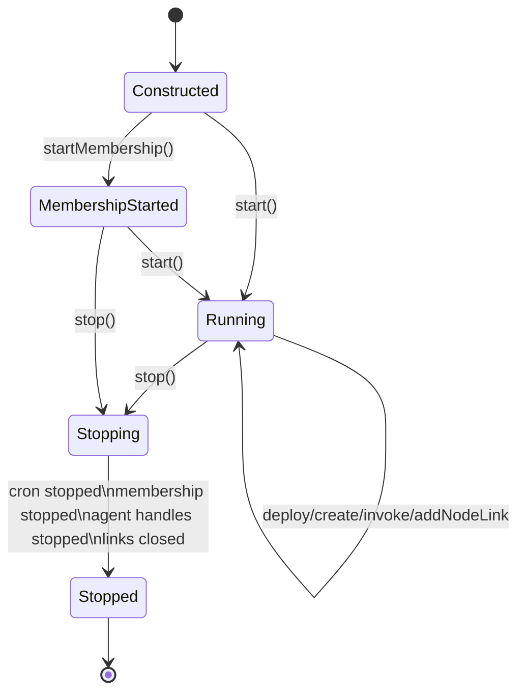

#### Node presence: `EtcdMembership` and `/nodes/{nodeId}`

Cluster-visible node presence is lease-based. A node is considered live only
while its membership lease is alive.

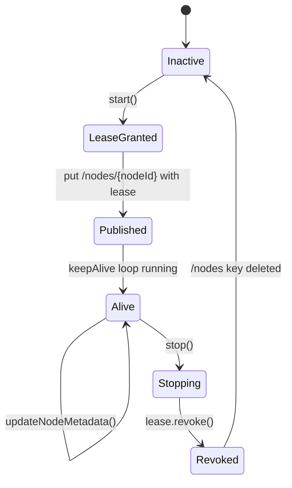

#### Logical agent identity: `AgentRecord`

`AgentRecord` is the controller's logical view of an agent slot. It can exist
before any live runtime is attached.

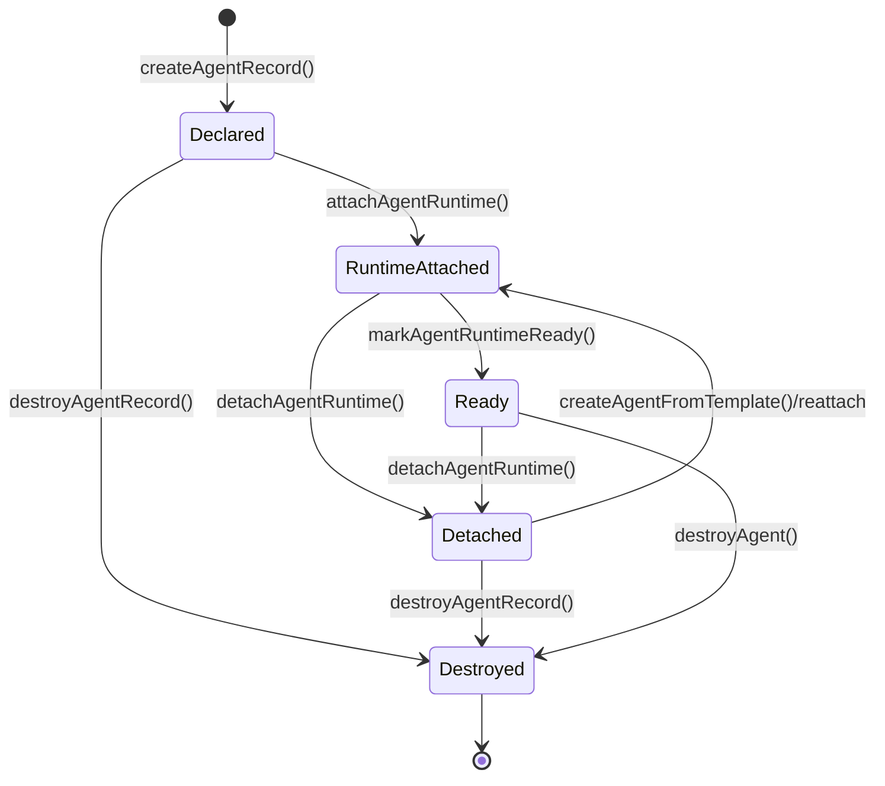

This is intentionally distinct from cluster-visible liveness. A declared or
detached `AgentRecord` does not imply that `/agents/{agentName}` exists.

#### Live runtime: `AgentShellImpl`

The runtime embodiment of an agent is an `AgentShellImpl` created by the RC
via `createAgentFromTemplate()`. The RC uses a `BehaviorFactory` to create an
`AgentBehavior` and attaches it to the shell.

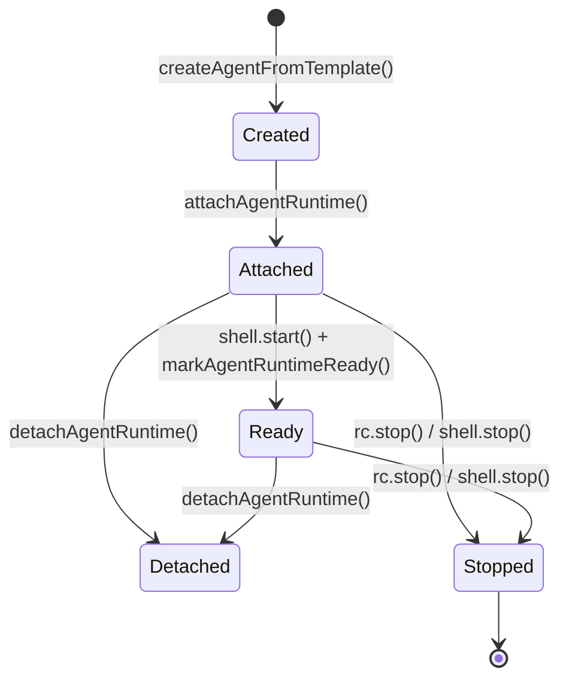

#### Live cluster-visible presence: `/agents/{agentName}`

The `/agents/` keyspace is live presence, not durable inventory. Presence is
published only for addressable attached/ready runtimes and is tied to the node
lease.

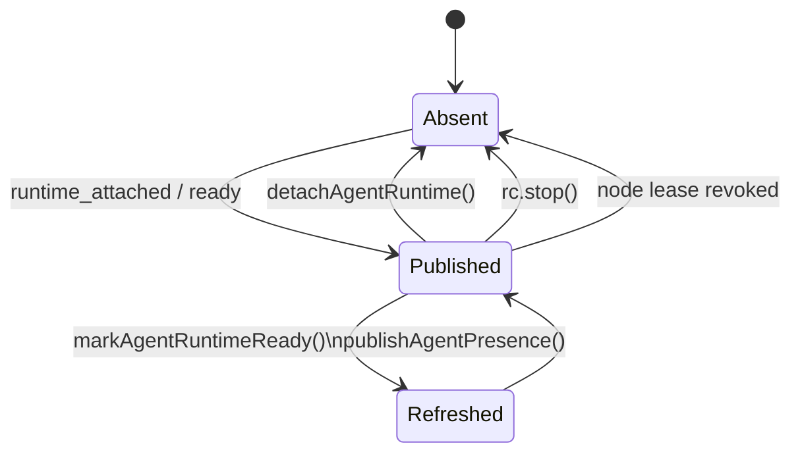

This is the cluster-facing lifecycle that remote resolution and membership
watches care about.

#### `RoleRun`

`RoleRun` is the lifecycle of one concrete execution of one role graph.

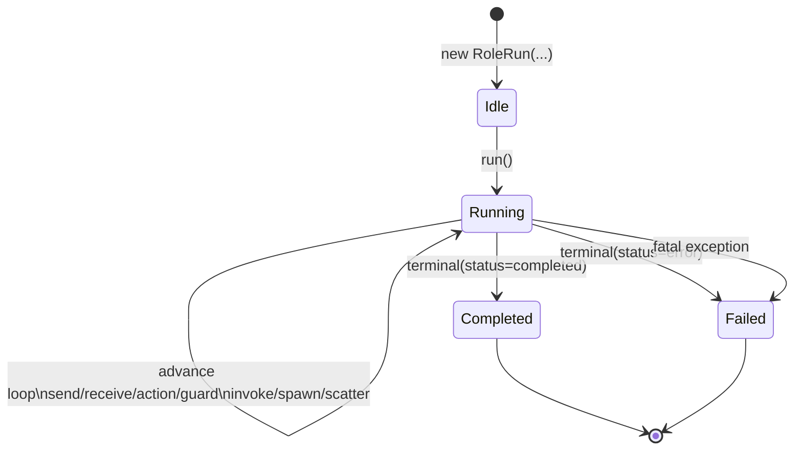

Runs are created by `AgentShellImpl` either from an explicit
trigger/invocation or by receive-side lazy materialization when the first
message arrives.

#### Secondary operational entities

These have real lifecycle too, but they are supporting infrastructure rather
than the primary RC ontology:

- `CronAgent`: idle -> started -> ticking -> stopped
- `NodeLink`: added -> connected -> active routing -> closed
- spawned agents: requested -> declared -> attached -> ready -> cleaned up or persisted

Together these layers explain why the runtime distinguishes:

- logical declaration (`AgentRecord`)
- live execution (`AgentShellImpl`)
- cluster-visible liveness (`/agents/*`)
- node-visible liveness (`/nodes/*`)
- per-run execution (`RoleRun`)

For the operational semantics of these lifecycle entities — ownership, supervision, fault propagation, and re-homing — see §9.

## 9. Process Model and Supervision

This section defines the **operational process model** for the Reagent runtime.
It describes how protocols and agents relate as processes — who creates whom,
who owns whom, what happens when something fails, and how the cluster recovers.

The R1 ontology (§3, §8) defines **what things are** (AgentShell, RoleRun, AgentRecord).
This section defines **how they behave as processes**.

Design rationale and the original RFC are archived in `../archive/process-model.md`.

### 9.1 Process Kinds

**Protocol process** — a distributed process spanning one or more nodes.
Represented by correlated `RoleRun` instances across participating agents.

- Globally unique `instanceId` + `protocolName`
- Has a **home RC** — the RC whose initiator agent fired the trigger
- May have child protocol processes (via `invokes` / `async invokes`) and spawned agents (via `spawns`)
- Tracked locally in the home RC and globally in etcd at `/protocol-runs/{instanceId}`
- There is no single `ProtocolRun` class — the distributed identity is a `ProtocolRunRef`, an etcd record, and a set of local `RoleRun` fibers

**Agent process** — a local process on exactly one node.
Represented by an `AgentShellImpl` inside a `ReagentController`.

- Globally unique `agentName`
- Bound to exactly **one role** (the role may `plays` multiple protocols)
- Hosts zero or more `RoleRun` fibers concurrently
- Projected as an `AgentRecord` in the registry

**RoleRun (fiber)** — not a standalone process but a lightweight execution
context inside an agent process, participating in one protocol process.

- Bound to one agent process (host shell) and one protocol process (correlation)
- Has its own `$ctx`, FSM state (`RoleEngine`), inbox, and completion callbacks
- Cannot outlive its host agent process

The key insight: an agent process is the **execution host**, a protocol process
is the **coordination scope**, and a RoleRun is the **intersection** of the two.

```
┌─────────────────────────────────────────────────────────────┐
│ Agent Process (AgentShell: coordinator)                      │
│ Role: CoordinatorRole (plays Auction/seller, Scoring/eval)  │
│                                                             │
│  ┌─────────────────┐  ┌─────────────────┐                  │
│  │ RoleRun          │  │ RoleRun          │                  │
│  │ auction-1/seller │  │ scoring-1/eval  │                  │
│  │ (protocol fiber) │  │ (protocol fiber) │                  │
│  └────────┬─────────┘  └────────┬─────────┘                  │
│           │                     │                            │
│      participates in       participates in                   │
│           │                     │                            │
│  ┌────────▼─────────┐  ┌───────▼──────────┐                 │
│  │ Protocol Process  │  │ Protocol Process  │                 │
│  │ Auction:inst-1    │  │ Scoring:inst-1    │                 │
│  │ (distributed)     │  │ (distributed)     │                 │
│  └───────────────────┘  └──────────────────┘                 │
└─────────────────────────────────────────────────────────────┘
```

### 9.2 Process Tree

The process tree exists at two levels.

**Node-local tree.** Each RC maintains an in-memory tree that is always consistent.

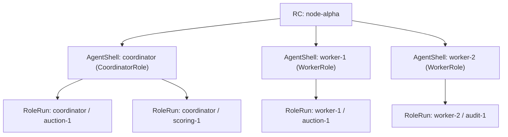

Ownership edges: RC → AgentShell is **strong** (shell cannot outlive RC).
AgentShell → RoleRun is **hosting** (RoleRun cannot outlive its shell).
The local tree does not track cross-node relationships.

**Cluster-wide protocol tree.** A logical structure tracked in etcd.
Represents parent-child relationships between protocol processes and their
spawned agents, regardless of which node they run on.

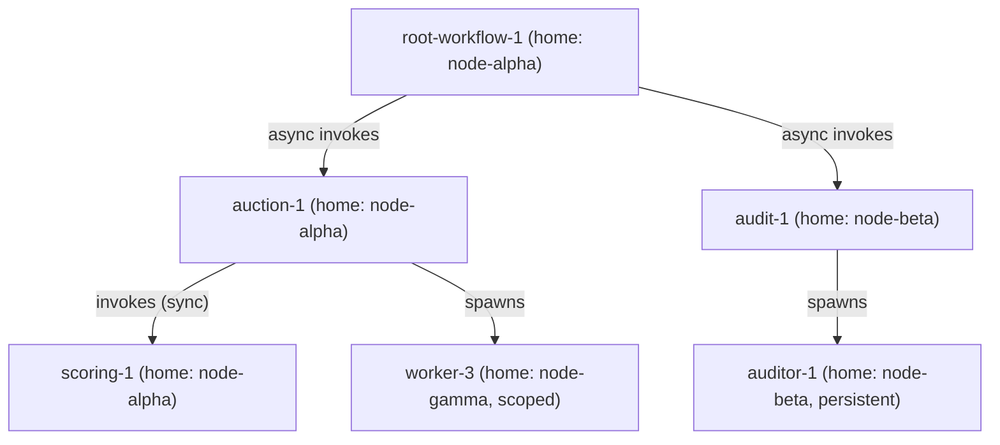

Properties: eventually consistent (etcd projection), rooted at one or more
root protocols, each edge carries ownership semantics (§9.3).

| Aspect | Node-local | Cluster-wide |
|--------|-----------|--------------|
| Scope | One node | Entire cluster |
| Granularity | Down to RoleRun fibers | Protocol and agent processes |
| Consistency | Strong (in-memory) | Eventually consistent (etcd) |
| Purpose | Execution, routing, dispatch | Supervision, ownership, re-homing |
| Lifetime | Dies with RC | Survives individual RC failures |

### 9.3 Ownership Semantics

Every edge in the process tree is an ownership relationship with four
properties: creator, owner, coupling, and detach behavior.

| Parent | Child | Coupling | On parent complete | On parent fail | On home RC dies |
|--------|-------|----------|-------------------|----------------|-----------------|
| RC | AgentShell | **strong** | `shell.stop()` | shell dies with RC | shell dies with RC |
| AgentShell (initiator) | ProtocolRun | **trigger** | run continues independently | initiator RoleRun fails, home RC continues supervision | run orphaned (§9.8) |
| ProtocolRun | child ProtocolRun (sync `invokes`) | **strong** | n/a — child finishes first | cancel child, propagate error | child orphaned |
| ProtocolRun | child ProtocolRun (async `invokes`) | **scoped** | cancel child | cancel child | child orphaned |
| ProtocolRun | spawned Agent (non-persistent) | **scoped** | destroy agent | destroy agent | agent orphaned |
| ProtocolRun | spawned Agent (`persistent`) | **detached** | agent survives | agent survives | agent survives |

**Coupling kinds:**

- **Strong** — child cannot outlive parent. Parent waits for child before completing. Parent failure cancels child immediately.
- **Scoped** — child's lifetime bounded by parent's lifetime. Parent triggers cleanup as a side effect of its own completion but does not join scoped children before reaching terminal state.
- **Trigger** — the initiator agent creates the protocol via a trigger. Supervision transfers immediately to the home RC. The protocol's lifetime is self-determined.
- **Detached** — no lifecycle dependency. The `persistent` flag on `spawns` produces this coupling.

### 9.4 Protocol Process Lifecycle

The runtime uses a **collapsed terminal model** for protocol process status:

```
starting | running | cancelling | completed | failed | cancelled | orphaned | adopting
```

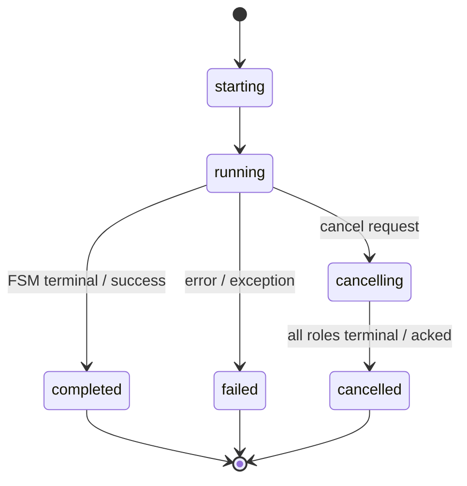

Additional distributed states:

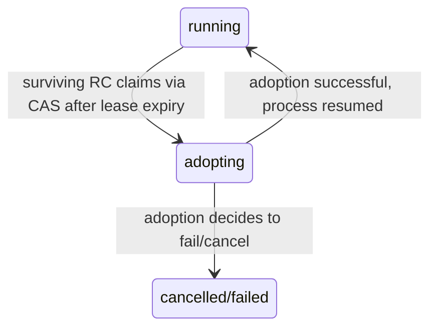

- **orphaned** — home RC died and no survivor has claimed the record yet
- **adopting** — a surviving RC has claimed ownership via etcd CAS and is evaluating the process state

Agent process and RoleRun lifecycles remain as described in §8.

### 9.5 Supervision Model

Supervision is organized in four layers.

**Layer 1: Cluster Supervisor** (scope: entire cluster). Not a single process
but an emergent behavior of all surviving RCs cooperating through etcd.
Detects RC failure via lease expiry, scans for orphaned protocols, claims
them via CAS, and executes the adoption decision. Always active.

**Layer 2: RC / Node Supervisor** (scope: one node). `ReagentController`
supervises all agent processes on its node. Creates/destroys shells,
propagates `stop()` on shutdown. Current state: no restart policy yet.

**Layer 3: Protocol Supervisor** (scope: one protocol process, distributed).
The home RC of the protocol. Tracks child processes and spawned agents,
applies supervision strategy on child failure, executes scoped cleanup,
and propagates cancellation.

**Layer 4: Agent Supervisor** (scope: one agent process, **future**).
Self-healing agent that can restart its own behavior on failure and
re-attach to in-progress RoleRuns. Requires stateful detach/re-attach
that AgentShell supports structurally but does not exploit yet.

**Supervision strategies.** Each protocol can declare a strategy via the
`supervision:` directive in `.rg`:

```rg
protocol Example {
  supervision: one-for-one
  // ...
}
```

The strategy is carried through parser → AST → IR → decompile → runtime
record persistence. Default is **scoped**.

| Strategy | On child fail | On parent complete |
|----------|--------------|-------------------|
| **one-for-one** | Re-resolve lost participants, continue if replacement found | Cancel remaining children |
| **all-for-one** | Same first-wave re-resolve as one-for-one (MVP; no full sibling restart yet) | Cancel all children |
| **scoped** | Notify parent via lifecycle handler, do not restart | Cancel/destroy all scoped children |
| **detached** | No action — child is independent | No action |

MVP limitations: `one-for-one` / `all-for-one` do not checkpoint/resume
RoleRun position — they only attempt narrow re-resolve/rebind of lost
participants. Per-child strategy overrides are a future extension.

### 9.6 Fault Propagation

**Local faults** (within one node):

1. *Behavior throws during zone execution* — RoleRun catches the exception; if a `try/catch` block exists, the catch path executes; otherwise the run transitions to `failed`. `handleRunComplete` fires, lifecycle handlers for `protocolFailed` execute, and the home RC records partial failure.

2. *RoleRun reaches terminal state with error* — removed from `activeRuns`, added to `finishedRuns`. Completion callbacks fire. If the initiator RoleRun, the home RC marks the protocol as failing. Scoped children are cancelled/destroyed.

3. *AgentShell stops* — all active RoleRuns are cancelled (via `run.cancel()`), the shell awaits their terminal status via `waitForRunStop()`, detaches behavior, notifies RC. All protocol processes with a RoleRun on this shell detect participant loss.

4. *Participant agent fails locally while the home RC remains alive* — the home RC treats this as participant loss (not RC/node loss), applies supervision: re-resolve, fail/cancel, or future compensation. No orphan/adoption protocol involved.

**Distributed faults** (multiple nodes):

1. *RC dies* — detected via etcd lease expiry. Surviving RCs scan `/protocol-runs/` for orphaned entries and claim them via CAS (see §9.8).

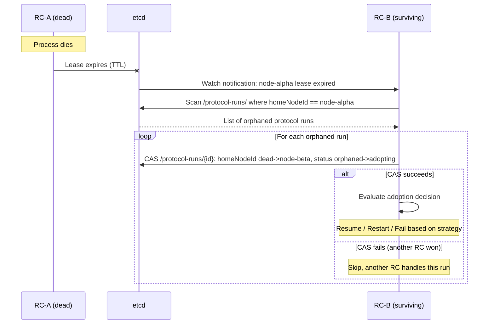

2. *Participant node dies* — the home RC (if alive) detects undeliverable messages, checks etcd for lease expiry, and applies the protocol's fault strategy (re-resolve, fail, or future compensate).

3. *Home RC dies with active children* — child protocol processes become orphaned. Surviving RCs adopt them independently (each child is a separate etcd entry). An adopted child discovers its parent is also orphaned; the adopting RC walks up the tree to find the nearest living ancestor.

**Fault propagation direction:**

- *Downward* (parent → children): parent failure cascades to scoped children
- *Upward* (child → parent): child failure notifies parent via lifecycle handler; the supervision strategy decides the response
- *Lateral* (sibling → sibling): only under `all-for-one`

### 9.7 Cancellation

**Local cancellation.** Targets a protocol process by `instanceId`. The home RC
transitions the process to `cancelling`, cancels local RoleRuns, recursively
cancels scoped children, and destroys scoped spawned agents.

**Distributed cancellation.** When participants span multiple nodes:

1. Home RC writes `status: cancelling` to `/protocol-runs/{instanceId}` in etcd
2. Other RCs observe the change via prefix watch on `/protocol-runs/`, cancel their local RoleRuns
3. Each RC reports local cancellation status back (via etcd or message plane)
4. Home RC considers cancellation complete when all participants have acknowledged

Tracked durably on the record via `ProtocolCancellationState` (stores `requestedByNodeId`, reason, acked roles, acked nodes).

**Cancellation triggers:** external request (admin API / `cancelRun()`), parent failure (scoped coupling), timeout (future), or supervision decision.

**Cancellation vs. compensation.** Cancellation is a hard stop — it interrupts execution and cleans up resources but does not undo side effects. Compensation (semantic rollback) is out of scope here (see backlog L1 / `distributed-try-catch.md`).

### 9.8 RC Failure and Protocol Re-homing

**Detection.** Each RC holds an etcd lease (configurable TTL, default 10s).
When the RC dies, the lease expires. Surviving RCs watch `/nodes/` and detect
the disappearance.

**Orphan identification.** Surviving RCs scan `/protocol-runs/` for entries
where `homeNodeId` matches the dead node and status is not terminal
(`completed`, `failed`, or `cancelled`).

**Adoption protocol:**

1. **Claim** — a surviving RC performs CAS on `/protocol-runs/{id}`, transitioning from `{ homeNodeId: dead, status: orphaned }` to `{ homeNodeId: survivor, status: adopting }`. Exactly one RC wins.
2. **Evaluate** — the adopting RC branches on `supervisionStrategy`:
   - `scoped` → terminate as `cancelled`, clean up non-persistent spawned agents
   - `detached` → terminate as `failed` (conservative MVP)
   - `one-for-one` / `all-for-one` → attempt re-resolve/rebind for participants lost with the dead node
3. **Continue or terminate** — if all lost participants can be rebound, the record returns to `running`; otherwise it terminates conservatively
4. **Cascade** — for child processes also orphaned, adoption cascades

**Spawned agent cleanup after restart.** `cleanupSpawnedAgents()` merges the
durable `record.spawnedAgents` lineage with the in-memory map to ensure
non-persistent agents are destroyed even after RC restart. A startup
reconciliation pass (`reconcileSpawnedAgentCleanup()`) iterates terminal
durable records on the node to catch anything missed.

**State loss.** When an RC dies, the following state is lost:

| State | Location | Recoverable? |
|-------|----------|-------------|
| `$self` (agent persistent state) | In-memory only | No — unless checkpointed (G5, deferred) |
| `$ctx` (protocol run context) | In-memory only | No |
| `activeRuns` / `finishedRuns` maps | In-memory only | No |
| RoleRun FSM position | In-memory only | No — unless checkpointed |
| `ProtocolRunRecord` | etcd | Yes |
| `AgentRecord` | etcd | Yes (lease-bound copy expires) |

Without checkpointing, adoption offers narrow re-resolve/rebind or
conservative fail/cancel. Checkpointing is a future extension.

### 9.9 Root Protocol

A **root protocol** has no parent (`parentInstanceId` is null). It is the
top of a cluster-wide process tree. Multiple root protocols can coexist.

Its owner is the cluster itself (the etcd record). The home RC acts as local
supervisor; if it dies, the root protocol is adopted like any other orphan.

Root protocols are started by: external trigger (admin API), cron trigger,
event trigger (gate/MCP), or cluster bootstrap (autostart from deployment
manifest, leader-elected RC fires triggers).

### 9.10 Process Identity and Lineage

**Agent process identity:** `{nodeId}/{agentName}`

**Protocol process identity:** `{protocolName}:{instanceId}` (instanceId is a globally unique string)

**Lineage** is stored as a field on the child, not encoded in the identity string. Each `ProtocolRunRecord` contains:

```typescript
interface ProtocolRunRecord {
  instanceId: string;
  protocolName: string;
  homeNodeId: string;
  status: ProtocolRunStatus;
  supervisionStrategy: SupervisionStrategy;
  parentInstanceId?: string;      // null for root protocols
  rootInstanceId: string;
  roles: Record<string, ProtocolRunRoleStatus>;
  childInstanceIds: string[];
  spawnedAgents: Array<{ agentName: string; persistent: boolean }>;
  createdAt: number;
  updatedAt: number;
  startedAt?: number;
  completedAt?: number;
  cancellation?: ProtocolCancellationState;
  participantLosses?: Array<{ roleName: string; agentName: string; reason: string }>;
  failureReason?: string;
}
```

`roles` is keyed by role name — the MVP assumes one live owner entry per role name. Richer `many`-cardinality ownership requires a broader storage model.

**Etcd schema:**

- `/protocol-runs/{instanceId}` → `ProtocolRunRecord` (JSON, CAS-updated)
- `/agents/{agentName}` → `AgentRecord` (JSON, lease-bound)

The ownership tree is reconstructed on demand by following `parentInstanceId` links.

**Retention.** In-memory `finishedRuns` is bounded by `finishedRunRetentionLimit` (default 100, FIFO eviction). Durable `/protocol-runs/*` entries need an explicit retention policy (TTL, archival sweep, or external export) — this is still open.

### 9.11 Current Implementation Mapping

| This model | Current code | Gap |
|-----------|-------------|-----|
| Agent process | `AgentShellImpl` | No restart/self-healing supervision policy |
| Protocol process | `ProtocolRunRecord` + correlated `RoleRun`s | No checkpointed resume; `many` cardinality modeled as one owner per role |
| RoleRun fiber | `RoleRun` class | Cooperative cancellation exists; no checkpointed continuation |
| Home RC | `ReagentController` | Explicit in record + supervision helpers |
| Cluster supervisor | `EtcdMembership` + `handleNodeDeparture()` | Record-level CAS adoption implemented; strategy branching MVP-scoped |
| Process tree | `/protocol-runs/*` + spawned-agent ownership | Durable retention/TTL policy missing |
| Scoped cleanup | `cleanupSpawnedAgents()` | Wired, including durable spawned-lineage cleanup on restart |
| Cancellation | `cancelRun()` / admin cancel surfaces | Prefix-watch convergence implemented; timeout/fencing open |

## 10. Runtime Config Boundary

The runtime config boundary is now explicit.

Declarative runtime config should describe:

- node identity
- state store backend
- membership settings
- message-plane backend
- telemetry settings
- trigger policy defaults

In code, this boundary lives in:

- `runtime/ts/src/cluster/runtime-config.ts`
- `runtime/ts/src/cluster/runtime-bootstrap.ts`

This config is intentionally about the node-local RC host only.
It should not be extended with Claude-specific or other external agent
settings.

Imperative host code should provide:

- concrete `BehaviorFactory` instances
- host-specific callbacks
- control-plane transport connections
- process lifecycle integration

When a node is launched through an external live-agent wrapper, the wrapper
config should embed `RuntimeConfig` rather than mutate its meaning. In the
current Claude path, the UX-facing launch file is a wrapper config of the form:

- `kind: "claude_live_agent_node"`
- `runtime: RuntimeConfig`
- `agent: { name, roles }`
- `claude: { ...Claude SDK settings... }`

That wrapper is a launch artifact for a specific node kind. It is not part of
the core RC runtime model itself.

## 11. What Changed Relative To Older Docs

- RC now owns local protocol invocation through `invokeProtocol()`.
- cluster state is part of runtime behavior, not just an orchestration side-channel.
- receive-side instance materialization is implemented in both managed and custom paths.
- `AgentRecord` and `AgentShellImpl` are now separate concepts in the TS runtime model.
- the TS runtime filesystem now matches the architecture described here.
- the Python runtime remains implemented but structurally asymmetric relative to TS.

## 12. Primary Files

For the current runtime core, start with:

**R1 ontology (new):**
- `runtime/ts/src/contracts/agent-behavior.ts` — `AgentBehavior` interface
- `runtime/ts/src/contracts/behavior-factory.ts` — `BehaviorFactory` interface
- `runtime/ts/src/contracts/agent-shell.ts` — `AgentShell` interface and related types
- `runtime/ts/src/contracts/protocol-run.ts` — `ProtocolRunRef`, `RoleRunIdentity`, `RoleRunStatus`
- `runtime/ts/src/core/role-engine.ts` — `RoleEngine` class (extends `ProtocolEngine`)
- `runtime/ts/src/core/role-run.ts` — `RoleRun` class (unified orchestration)
- `runtime/ts/src/core/agent-shell-impl.ts` — `AgentShellImpl` class (unified shell)
- `runtime/ts/src/nodes/managed/managed-behavior-factory.ts` — `ManagedBehaviorFactory`
- `runtime/ts/src/nodes/custom-behavior-factory.ts` — `CustomBehaviorFactory`
- `runtime/ts/src/nodes/gate/gate-behavior-factory.ts` — `GateBehaviorFactory`
- `runtime/ts/src/nodes/claude/claude-behavior-factory.ts` — `ClaudeBehaviorFactory` (Claude SDK integration)

**Controller and infrastructure:**
- `runtime/ts/src/controller/reagent-controller.ts`
- `runtime/ts/src/controller/protocol-registry.ts`
- `runtime/ts/src/controller/role-bindings.ts`
- `runtime/ts/src/triggers/trigger-matcher.ts`
- `runtime/ts/src/cluster/runtime-config.ts`
- `runtime/ts/src/cluster/runtime-bootstrap.ts`

**Engine (internal, used by RoleRun):**
- `runtime/ts/src/core/protocol-engine.ts`
