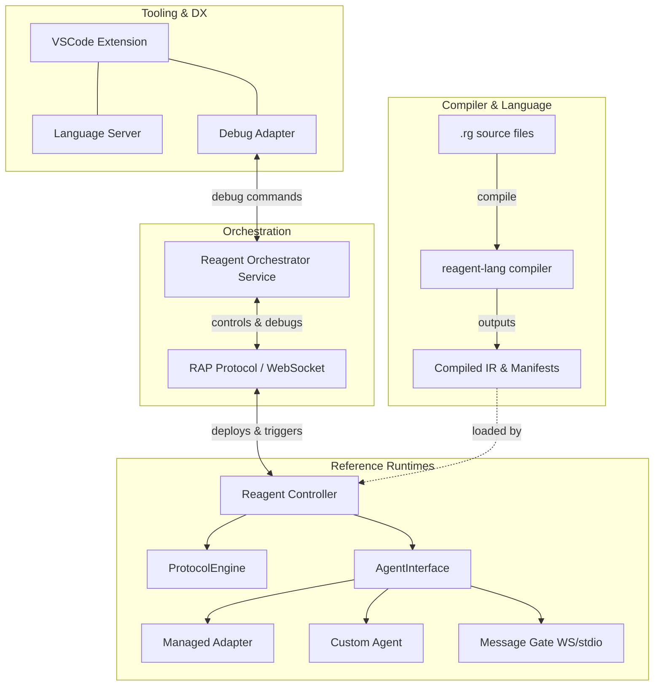
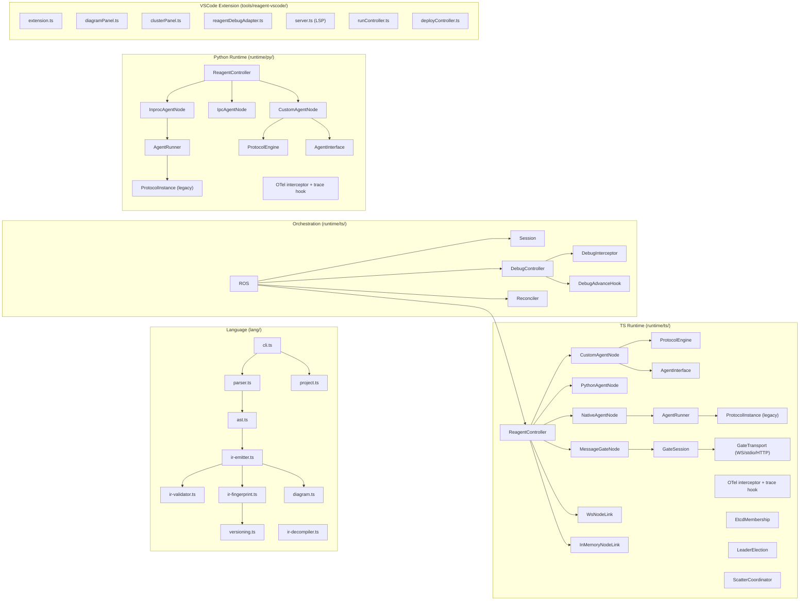

# Reagent Documentation Registry

This is the central entry point for understanding Reagent's architecture and navigating its documentation.

## 1. High-Level Architecture

Reagent is a language and toolchain for implementing agentic and distributed protocols. It separates **choreography** (the protocol, written in Reagent) from **computation** (agent decision-making, written in a host language like Python or TypeScript).

## 2. Document Registry

The `docs/` folder is split by temporal relevance:
- `current/` — Actively implemented features and canonical architecture docs.
- `future/` — Planned features, active backlog, and RFCs for upcoming changes.
- `archive/` — Historical references and superseded drafts.

### Core Specifications & Guides
| Area | Document | Description |
|---|---|---|
| **User Guide** | [user-guide.md](user-guide.md) | End-to-end how-to: project structure, CLI, running, and debugging. |
| **Language** | [lang-spec.md](lang-spec.md) | The definitive Reagent DSL specification (syntax, semantics, EBNF). |
| **Runtime Core** | [rc-spec.md](rc-spec.md) | ReagentController (RC) spec: `ProtocolEngine`, `AgentInterface`, envelope format. |

### Architecture Deep Dives
| Area | Document | Description |
|---|---|---|
| **Connectivity** | [connectivity.md](connectivity.md) | Routing, `AgentNode`, interceptors, `NodeLink`, scatter scaling, and etcd-based discovery. |
| **Orchestrator** | [orchestrator.md](orchestrator.md) | ROS architecture, RAP sub-protocols, debugging model (message + state level). |
| **ROS ↔ RC Interaction** | [ros-rc-interaction.md](ros-rc-interaction.md) | Current-state note on how ROS, RC, `RemoteNode`, and `mcp-gate` interact across control-plane and data-plane paths. |
| **Versioning** | [protocol-versioning.md](protocol-versioning.md) | Protocol identity, AST fingerprints, auto-semver, and the reconciler. |
| **Tooling & DX** | [dx-tooling.md](dx-tooling.md) | Visualizations, diagrams, cluster panel, visual debugger, and OTel integration. |
| **LSP** | [lsp.md](lsp.md) | Language Server Protocol architecture and features. |

### Specific Semantics & Use Cases
| Area | Document | Description |
|---|---|---|
| **Scatter / Gather** | [scatter-gather-semantics.md](scatter-gather-semantics.md) | Detailed semantics for parallel fan-out, branch isolation, and collection. |
| **NMMO** | [nmmo-reagent-support.md](nmmo-reagent-support.md) | Feature gaps and requirements for the Neural MMO multi-agent use case. |
| **Test Spec** | [test-spec.md](test-spec.md) | Test suite overview, file locations, and full test registry (~310 tests). |

### Future & Backlog
| Area | Document | Description |
|---|---|---|
| **Feature Matrix** | [../future/backlog.md](../future/backlog.md) | Compact matrix of planned work and upcoming features. |
| **Long-Term Vision** | [../future/backlog-far.md](../future/backlog-far.md) | Formal foundations (TLA+, MPST projection), target architecture. |
| **Resolve Policy** | [../future/resolve-policy.md](../future/resolve-policy.md) | (RFC) Agent platform, participant binding, resolve pipelines, spawn lifecycle. |
| **Composite Agent**| [../future/composite-agent.md](../future/composite-agent.md) | (RFC) Holonic agent pattern: inner RC behind a single AgentHandle facade. |

## 3. Component Map

## 4. Version Sync

| Component | Current | Source of truth |
|---|---|---|
| Language spec | v0.0.14 | `docs/current/lang-spec.md` |
| `@reagent/lang` | 0.0.8 | `lang/package.json` |
| `reagent-vscode` | 0.0.10 | `tools/reagent-vscode/package.json` |
| `rc-spec.md` | Draft v1 | `docs/current/rc-spec.md` |
| `@reagent/system` | — | `packages/reagent-system/reagent.json` |
