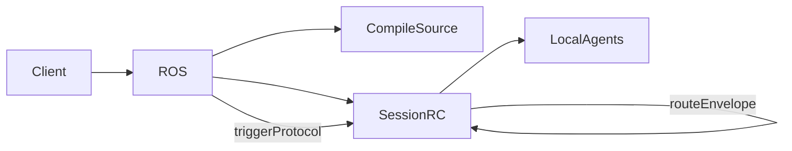
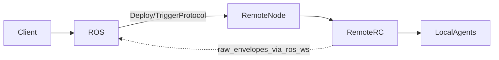
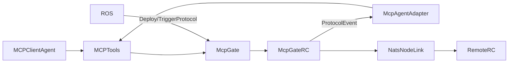

# ROS and RC: Current Interaction

This note describes how `ROS` and `RC` interact in the current codebase. It focuses on the implemented behavior in `runtime/ts/src`, using the current docs as secondary context where they still match the code.

## Scope

This is a current-state note, not a target-architecture document.

- `ROS` means `ReagentOrchestratorServer` in `runtime/ts/src/ros.ts`
- `RC` means `ReagentController` in `runtime/ts/src/reagent-controller.ts`
- `RemoteNode` means the WS-connected adapter node in `runtime/ts/src/remote-node.ts`
- `mcp-gate` means the MCP-connected adapter node in `runtime/ts/src/mcp-gate.ts`

## Components and Roles

### ROS

`ROS` is the control-plane service.

- Accepts RAP messages over WebSocket from IDE and CLI clients
- Compiles `.rg` sources into IR for local run flows
- Creates and owns per-run local sessions
- Tracks connected adapter nodes
- Distributes deploy and trigger commands to remote nodes
- Brokers cluster inspection and debug events
- Maintains an internal `systemRC` for self-hosting bootstrap

### RC

`RC` is the per-node runtime core.

- Registers local agents and their protocol graphs
- Maintains the routing table `agentName -> node`
- Creates per-agent transports
- Routes envelopes locally or through `NodeLink`
- Manages interceptors, triggers, cron, and optional membership
- Exposes node-level introspection through `inspect()`

### RemoteNode

`RemoteNode` is a ROS-managed adapter node with its own local `RC`.

- Connects to `ROS` over WebSocket
- Registers itself through RAP `Register`
- Receives `Deploy`, `TriggerProtocol`, `NodeInspect`, and `DebugCommand`
- Calls local `rc.registerAgent()` and `rc.triggerProtocol()`
- Sends traces and debug stop events back to `ROS`

### MCP Gate

`mcp-gate` is also a node with its own local `RC`, but it additionally exposes an MCP server to an external agent.

- Connects to `ROS` for registration, deploy, trigger, and inspect
- Uses `CustomAgentNode` plus `McpAgentAdapter` to keep the protocol engine inside the local `RC`
- Exposes zone events to the external MCP client via `reagent/register`, `reagent/wait_for_events`, and `reagent/respond`
- Uses `EtcdMembership` and `NatsNodeLink` for cross-node routing

## Current Interaction Modes

### 1. Local ROS Session

This is the most direct path.

1. A client sends `Compile` and `RunStart` to `ROS`.
2. `ROS` compiles the source and creates a fresh local `RC` for the session.
3. `ROS` registers all agents into that `RC`.
4. `ROS` starts the first protocol via `rc.triggerProtocol(...)`.
5. After startup, message routing stays inside the local `RC`.

This mode makes `ROS` both the entrypoint and the session owner, but not the message data-plane after the session starts.

### 2. Remote Adapter Node

This is the cluster path built around `RemoteNode`.

1. `RemoteNode` opens a WebSocket to `ROS`.
2. It sends RAP `Register`.
3. `ROS` sends RAP `Deploy` and `TriggerProtocol`.
4. `RemoteNode` translates these commands into local `RC` calls.
5. Raw envelopes may still be relayed through the same ROS WebSocket channel.

This path is partly link-based in intent, but still uses `ROS` as an active relay for some envelope traffic.

### 3. MCP Gate Node

This is the MCP-based external-agent path.

1. An MCP client starts `mcp-gate` as a subprocess.
2. `mcp-gate` creates its own local `RC`.
3. `mcp-gate` registers with `ROS` over WebSocket and receives deploy and trigger commands.
4. `mcp-gate` also starts `EtcdMembership` and creates `NatsNodeLink`s lazily for remote nodes.
5. The local `RC` routes protocol events to `McpAgentAdapter`, which exposes them through MCP tools.
6. The external MCP client consumes events and responds with updated context.

This path splits control-plane and data-plane more clearly than `RemoteNode`: deploy and trigger come from `ROS`, while cross-node data routing uses `etcd` plus `NatsNodeLink`.

## Control-Plane vs Data-Plane

### Control-Plane

Current control-plane responsibilities are centered in `ROS`.

- Client-facing RAP protocol over WebSocket
- Compile and local run orchestration
- Adapter registration
- Cluster deploy
- Cluster trigger
- Cluster inspection
- Cluster debug command fan-out
- Trace and stop-event forwarding back to clients

### Data-Plane

The current data-plane depends on the runtime mode.

#### Local ROS session

- Envelope routing is fully local inside the session `RC`
- `ProtocolInstance` sends through `transport.ref(...).sendEnvelope(...)`
- `RC` decides loopback vs remote routing

#### Remote adapter node

- Local routing happens inside the node `RC`
- Cross-node relay still depends on `ROS` WebSocket forwarding in practice
- `ROS` also accepts bare envelopes and forwards them to the target adapter

#### MCP gate node

- Local execution stays inside the node `RC`
- External agent participation is surfaced as MCP tool calls
- Cross-node discovery uses `EtcdMembership`
- Cross-node envelope delivery uses `NatsNodeLink`

## Channels and Message Types

### RAP / WebSocket

The implemented ROS-facing control surface is RAP over WebSocket.

Common messages:

- `Compile`, `CompileSuccess`, `CompileError`
- `RunStart`, `RunCompleted`, `RunFailed`
- `Register`, `Accepted`, `Rejected`
- `Deploy`, `Deployed`
- `TriggerProtocol`, `TriggerAck`, `TriggerFailed`
- `SetBreakpointsRequest`, `DebugCommand`, `DebugAck`, `Stopped`
- `GetState`, `StateSnapshot`, `InspectError`
- `NodeInspect`, `NodeInspectResult`
- `TraceEvent`
- `ClusterStatus`
- `DeployProject`, `DeployProjectSuccess`, `DeployProjectFailed`

### RC API

The key runtime boundary from orchestrator to controller is the direct RC API.

- `registerAgent()`
- `triggerProtocol()`
- `addNodeLink()`
- `registerRemoteAgent()`
- `inspect()`
- `startMembership()`

### MCP Tools

The MCP-facing surface is narrower and zone-oriented.

- `reagent/register`
- `reagent/unregister`
- `reagent/wait_for_events`
- `reagent/respond`
- `reagent/invoke`
- `reagent/list_protocols`
- `reagent/list_instances`
- `reagent/get_state`

Only the first three interaction tools are fully central to the current MCP event loop. The rest exist as API surface, but some are only partially wired from `mcp-gate`.

## Where ROS Is Needed

### ROS is not required for:

- Plain single-node execution with a directly created `RC`
- In-process local routing inside one node
- `etcd`-free local development
- `NATS`-free local development

### ROS is currently required for:

- RAP-based IDE and CLI orchestration
- Cluster deploy workflow
- Cluster trigger workflow
- Cluster inspection UX
- Current cluster debug UX
- Current `RemoteNode` and `mcp-gate` bootstrap path

## Current Optionality of NATS and etcd

### etcd

`etcd` is optional at the RC architecture level, but active in the current `mcp-gate` cluster path.

- Single-node `RC` works without `etcd`
- `rc.startMembership()` is optional
- `mcp-gate` currently assumes `EtcdStateStore` and `EtcdMembership`

### NATS

`NATS` is optional at the architecture level, but active in the current `mcp-gate` cross-node data-plane.

- Local ROS sessions do not require `NATS`
- `RemoteNode` currently uses the ROS WebSocket path instead of `NatsNodeLink`
- `mcp-gate` currently creates `NatsNodeLink`s to discovered remote nodes

## Mismatches and Technical Debt

### ROS self-hosting status is mixed

The code initializes `systemRC` inside `ROS`, but some docs still describe the orchestrator as not yet a full Reagent node. The implementation is therefore ahead of at least part of the narrative docs.

### RemoteNode does not fully follow the NodeLink model

`RemoteNode` constructs a `WsNodeLink`, but the current implementation still multiplexes control and envelope traffic directly over the ROS WebSocket and dispatches envelopes by hand. This keeps `ROS` in the data-plane more than the link model suggests.

### MCP gate mixes multiple roles

`mcp-gate` currently acts as:

- MCP server
- RC node
- cluster membership client
- NATS link bootstrapper
- ROS adapter

This makes it useful for experiments, but it also couples external-agent integration to cluster transport details.

### MCP surface is broader than the wired implementation

`mcp-gate` exposes `invoke`, `list_protocols`, `list_instances`, and `get_state` through `ReagentMcpServer`, but not all of these are fully backed by concrete handlers in the current `mcp-gate` setup.

### Docs and code diverge on connectivity

The docs often describe the target link-based topology where `ROS` is mostly control-plane, but the current implementation still has a hybrid shape:

- local run is direct RC orchestration inside `ROS`
- `RemoteNode` still depends on `ROS` for envelope relay
- `mcp-gate` already separates control-plane and data-plane more strongly

## Primary Source Files

Code:

- `runtime/ts/src/ros.ts`
- `runtime/ts/src/reagent-controller.ts`
- `runtime/ts/src/remote-node.ts`
- `runtime/ts/src/mcp-gate.ts`
- `runtime/ts/src/protocol-instance.ts`
- `runtime/ts/src/transport.ts`

Docs:

- `docs/current/orchestrator.md`
- `docs/current/rc-spec.md`
- `docs/current/connectivity.md`
- `docs/current/user-guide.md`
