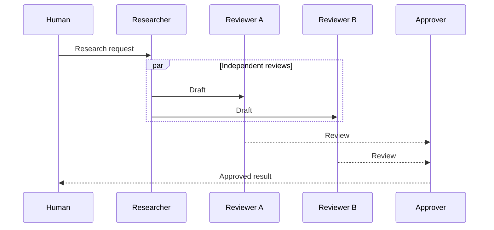
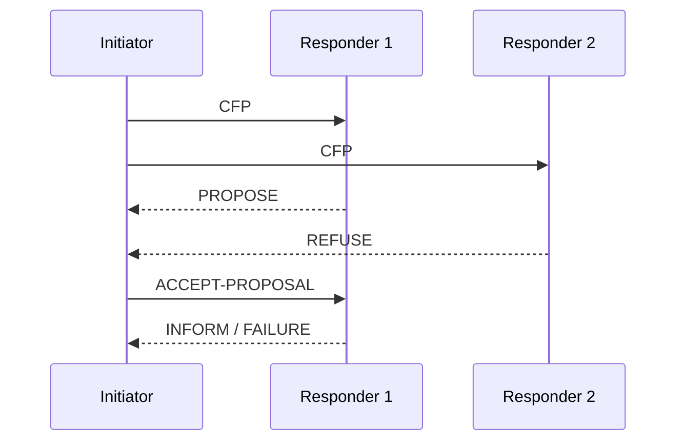
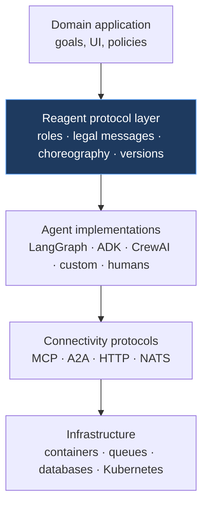

# Кто управляет разговором агентов?

## Сценарии, протоколы и runtime-ы мультиагентных платформ

Конкурентная карта для Reagent

Research snapshot · 30 September 2026

<!--
Цель деки — не доказать, что Reagent уникален. Цель — точно найти слой,
на котором он может быть полезен и отличим.
-->

---
transition: slide-left
---

# Одна задача — пять разных артефактов

Нужно выполнить один сценарий: **research → parallel review → approval → publish**.

  
<b>LangGraph</b> state graph

  
<b>AutoGen</b> team / GraphFlow

  
<b>CrewAI</b> Crew + Flow

  
<b>JADE</b> protocol behaviours

  
<b>Moise</b> organization scheme

<!--
Функционально эти системы могут решить одну задачу. Конкуренция начинается
не с feature checklist, а с вопроса: какой артефакт становится source of truth?
-->

---
transition: slide-left
layout: center
---

# Настоящий конкурент = descriptor + runtime

  

    
Descriptor

    
Как зафиксированы роли, порядок, branching, delegation и допустимые коммуникации?

  

  

    
Runtime

    
Кто исполняет, маршрутизирует, сохраняет состояние, восстанавливает и наблюдает swarm?

  

MCP/A2A без orchestration и single-agent SDK без scenario model — смежные слои, не прямые конкуренты.

---
transition: slide-left
---

# Три линии развития

  

    
Workflow / graph

    
LangGraph Microsoft Agent Framework Dapr Agents Google ADK CrewAI Flows

    
Primary artifact: application execution graph

  

  

    
Teams / swarms

    
AutoGen CrewAI Crews OpenAI Agents SDK CAMEL / AgentScope

    
Primary artifact: team policy and delegation

  

  

    
Protocols / organizations

    
JADE + FIPA JaCaMo + Moise Scribble / MPST Choral

    
Primary artifact: legal interaction or organization

  

LLM frameworks дали новую волну автономии. Protocol systems напоминают, что coordination — отдельная инженерная дисциплина.

---
transition: slide-left
---

# По каким осям сравниваем

  
<b class="text-blue-300">1. Source of truth</b> код, graph, config, SOP или protocol artifact

  
<b class="text-blue-300">2. Global view</b> виден ли весь разговор или только локальные handlers

  
<b class="text-blue-300">3. Communication semantics</b> messages/roles enforced или просто function outputs

  
<b class="text-blue-300">4. Control</b> deterministic edges, model routing, handoff, norms

  
<b class="text-blue-300">5. Durability</b> checkpoint, resume, queue, crash recovery

  
<b class="text-blue-300">6. Distribution</b> один process, workers, multi-node agent runtime

  
<b class="text-blue-300">7. Verification</b> type checks, graph validation, conformance, formal model

  
<b class="text-blue-300">8. Operability</b> deploy, tracing, HITL, debugging, ecosystem

«Есть multi-agent» — слишком слабый критерий. Важно, что именно runtime обещает сохранить и enforce.

---
transition: slide-left
---

# Карта рынка

Качественная карта: не benchmark и не ranking adoption

  

    
Сильный production runtime

    
LangGraph · Microsoft Agent Framework · Dapr Agents

    
Durability и workflow control сильнее protocol semantics

  

  

    
Богатые multi-agent patterns

    
AutoGen · Google ADK · OpenAI Agents SDK

    
Teams, handoffs, managers, loops; choreography обычно code-first

  

  

    
Явный interaction / organization contract

    
JADE/FIPA · JaCaMo/Moise · MPST/Scribble

    
Сильные semantics; слабее современный LLM/cloud DX

  

  

    
Целевая позиция Reagent

    
Global choreography + role runtime + agent integrations

    
Позиция убедительна только после hardening durability и enforcement

  

---
transition: slide-left
---

# LangGraph и Microsoft Agent Framework

## Самые сильные конкуренты на runtime-слое

  

    
LangGraph

    <ul class="text-sm mt-3 opacity-80">
      <li>state graph + conditional routing</li>
      <li>checkpoints на supersteps</li>
      <li>interrupt / resume / time travel</li>
      <li>durable queue workers в Agent Server</li>
    </ul>
    
Граф хранит состояние приложения; agents часто являются nodes/tools.

  

  

    
Microsoft Agent Framework

    <ul class="text-sm mt-3 opacity-80">
      <li>typed executors + edges</li>
      <li>Sequential / Concurrent / Handoff / Group Chat / Magentic</li>
      <li>BSP superstep execution</li>
      <li>Durable Task: sessions, recovery, distributed workers</li>
    </ul>
    
Очень близко к typed workflow runtime; global protocol не отдельный artifact.

  

Reagent сегодня проигрывает обоим в crash recovery, packaging и operational maturity.

Sources: LangGraph persistence · Microsoft Workflow concepts / Durable Extension

<!--
Не называем эти системы «просто графами». У них серьёзные runtime guarantees.
Отстройка Reagent должна быть на semantic artifact, а не на наличии branching.
-->

---
transition: slide-left
---

# Dapr Agents: сильный runtime без protocol DSL

  

    
Что уже решено

    <ul class="text-sm mt-3 opacity-80">
      <li><code>DurableAgent</code> поверх Dapr Workflows</li>
      <li>checkpointed LLM и tool interactions</li>
      <li>retries, recovery, deterministic execution</li>
      <li>virtual-actor identity and state</li>
      <li>independent services + Pub/Sub</li>
    </ul>
  

  

    
Что остаётся code-first

    <ul class="text-sm mt-3 opacity-80">
      <li>Dapr workflows and child calls</li>
      <li>message-router handlers</li>
      <li>topic and service topology</li>
      <li>нет global role/message choreography</li>
      <li>нет compiler-generated local projections</li>
    </ul>
  

Dapr закрывает runtime-часть обещания Reagent лучше, чем Reagent сегодня. Отстройка остаётся только на protocol semantics.

Sources: Dapr Agents Introduction · Core Concepts · Why Dapr Agents

---
transition: slide-left
---

# AutoGen и Google ADK

## Богатый словарь orchestration patterns

  

    <h3 class="text-purple-300">AutoGen</h3>
    

      
<b>GraphFlow</b> edges, parallel, conditions, loops

      
<b>SelectorGroupChat</b> model picks next speaker

      
<b>Swarm</b> decentralized handoffs

      
<b>Core runtime</b> lifecycle + messaging

    

  

  

    <h3 class="text-green-300">Google ADK</h3>
    

      
<b>Graph workflows</b> nodes, edges, routes, joins

      
<b>Workflow agents</b> sequential, parallel, loop

      
<b>Dynamic workflows</b> programmatic orchestration

      
<b>Resume</b> completed nodes restored; idempotency required

    

  

AutoGen описывает team dynamics. ADK — graph/composition runtime. Оба исполняют swarm, но не требуют global message choreography.

Sources: AutoGen GraphFlow/Swarm/Core · Google ADK graphs/resume

---
transition: slide-left
---

# CrewAI: роли есть, protocol — нет

  

    
Crews

    
Agents + roles + tasks + process

    

      <b>Sequential</b> — фиксированный порядок 
      <b>Hierarchical</b> — manager delegates and validates
    

  

  

    
Flows

    
Event-driven application workflow

    

      routing · conditions · state · persistence · resume/fork
    

  

CrewAI сам рекомендует для production начинать с <b>Flow</b> и встраивать Crew внутрь.

Следствие: production abstraction снова становится workflow вокруг agent team.

Sources: CrewAI Crews · Processes · Production Architecture · Flow persistence

---
transition: slide-left
---

# Swarm frameworks: SOP, planning, conversation

  

    
MetaGPT

    
Code = SOP(Team)

    
Roles watch upstream message/action types.

  

  

    
ChatDev

    
ChatChain + phases

    
JSON-configured role dialogues for software process.

  

  

    
CAMEL

    
Workforce

    
Planner decomposes and coordinator assigns workers.

  

  

    
AgentScope

    
Pipelines + MsgHub

    
Sequential/fanout execution and broadcast context.

  

Они доказывают спрос на <b>structured collaboration</b>.

Но scenario semantics остаётся в Python/config/prompts и редко становится independently verifiable contract.

Sources: MetaGPT · ChatDev paper · CAMEL Workforce · AgentScope pipelines

---
transition: slide-left
---

# FIPA → Reagent: protocol-first идея для современных агентов

  
<b>ACL semantics</b> performative, conversation-id, ontology

  
<b>Role behaviours</b> initiator / responder state machines

  
<b>Distributed runtime</b> containers, AMS, DF, transports

Reagent явно продолжает линию FIPA: переносит explicit interaction protocols в мир <b>LLM-, human- и tool-agents</b>.

Sources: JADE Technical Description · jade.proto · ContractNetInitiator

<!--
JADE/FIPA здесь не как прямой contemporary product competitor, а как
архитектурный предшественник и явный источник вдохновения Reagent.
Новизна Reagent — применение protocol-first модели к современным агентам,
global DSL и интеграция с актуальным agent/runtime stack.
-->

---
transition: slide-left
---

# JaCaMo + Moise: организация как программа

  

    
Structural

    
roles · groups · links · cardinalities

  

  

    
Functional

    
goals · missions · schemes · sequence/choice/parallel

  

  

    
Normative

    
obligations · permissions · deadlines

  

Отдельная organization specification используется и агентами, и runtime-ом, который её enforce.

Moise ближе к «constitutional layer». Reagent — к «conversation choreography».

Sources: moise-lang.github.io · Moise specification · JaCaMo organization artifacts

---
transition: slide-left
---

# Сравнение современных runtime-ов

| Platform | Scenario descriptor | Durable resume | HITL | Runtime shape |
|---|---|:---:|:---:|---|
| **LangGraph** | state graph / conditional edges | ●●● | ●●● | graph workers + Agent Server |
| **MS Agent Framework** | typed executors / edges / orchestrations | ●●● | ●●● | superstep workflow runtime |
| **Dapr Agents** | durable workflows / message routers / pubsub | ●●● | ●● | actors + distributed services |
| **AutoGen** | GraphFlow / team policy / handoffs | ● | ●● | AgentChat + Core runtime |
| **Google ADK** | workflow-agent composition | ●● | ●● | Runner + session services |
| **CrewAI** | Crew process + event-driven Flow | ●● | ●● | Flow runtime + Crews |

●●● = first-class documented capability · ●● = available with explicit setup · ● = limited/core-adjacent. Qualitative snapshot, not benchmark.

Branching, parallelism и handoffs уже commodity. Reagent нельзя позиционировать через этот feature list.

---
transition: slide-left
---

# Где конкуренты сильнее Reagent сегодня

  
<b>Durable execution</b> checkpoint/resume на уровне шага, а не только process record

  
<b>Runtime trust</b> стабильные failure semantics и production storage

  
<b>Packaging</b> installable SDK, version policy, hosted deployment

  
<b>Ecosystem</b> models, tools, connectors, cloud integrations

  
<b>Typed enforcement</b> MSAF validates edge compatibility; Reagent message schemas пока documentary

  
<b>Operational surface</b> queues, workers, auth, managed observability

Ширина архитектуры Reagent уже большая. Доверие к guarantees пока меньше.

---
transition: slide-left
---

# Где остаётся пространство для Reagent

  

    
Standalone protocol artifact

    
Coordination versioned отдельно от agent code и prompts.

  

  

    
Global choreography

    
Видно, кто кому что может отправить и в какой фазе.

  

  

    
Role-local projection

    
Один protocol компилируется в локальное поведение участников.

  

  

    
Cross-runtime enforcement

    
Managed, custom, gate и MCP agents под одним interaction contract.

  

Дифференциация — не «мы тоже запускаем граф», а <b>protocol is the product boundary</b>.

---
transition: slide-left
---

# Reagent должен занять отдельный слой

  
<b>Не заменять agent SDK</b> подключать их как behavior hosts

  
<b>Не заменять wire protocols</b> задавать legal conversations поверх них

---
transition: slide-left
---

# Что можно и нельзя заявлять

  

    <h3 class="text-green-300">Defensible</h3>
    <ul class="text-sm mt-3">
      <li>protocol — отдельный coordination artifact</li>
      <li>global choreography, не только app graph</li>
      <li>одна модель для heterogeneous participants</li>
      <li>путь к independent audit / conformance / verification</li>
      <li>wire-agnostic interaction layer</li>
    </ul>
  

  

    <h3 class="text-red-300">Не заявлять</h3>
    <ul class="text-sm mt-3">
      <li>«конкурентов нет»</li>
      <li>«никто не описывает multi-agent workflows»</li>
      <li>«первые исполняемые interaction protocols»</li>
      <li>«production durability уже решена»</li>
      <li>«typed/formal guarantees покрывают host code»</li>
    </ul>
  

Честная отстройка сильнее широкой претензии на уникальность.

---
transition: slide-left
---

# Стратегический вывод

  

    
1

    
Сузить wedge

    
TS-first approval-gated workflows для trusted agent teams.

  

  

    
2

    
Усилить contract

    
Typed messages, role projection conformance, branch semantics.

  

  

    
3

    
Догнать runtime

    
Checkpoint/resume, CI, packaging, auth, one golden path.

  

Новые hosts и transports — после того, как protocol guarantees стали сильнее обычного workflow graph.

---
transition: slide-left
layout: center
---

# Рынок уже умеет запускать swarm

Открытый вопрос — кто сможет сделать его взаимодействие

контрактом, а не побочным эффектом кода

Primary sources and full matrix: <code>competitors/files/research.md</code>

<!--
Финальная формула: Reagent не должен выигрывать количеством orchestration
patterns. Он должен выиграть тем, что coordination становится independently
versioned, inspectable and enforceable artifact.
-->

