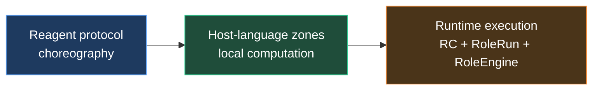
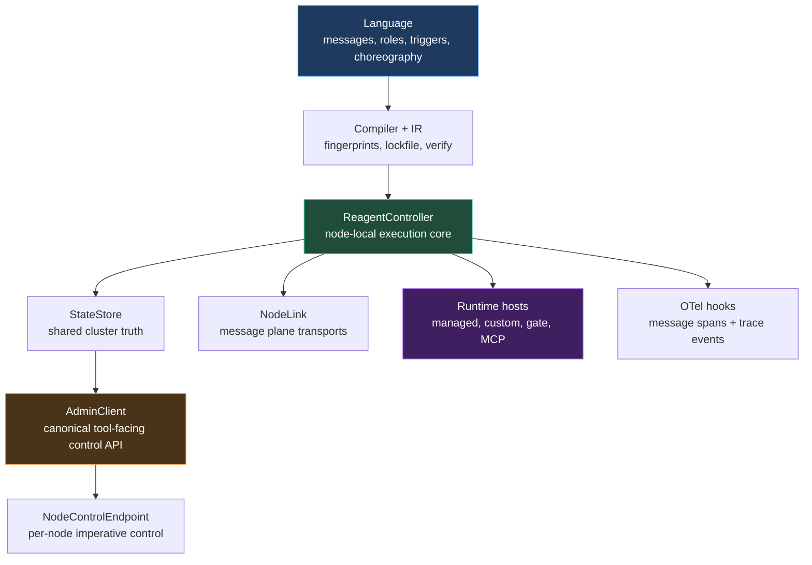
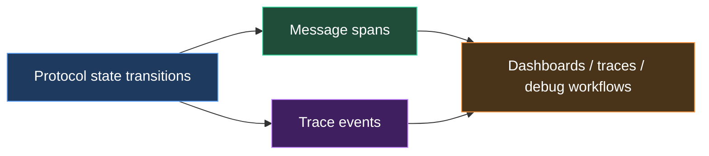

# Reagent

## Meta-language for an agentic control plane

Philosophy, architecture, and capability model for reliable agent systems

  Deep Dive · 2026

---
transition: slide-left
---

# The central problem

Modern agent systems have no shortage of intelligence.

They have a shortage of:

- control
- predictability
- communication discipline
- auditability
- operational trust

  The hardest part of agent systems is not making agents <strong>capable</strong>.
  It is making their behavior <strong>governable</strong>.

---
transition: slide-left
---

# Why free-form agent loops are not enough

ReAct-style loops are powerful because they are flexible.

They are also risky because they hide coordination inside:

- prompts
- tool-call policies
- local heuristics
- implicit message contracts
- runtime side effects

| Free-form loop | Protocol-governed system |
|---|---|
| hidden coordination | explicit interaction model |
| ad hoc communication | typed message steps |
| hard to constrain | runtime-enforced flow |
| hard to verify | formal protocol surface |
| hard to audit | traceable control path |

---
transition: slide-left
---

# Reagent's thesis

Interaction is a <strong class="text-blue-300">first-class citizen</strong>.

  

    
What Reagent makes explicit

    
participants, messages, triggers, control flow, invoke/spawn/scatter, resolution, protocol boundaries

  

  

    
What stays local to the agent

    
reasoning, tool use, domain logic, local state transitions, host-language execution, external integrations

  

  Reagent does not try to remove intelligence from agents.
  It moves <strong>coordination</strong> into a surface that can be read, enforced, traced, and verified.

---
transition: slide-left
---

# What Reagent is

From the current docs:

- Reagent is a **protocol language**
- actual computation happens in host-language zones
- the runtime injects execution bindings like `$ctx`, `$self`, `reagent`, and optional `$agent`
- protocol-level constructs govern communication, control flow, and orchestration

---
transition: slide-left
---

# Reagent as control plane

The key abstraction is not "agent framework".

It is **agentic control plane**:

- protocols define allowed interaction
- RC executes the protocol state machine
- tools and operators use a separate control surface to deploy, trigger, inspect, and stop

| Plane | Responsibility |
|---|---|
| Protocol plane | who can say what, when, and in what order |
| Runtime plane | execute the state machine on live agents |
| Control plane | manage nodes, deployments, and cluster operations |

---
transition: slide-left
---

# Architecture overview

---
transition: slide-left
---

# RC is the communication gate

Reagent's security idea is not "the agent promises to behave".

It is:

- the runtime advances through legal protocol states
- the engine enforces message ordering and protocol semantics
- protocol-visible communication is mediated by the state machine

  
Protocol-bounded interaction

  

    Agents do not simply invent arbitrary protocol-visible traffic.
    RC acts as the gate that constrains communication to what the protocol allows.
  

This is why Reagent is relevant in reliability-sensitive environments.

---
transition: slide-left
---

# Open to heterogeneous agents

The current runtime model already supports multiple agent forms on one execution architecture.

| Mode | Current path | Meaning |
|---|---|---|
| Managed | `ManagedBehaviorFactory` | `.rg` zones executed by the runtime |
| Custom / external | `CustomBehaviorFactory` | user-defined or provider-defined behavior |
| Gate-backed | `GateBehaviorFactory` | proxy behavior across process boundaries |
| MCP-facing | `mcp-gate` | protocol participation through MCP clients |

  One protocol-governed execution model across multiple runtime shapes.

---
transition: slide-left
---

# Distributed by design

Reagent is not tied to one process or one transport.

From the current architecture:

- node-local execution lives in `ReagentController`
- shared cluster truth lives in `StateStore`
- the message plane uses `NodeLink`
- the control plane uses `AdminClient` and per-node endpoints

| Layer | Current options |
|---|---|
| Message plane | in-memory, WebSocket, NATS |
| Cluster truth | in-memory, etcd |
| Runtime hosts | local nodes, `mcp-gate`, Claude host, test hosts |

This makes wide agent networks possible without collapsing everything into one monolithic orchestrator.

---
transition: slide-left
---

# Verification matters

Agent systems need stronger guarantees than "it usually works".

Reagent provides a verification path through:

- protocol-first choreography
- explicit control-flow constructs
- `verify` pipeline that generates TLA+ artifacts
- TLC execution when available

  
The point is not academic formalism.

  

    The point is to make coordination logic inspectable and analyzable before it becomes a production incident.
  

---
transition: slide-left
---

# Observability is part of the model

Reagent is designed to integrate with operational telemetry.

Current hooks include:

- message-level OpenTelemetry interception
- trace/event-level OpenTelemetry hooks

Reliable agent systems need protocol traces, not only model outputs.

---
transition: slide-left
---

# Capability-aware interaction

Current Reagent already supports agent metadata:

- tags
- capabilities
- labels

These feed resolve-time selection today.

Future `agent type` docs take the next step:

- agents declare what they can **consume**
- agents declare what they can **produce**
- the runtime can negotiate richer target-aware message forms

| Today | Future direction |
|---|---|
| resolve-time matching | full capability-aware interaction model |
| metadata on agent records | capabilities on agent types |
| mostly transport/runtime selection | content negotiation and response shaping |

---
transition: slide-left
---

# Why this matters strategically

The strongest Reagent use cases are not toy demos.

They are environments where agent communication must be:

- constrained
- observable
- governable
- distributable
- trustworthy

  

    
Medicine

    
approval paths, audit trails, bounded communication

  

  

    
Banking / finance

    
compliance, escalation, verifiable workflows, risk controls

  

  

    
Inter-org systems

    
wide protocol-governed networks across organizational boundaries

  

---
transition: slide-left
---

# Present and future fit together

The current docs already support the core story:

- protocol-first control
- RC-based distributed runtime
- heterogeneous agent hosting
- verification path through TLA+
- OpenTelemetry integration

The future docs extend that story through:

- `agent type`
- stronger scatter/gather semantics
- distributed `try/catch`
- richer resolve policies
- broader runtime-platform options

  Reagent is not only a language for agents.
  It is a path toward <strong>reliable agent infrastructure</strong>.

---
layout: center
class: text-center
---

# Reagent

Not just more autonomous loops.

An agentic control plane with protocol-bounded interaction.

Build agents that can coordinate at scale without giving up control.

