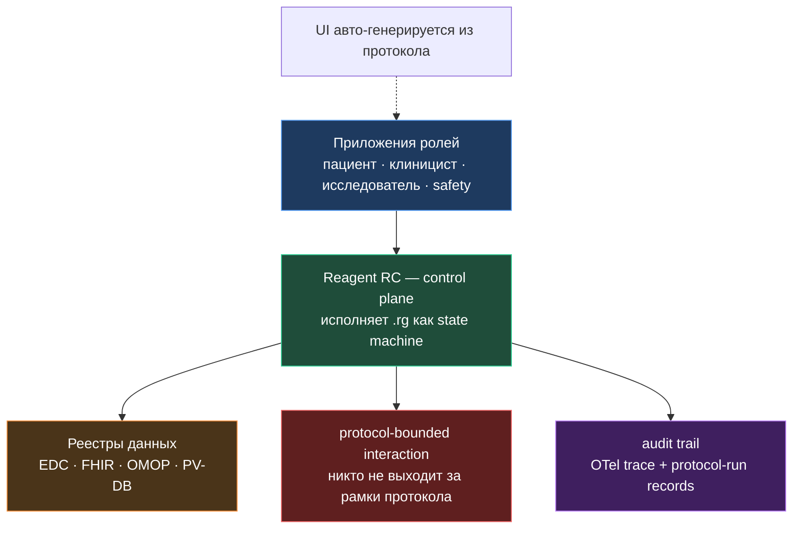
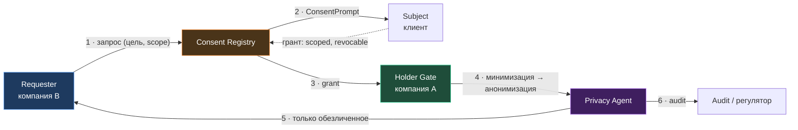
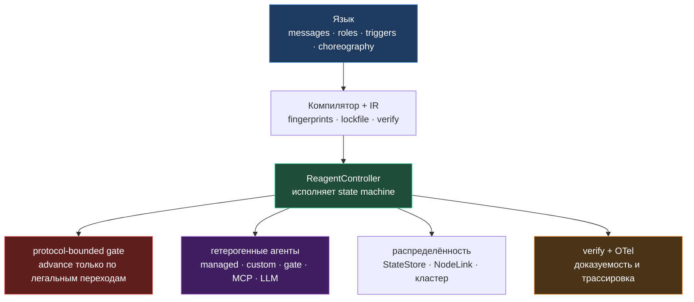

# Reagent

## Платформа для управляемых сетей агентов

<div class="pt-6 text-xl opacity-80">
Когда автономности уже достаточно, а управляемости — ещё нет
</div>

<div class="abs-br m-6 flex gap-2">
  <span class="text-sm opacity-50">Startupcamp · 2026</span>
</div>

<!--
План: от конкретной клинической сцены → платформа → пример протокола →
сертификация → второй кейс (межорг. обмен данными, data space) →
обобщение до языка и рантайма → видение.
-->

---
transition: slide-left
layout: center
---

# Начнём не с технологии

<div class="text-2xl mt-4 opacity-90">
а с одного пациента и одного дня в клинике.
</div>

<div class="mt-10 text-lg opacity-70">
Самый требовательный домен, который мы знаем:<br/>
здесь ошибка координации — это не баг, а вред здоровью.
</div>

---
transition: slide-left
---

# Сцена: один пациент — три протокола

Анна приходит на сеанс. За один визит её путь пересекает **три регламента**:

<div class="grid grid-cols-3 gap-4 mt-6">
  <div class="p-4 rounded-xl bg-blue-500/10 border border-blue-500/20">
    <div class="font-bold text-blue-300">Информированное согласие</div>
    <div class="text-sm mt-2 opacity-75">подписать актуальную версию до любых действий</div>
  </div>
  <div class="p-4 rounded-xl bg-green-500/10 border border-green-500/20">
    <div class="font-bold text-green-300">Психотерапевтическая сессия</div>
    <div class="text-sm mt-2 opacity-75">measurement-based care: шкалы, скрининг риска, план</div>
  </div>
  <div class="p-4 rounded-xl bg-purple-500/10 border border-purple-500/20">
    <div class="font-bold text-purple-300">Клиническое исследование</div>
    <div class="text-sm mt-2 opacity-75">eligibility, рандомизация, сбор данных, фармаконадзор</div>
  </div>
</div>

<div class="mt-8 p-4 rounded-lg bg-gray-800/50 text-center">
  Сегодня это три разные системы, три реализации, три цикла валидации —
  и человек посередине, который должен их состыковать вручную.
</div>

---
transition: slide-left
---

# Участники сцены — это роли

Одна и та же сцена, но у каждого — своё приложение и своя зона ответственности.

| Роль | Кто | Как подключён |
|---|---|---|
| **Patient** | пациент в приложении | gate / MCP |
| **Clinician** | терапевт ведёт протокол, апрувит шаги | gate + human-in-the-loop |
| **Investigator** | исследователь, sponsor-сторона | gate / admin |
| **Autonomous agent** | LLM: скрининг, скоринг, предзаполнение | managed зоны / MCP |
| **Data registry** | EDC / EHR(FHIR) / OMOP / PV-DB | custom factory |
| **Safety monitor** | safety officer, кризисная служба | роль с эскалацией |

<div class="mt-5 p-3 rounded-lg bg-blue-500/10 border border-blue-500/20 text-center text-sm">
  Протокол описывает, <strong>кто, что, кому и в каком порядке</strong> может сказать.
</div>

---
transition: slide-left
---

# Платформа: приложения + control plane + реестры



<div class="mt-4 text-center text-sm opacity-75">
  Кастомные протоколы разворачиваются на одну платформу.
  Клинический регламент перестаёт быть PDF — становится исполняемым артефактом.
</div>

---
transition: slide-left
---

# UI, ведомый протоколом

Приложение человека **не верстается под каждый протокол** — оно его проекция.

<div class="grid grid-cols-2 gap-6 mt-4">
  <div class="p-5 rounded-xl bg-blue-500/10 border border-blue-500/20">
    <div class="font-bold text-blue-300">Из протокола следует</div>
    <div class="text-sm mt-3 opacity-80">
      какие поля показать (схема сообщения)<br/>
      что сейчас легально отправить (состояние)<br/>
      порядок шагов (choreography)
    </div>
  </div>
  <div class="p-5 rounded-xl bg-green-500/10 border border-green-500/20">
    <div class="font-bold text-green-300">Что это даёт</div>
    <div class="text-sm mt-3 opacity-80">
      нет implementation gap между сайтами<br/>
      новый протокол → рабочий UI «из коробки»<br/>
      UI — часть сертифицированного артефакта
    </div>
  </div>
</div>

<div class="mt-6 p-3 rounded-lg bg-gray-800/50 text-center text-sm opacity-70">
  Roadmap-направление: требует UI-аннотаций в схемах сообщений. Но архитектурно
  UI выводится из того же артефакта, что и исполнение.
</div>

---
transition: slide-left
---

# Живой протокол: терапевтическая сессия с safety-границей

Measurement-based care: шкалы → **обязательный** скрининг риска → план.

```ts {all|9-12|14-17|19-24|all}
protocol TherapySession {
  participants:
    therapist [ts] initiator,   // human-in-the-loop
    client [ts],                // пациент в приложении
    assistAgent [ts],           // LLM-ко-терапевт
    crisisTeam [ts]             // кризисная служба

  // 1. валидированные шкалы
  therapist --> client: PHQ9 = { onReceive { $self.phq9 = $ctx.msg.total } }

  // 2. скрининг риска — ДО любого терапевтического контента
  therapist --> client: RiskScreen = { onReceive { $ctx.risk = $ctx.msg.riskLevel } }

  // 3. safety-граница: высокий риск → эскалация, минуя обычный поток
  alt ($ctx.risk == "high") {
    assistAgent --> client: SafetyPlan = { /* план безопасности */ }
    therapist  --> crisisTeam: Escalation = { onSend { $ctx.msg.reason = "C-SSRS high" } }
  } else {
    // обычный CBT-поток: план сессии, домашнее задание
    assistAgent --> therapist: SessionPlan = { /* ... */ }
    therapist  --> client: SessionPlan   = { /* ... */ }
  }
}
```

---
transition: slide-left
---

# Почему это не просто «ещё один workflow»

Тот же `.rg` мы можем **доказать**, а не только исполнить.

<div class="grid grid-cols-2 gap-6 mt-6">
  <div class="p-5 rounded-xl bg-green-500/10 border border-green-500/20">
    <div class="font-bold text-green-300">reagent verify → TLA+</div>
    <div class="text-sm mt-3 opacity-80">
      «risk-screen всегда исполняется до терапевтического контента»<br/>
      «из ветки high-risk достижима Escalation»
    </div>
  </div>
  <div class="p-5 rounded-xl bg-orange-500/10 border border-orange-500/20">
    <div class="font-bold text-orange-300">protocol-bounded interaction</div>
    <div class="text-sm mt-3 opacity-80">
      LLM-ассистент <strong>физически не может</strong> отправить пациенту
      или записать в реестр то, чего нет в протоколе
    </div>
  </div>
</div>

<div class="mt-6 p-4 rounded-lg bg-gray-800/50 text-center">
  Для клинициста, регулятора и страховщика это <strong>формальная гарантия
  safety</strong>, а не обещание в инструкции.
</div>

---
transition: slide-left
layout: center
---

# Теперь — коммерческий поворот

<div class="text-2xl mt-4 opacity-90">
Что если платформа сертифицирована,<br/>
а протоколы сертифицируются по отдельности?
</div>

---
transition: slide-left
---

# Боль сегодня: валидируется весь софт целиком

<div class="grid grid-cols-2 gap-6 mt-6">
  <div class="p-5 rounded-xl bg-red-500/10 border border-red-500/20">
    <div class="font-bold text-red-300">Как сейчас</div>
    <div class="text-sm mt-3 opacity-80">
      клиническое ПО (SaMD / EDC) валидируется как единое целое (CSV)<br/><br/>
      любая новая клиническая логика = новый код = новый цикл валидации<br/><br/>
      поэтому протоколы почти никогда не бывают «software-defined»
    </div>
  </div>
  <div class="p-5 rounded-xl bg-gray-800/50 border border-gray-600/30">
    <div class="font-bold opacity-90">Следствие</div>
    <div class="text-sm mt-3 opacity-75">
      долго, дорого, негибко<br/><br/>
      каждый сайт реализует регламент по-своему<br/><br/>
      изменение протокола = регуляторный проект на месяцы
    </div>
  </div>
</div>

---
transition: slide-left
---

# Идея Reagent: граница «платформа / протокол»

<div class="grid grid-cols-2 gap-6 mt-4">
  <div class="p-5 rounded-xl bg-blue-500/10 border border-blue-500/20">
    <div class="font-bold text-blue-300">Платформа</div>
    <div class="text-sm mt-3 opacity-80">
      RC + язык + компилятор + verifier + audit<br/><br/>
      стабильна, заморожена, <strong>сертифицирована один раз</strong>
    </div>
  </div>
  <div class="p-5 rounded-xl bg-green-500/10 border border-green-500/20">
    <div class="font-bold text-green-300">Протокол (.rg)</div>
    <div class="text-sm mt-3 opacity-80">
      конфигурация, а не код платформы<br/><br/>
      verified + зафиксирован fingerprint'ом<br/>
      не может выйти за рамки платформы
    </div>
  </div>
</div>

<div class="mt-6 p-4 rounded-lg bg-green-500/10 border border-green-500/20 text-center">
  Тогда валидация нового протокола ≈ проверка <strong>самого .rg</strong>
  (его клинического содержания + пройденной верификации),<br/> а не повторная
  ре-валидация всего стека ПО.
</div>

---
transition: slide-left
---

# Это опирается на реальные рамки

Не новая регуляторика — а новый технический носитель для существующей.

| Рамка | Что даёт Reagent |
|---|---|
| **GAMP 5** (configurable vs custom) | протокол как *configuration item*, не custom code |
| **FDA PCCP** (предодобренные изменения) | fingerprints MAJOR/MINOR/PATCH как носитель плана изменений |
| **IEC 62304** (lifecycle) | раздельные процессы для платформы и артефактов |
| **21 CFR Part 11 / Annex 11** | audit trail + signed deploy |
| **ICH GCP E6(R3)** | контроль версий протокола + аудит отклонений |

<div class="mt-5 p-3 rounded-lg bg-orange-500/10 border border-orange-500/20 text-center text-sm">
  Честно: это продуктовая гипотеза. Требует pre-submission диалога с регулятором.
  Но архитектура Reagent делает её правдоподобной.
</div>

---
transition: slide-left
---

# Питч одной фразой

<div class="text-xl mt-6 p-6 rounded-xl bg-blue-500/10 border border-blue-500/20">
Сертифицируете платформу <strong>один раз</strong>. Дальше каждый новый
клинический протокол — это <strong class="text-blue-300">верифицированный
артефакт</strong>, который проходит облегчённую протокол-уровневую
сертификацию, а не полную ре-валидацию ПО.
</div>

<div class="mt-6 text-lg opacity-85">
Reagent даёт регулятору три вещи, которых нет у обычного клинического софта:
</div>

<div class="grid grid-cols-3 gap-4 mt-4">
  <div class="p-4 rounded-xl bg-green-500/10 border border-green-500/20 text-center text-sm">формальное доказательство корректности</div>
  <div class="p-4 rounded-xl bg-purple-500/10 border border-purple-500/20 text-center text-sm">неизменяемый аудит-трейл</div>
  <div class="p-4 rounded-xl bg-orange-500/10 border border-orange-500/20 text-center text-sm">точную классификацию каждого изменения</div>
</div>

---
transition: slide-left
---

# Второй кейс: данные лежат в разных компаниях

«Частная модель пациента» собирается из фрагментов у разных держателей —
лаборатория, клиника, носимые устройства, страховая. Никто не отдаёт **сырые**
данные, но обмен нужен. Тот же протокольный аппарат задаёт **три точки контроля**:

<div class="grid grid-cols-3 gap-4 mt-6">
  <div class="p-4 rounded-xl bg-blue-500/10 border border-blue-500/20">
    <div class="font-bold text-blue-300">Консент субъекта</div>
    <div class="text-sm mt-2 opacity-75">first-class шаг: purpose-bound, scoped, с TTL, <strong>отзываемый</strong></div>
  </div>
  <div class="p-4 rounded-xl bg-green-500/10 border border-green-500/20">
    <div class="font-bold text-green-300">Гейт держателя</div>
    <div class="text-sm mt-2 opacity-75">проверка гранта + <strong>минимизация scope</strong> (только разрешённое согласием)</div>
  </div>
  <div class="p-4 rounded-xl bg-purple-500/10 border border-purple-500/20">
    <div class="font-bold text-purple-300">Анонимизация на источнике</div>
    <div class="text-sm mt-2 opacity-75">сырой PII <strong>не покидает</strong> организацию: наружу — только обезличенное</div>
  </div>
</div>

<div class="mt-6 p-3 rounded-lg bg-gray-800/50 text-center text-sm opacity-80">
  Паттерн <strong>data space</strong> (EHDS · Gaia-X · IDS), но соглашение об обмене —
  не PDF-policy, а <strong>исполняемый верифицируемый .rg</strong>.
</div>

---
transition: slide-left
---

# Обмен данными: что мы доказываем



<div class="grid grid-cols-2 gap-4 mt-3">
  <div class="p-4 rounded-xl bg-green-500/10 border border-green-500/20 text-sm">
    <strong class="text-green-300">verify (инварианты как теоремы)</strong><br/>
    I1 · нет данных без согласия<br/>
    I2 · нет egress без анонимизации<br/>
    I3 · released ⊆ consent.scope
  </div>
  <div class="p-4 rounded-xl bg-orange-500/10 border border-orange-500/20 text-sm">
    <strong class="text-orange-300">P4 · contract execution</strong><br/>
    исполняемое соглашение об обмене между
    <strong>взаимно-недоверяющими сторонами</strong> — без trust-overhead блокчейна
  </div>
</div>

<div class="mt-3 text-center text-xs opacity-60">
  Честно: Reagent гарантирует <em>маршрут</em> через privacy-гейт и минимизацию,
  но достаточность обезличивания — отдельный статистический анализ.
</div>

---
transition: slide-left
layout: center
---

# От частного — к общему

<div class="text-2xl mt-4 opacity-90">
Клиника — это <strong>один экземпляр</strong> общей машины.
</div>

<div class="mt-8 text-lg opacity-70">
То же самое нужно банкам, страхованию, цепочкам поставок,<br/>
межорганизационным процессам — везде, где взаимодействие<br/>
должно быть управляемым, верифицируемым и аудируемым.
</div>

---
transition: slide-left
---

# Reagent — язык: взаимодействие как первоклассный объект

Вместо описания жёстких свойств агентов — описываем **взаимодействия**, которые
хотим видеть в сети. Как реакции в химии.

<div class="grid grid-cols-2 gap-6 mt-6">
  <div class="p-5 rounded-xl bg-blue-500/10 border border-blue-500/20">
    <div class="font-bold text-blue-300">Протокол делает явным</div>
    <div class="text-sm mt-3 opacity-80">участники, типизированные сообщения, триггеры, control flow, invoke / spawn / scatter, resolve, границы протокола</div>
  </div>
  <div class="p-5 rounded-xl bg-green-500/10 border border-green-500/20">
    <div class="font-bold text-green-300">Остаётся локальным агенту</div>
    <div class="text-sm mt-3 opacity-80">рассуждение, использование инструментов, доменная логика, исполнение в host-языке (зоны)</div>
  </div>
</div>

<div class="mt-6 p-4 rounded-lg bg-gray-800/50 text-center">
  Reagent не убирает интеллект из агентов. Он выносит <strong>координацию</strong>
  в поверхность, которую можно читать, исполнять, верифицировать и аудировать.
</div>

---
transition: slide-left
---

# Reagent — рантайм: control plane, а не agent framework



<div class="mt-3 text-center text-sm opacity-70">
  Один протокол-управляемый исполнитель для разных форм агентов и узлов.
</div>

---
transition: slide-left
---

# Зачем это всё — картина будущего

В обозримом будущем — кибер-физический рынок из людей, программных и физических
агентов. Доля агентов в цепочках производства, логистики, торговли, регуляции
будет только расти.

<div class="grid grid-cols-2 gap-6 mt-5">
  <div class="p-5 rounded-xl bg-red-500/10 border border-red-500/20">
    <div class="font-bold text-red-300">Два риска автономии</div>
    <div class="text-sm mt-3 opacity-80">
      <strong>Ненадёжность:</strong> сложные динамические системы, малое
      отклонение контекста → большое отклонение поведения<br/><br/>
      <strong>Самоорганизация:</strong> искусственные «личности» и
      меметическая координация агентов в нежелательных акторов
    </div>
  </div>
  <div class="p-5 rounded-xl bg-blue-500/10 border border-blue-500/20">
    <div class="font-bold text-blue-300">Два подхода к безопасности</div>
    <div class="text-sm mt-3 opacity-80">
      <strong>Сегодня:</strong> изоляция и фильтрация — сэндбоксы, политики,
      фильтры поверх автономии<br/><br/>
      <strong>Reagent:</strong> безопасность <strong>by construction</strong> —
      мы описываем сеть допустимых взаимодействий
    </div>
  </div>
</div>

---
transition: slide-left
layout: center
class: text-center
---

# Reagent

<div class="text-2xl opacity-85 mt-4">
Не больше автономных циклов.
</div>

<div class="text-3xl font-bold text-blue-300 mt-6">
Управляемая сеть взаимодействий — с доказуемой безопасностью.
</div>

<div class="mt-8 text-lg opacity-65">
От сертифицированного клинического протокола<br/>
до control plane для кибер-физического рынка.
</div>
