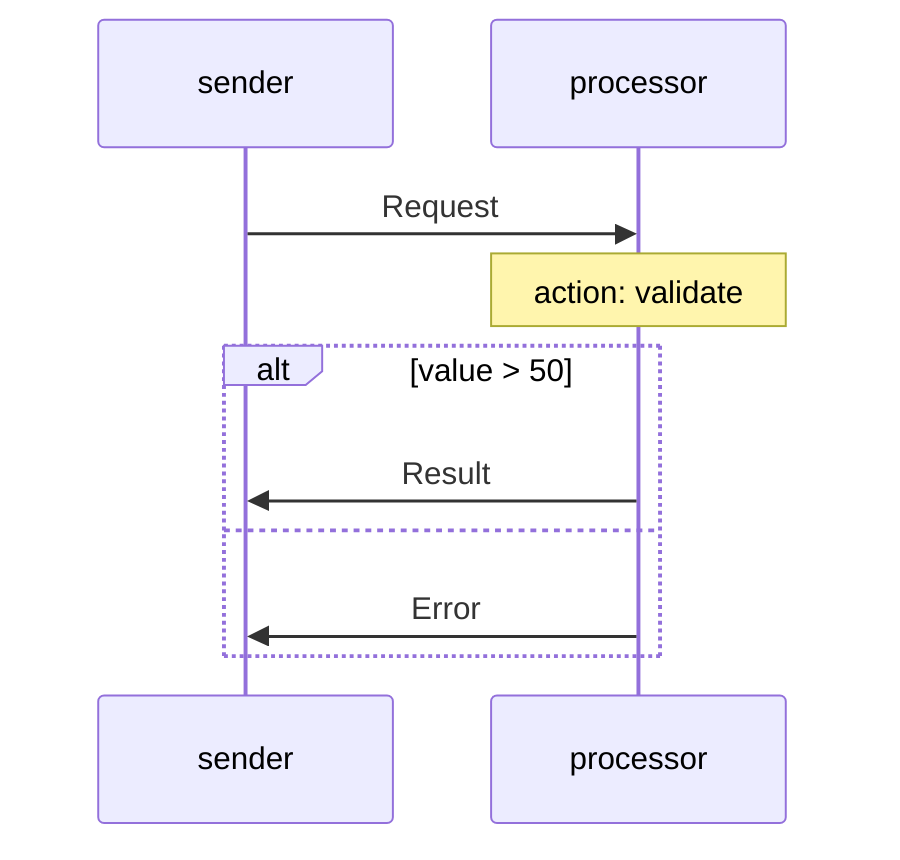
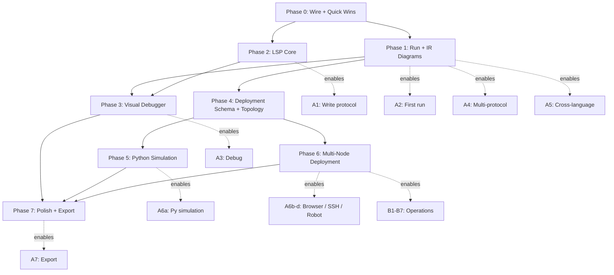

# Reagent Developer Experience & Tooling

Version: draft-1
Date: 2026-02-21
Milestone: M7-DX

---

## 1. Overview

This milestone turns Reagent from a language with test-driven runtimes into a **human-usable tool** — with interactive visualization, one-click execution, and a visual debugger.

### What exists today

| Component | Status |
|---|---|
| TextMate grammar (syntax highlighting) | Done — full `.rg` coverage incl. zone keywords (`await`, `None`, `$agent`, Python/JS builtins) |
| `.rg` file icon (benzene hexagon) | Done — light/dark SVG icons |
| Embedded language support (completion, hover, go-to-def in zones) | Done — virtual document delegation to host-language LSPs |
| Reagent LSP (language server for `.rg` itself) | Done — symbols, go-to-def, hover, completion, diagnostics. See [lsp.md](lsp.md) |
| DAP debug adapter → ROS | Done — breakpoints (4 types), step/continue, variable inspection |
| ROS manager | Done — TCP port probe, adopt existing, `freePort()` stale cleanup |
| Debug panel webview (trace timeline, agent state, held messages) | Done — wired to debug adapter events |
| Inline value decorations (`$ctx`/`$self`/`$flow` at paused line) | Done — wired via `pushStateToSinks()` |
| `inspectAgent` command | Done — GetState → Output channel with InspectError handling |
| IR-driven protocol diagrams (sequence + state machine) | Done — live reload on `.rg` save, click-to-source, role selector, zone summaries, nested frame margins |
| Project overview diagram (agents/roles/protocols) | Done — scoped to `reagent.json`, three-column layout, click-to-navigate |
| Self-contained VSIX packaging | Done — bundled `lang/dist` compiler, no source tree dependency |
| One-click run (no debug) | Done — `RunController`, CodeLens ▶ Run on `protocol` lines |
| Deployment topology view | UX mockup done — multi-RC nodes, agents, links, deploy actions |
| Mermaid / export | Not started |

The Reagent LSP is implemented and provides single-file intelligence: document symbols, go-to-definition, hover, context-aware completion, and parse + semantic diagnostics. For the full LSP design, current state, and backlog see **[lsp.md](lsp.md)**.

### Design goals

1. **Prototype-first** — build UX mockups (hardcoded SVGs in webview) before committing to rendering libraries or LSP architecture. Validate layout, interactions, and information density with real `.rg` examples.
2. **Interactive protocol diagram** that works in both design mode (editing `.rg`) and debug mode (live execution).
3. **Visual debugger** — step through a protocol and see the current state highlighted on the diagram, with `$ctx`/`$self` on hover.
4. **Reagent Language Server** — LSP for `.rg` files: completion, hover, diagnostics, go-to-definition, rename, document symbols.
5. **One-click run** — execute a `.rg` file without breakpoints, see results.
6. **Export** — generate Mermaid/SVG sequence diagrams from IR or traces for docs/Notion.
7. **Wire existing features** — connect the debug panel and inline values that are already built but disconnected.

### Non-goals (M7)

- Visual protocol editor (drag-and-drop to create `.rg` files).
- Remote multi-node debugging.
- Performance profiling.

---

## 2. Reagent Language Server (LSP)

### 2.1 Why LSP

The current extension provides syntax highlighting (TextMate) and embedded language support (virtual document delegation), but **zero intelligence for the Reagent DSL itself**. A developer writing `.rg` files gets no help with protocol structure, message references, role names, or participant lists.

An LSP transforms the editing experience:

| Feature | What it does | How it helps |
|---|---|---|
| **Completion** | Suggest `protocol`, `role`, `agent`, `message`, participant names, message names, role names in `plays`/`runs`/`extends`, control flow keywords | Faster authoring, discoverability |
| **Hover** | Show message schema on hover over message name in a step; show role definition on hover over role name; show protocol signature | Understanding without jumping |
| **Go to Definition** | Message name → `message Name { }` declaration; role name → `role Name { }` definition; protocol name → `protocol Name { }` definition; import path → imported file | Navigation |
| **Find References** | Where is message `X` used? Which agents run role `Y`? Which protocols does role `Z` play? | Refactoring confidence |
| **Rename** | Rename a message/role/agent across all usages in the file (and across imports) | Safe refactoring |
| **Diagnostics** | Real-time errors: undefined message name, undefined role, type mismatches in message fields, missing participants, unused imports | Instant feedback (no CLI compile needed) |
| **Document Symbols** | Outline view: protocols, roles, agents, messages as a tree | Navigation in large files |
| **Code Actions** | Quick-fix: "Add missing participant", "Generate agent for role", "Import protocol" | Productivity |
| **Signature Help** | Show protocol input schema when typing `invoke Proto(...)` | Correctness |
| **Semantic Tokens** | Differentiate message names, role names, agent names, protocol names beyond TextMate regex | Richer highlighting |

### 2.2 Architecture

```
┌──────────────────────────────┐     ┌──────────────────────────────┐
│  VSCode Extension (client)   │     │  Reagent Language Server     │
│                              │     │  (Node.js process)           │
│  vscode-languageclient ──────│────►│  vscode-languageserver       │
│                              │     │                              │
│  TextMate grammar (stays)    │     │  ┌────────────────────────┐  │
│  Virtual doc delegation      │     │  │  @reagent/lang          │  │
│  (stays for zone code)       │     │  │  parser → AST           │  │
│                              │     │  │  ir-emitter → IR        │  │
│  DAP adapter (stays)         │     │  │  ir-validator → diags   │  │
│  Diagram panel (stays)       │     │  │  source-map             │  │
│                              │     │  └────────────────────────┘  │
│                              │     │                              │
│                              │     │  AST index (per-document):   │
│                              │     │  - protocols, roles, agents  │
│                              │     │  - messages, imports         │
│                              │     │  - symbol table              │
└──────────────────────────────┘     └──────────────────────────────┘
```

The language server is a **separate Node.js process** using `vscode-languageserver` / `vscode-languageclient`. It reuses `@reagent/lang` (the existing compiler) for parsing and validation.

Key design decisions:

- **Reuse the existing parser**: the `@reagent/lang` parser already produces a complete AST with source locations. The LSP wraps it with incremental re-parsing on text changes.
- **AST-level intelligence**: most features (completion, hover, go-to-def, symbols) work at the AST level — no IR needed. Diagnostics can optionally run the IR emitter + validator for deeper checks.
- **Incremental validation**: on every keystroke, re-parse the document and update the AST index. Run IR validation on save (or with a debounce) to avoid lag.
- **Multi-file support**: `import "path"` resolution. The LSP maintains a workspace-level index of all `.rg` files for cross-file go-to-definition and find-references.
- **Coexistence with virtual doc delegation**: the LSP handles `.rg` constructs; the existing virtual document provider continues handling zone code delegation to TypeScript/Python language servers.

### 2.3 Completion details

| Context | Completions offered |
|---|---|
| Top-level | `protocol`, `role`, `agent`, `message`, `import` |
| Inside `participants:` | Known role names from the file + imports |
| Inside protocol body | Arrow syntax (`A --> B: `), control flow (`alt`, `loop`, `par`, `wait`, `timeout`, `try`, `invokes`, `spawns`, `scatter`), participant names |
| After `-->` arrow | Participant names |
| After `: ` (message position) | Defined message names |
| Inside `role ... { plays` | Protocol names + `as` + role names |
| Inside `agent ... runs` | Role names |
| Inside `role ... extends` | Other role names |
| Inside `on ` (lifecycle) | `protocolStarted`, `protocolCompleted`, `protocolFailed`, `protocolEvent` |
| After `invokes` / `spawns` | Protocol names |

### 2.4 Diagnostics

Real-time (on parse):
- Syntax errors (from parser).
- Undefined participant in message step.
- Undefined message name (if `message` declarations exist).
- Duplicate protocol/role/agent/message names.
- Missing `participants` or `initiator` in protocol.

On save / debounced (from IR validator):
- Role plays a protocol it's not a participant of.
- Agent runs a role that doesn't exist.
- `extends` cycle detection.
- Unused imports.
- Type mismatches in message fields.

### 2.5 LSP file structure

| File | Purpose |
|---|---|
| `tools/reagent-vscode/server/src/server.ts` | LSP server entry point, capabilities, request handlers |
| `tools/reagent-vscode/server/src/astIndex.ts` | Per-document AST index: symbols, references, scopes |
| `tools/reagent-vscode/server/src/workspaceIndex.ts` | Cross-file index: imports, global symbol table |
| `tools/reagent-vscode/server/src/completionProvider.ts` | Context-aware completion |
| `tools/reagent-vscode/server/src/hoverProvider.ts` | Hover information (message schema, role def, protocol signature) |
| `tools/reagent-vscode/server/src/definitionProvider.ts` | Go-to-definition |
| `tools/reagent-vscode/server/src/referencesProvider.ts` | Find all references |
| `tools/reagent-vscode/server/src/symbolProvider.ts` | Document symbols (outline) |
| `tools/reagent-vscode/server/src/diagnosticsProvider.ts` | Real-time + IR-level diagnostics |
| `tools/reagent-vscode/server/src/semanticTokensProvider.ts` | Semantic token classification |
| `tools/reagent-vscode/server/src/renameProvider.ts` | Rename symbol |
| `tools/reagent-vscode/server/package.json` | Server dependencies (`vscode-languageserver`, `@reagent/lang`) |

---

## 3. Visualization architecture

### 3.1 Diagram as a WebviewPanel

The diagram lives in a **WebviewPanel** opened beside the active `.rg` editor. This preserves all existing functionality (TextMate grammar, embedded language delegation, DAP adapter, debug sidebar).

```
┌─────────────────────────┐  ┌──────────────────────────────┐
│  .rg editor (standard)  │  │  Diagram WebviewPanel        │
│                         │  │                              │
│  syntax highlighting    │  │  ┌────────────────────────┐  │
│  zone completion/hover  │  │  │  Sequence view          │  │
│  breakpoint gutter      │  │  │  (all-roles timeline)   │  │
│  inline $ctx/$self      │  │  └────────────────────────┘  │
│                         │  │  ┌────────────────────────┐  │
│  ←── click node ───────►│  │  │  State machine view     │  │
│  ←── cursor sync ──────►│  │  │  (per-role IRGraph)     │  │
│                         │  │  └────────────────────────┘  │
│                         │  │                              │
│                         │  │  View toggle: [Seq] [State]  │
│                         │  │  Role selector (state view)  │
└────────┬────────────────┘  └──────────────┬───────────────┘
         │                                  │
         │  DAP events                      │  postMessage
         │                                  │
         ▼                                  ▼
    ┌───────────────────────────────────────────┐
    │  Extension Host                            │
    │                                            │
    │  ReagentDebugAdapter (existing)            │
    │  DiagramController (new)                   │
    │  RunController (new)                       │
    └──────────────────┬────────────────────────┘
                       │ RAP/WS
                       ▼
                  ROS (existing)
```

Why not a custom editor or sidebar integration:

- **Custom editor** replaces the standard text editor for `.rg` — breaks existing embedded language support and adds massive complexity.
- **Sidebar** is too narrow (300–400px) for interactive diagrams.
- **WebviewPanel** is opened beside the editor via `vscode.ViewColumn.Beside`, preserves everything, and can be closed/reopened independently.

### 3.2 Two diagram views

| View | What it shows | Data source | Layout |
|---|---|---|---|
| **Sequence view** | Protocol choreography. Vertical participant lifelines, horizontal message arrows, `alt`/`loop`/`par` boxes. | Compiled IR (all roles combined) or `.rg` AST | Custom SVG (columns = participants, rows = steps) |
| **State machine view** | Per-role IRGraph. Nodes = states (colored by kind), edges = transitions (labeled). | Single `IRGraph` for selected role | ELK.js layout + custom SVG rendering |

Toggle between views with a tab bar at the top. State machine view has a role selector dropdown.

### 3.3 Rendering stack

**ELK.js** for state machine layout + **custom SVG** for both views.

Rationale (vs alternatives):

| Option | Rejected because |
|---|---|
| Mermaid.js | ~2.5MB bundle, no interactive elements on sequence diagrams, full re-render on every update |
| Cytoscape.js | Excellent for graphs, but cannot do sequence diagrams — would need two libraries |
| React Flow | Adds React dependency (~150KB), overkill for read-only visualization |
| Sprotty | Purpose-built for DSL visualization in VSCode, but steep learning curve and framework lock-in |
| D3.js | Maximum flexibility, but building both diagram types from scratch is high effort |

**ELK.js** provides best-in-class hierarchical layout (handles ports, edge routing, compound nodes for `par`/`loop` nesting). ~200KB gzipped for the worker. Custom SVG gives full control over interactivity with near-zero overhead.

For sequence diagrams: the layout algorithm is straightforward (participants as columns, messages as rows with arrows, nested boxes for control flow) — no graph layout library needed. Custom SVG directly.

### 3.4 Data flow

#### Design mode (no debug session)

```
.rg file change
  → extension host compiles via @reagent/lang (in-process, no ROS needed)
  → sends compiled IR + source map to diagram webview via postMessage
  → webview renders static diagram
  → click node → postMessage to extension → editor.revealRange() to source line
  → cursor move in editor → postMessage to webview → highlight corresponding node
```

#### Debug mode (active DAP session)

```
ROS ──RAP──► ReagentDebugSession
                    │
                    ├── DAP 'stopped' event ──► VSCode Debug UI (standard)
                    │
                    ├── custom event to DiagramController
                    │     │
                    │     ├── postMessage('highlightState', {stateId, agentName})
                    │     ├── postMessage('updateCtx', {ctx, self, flow})
                    │     ├── postMessage('addTrace', traceEvent)
                    │     └── postMessage('dimCompleted', stateId[])
                    │     ▼
                    │   Diagram WebviewPanel
                    │     └── SVG: .active class on current node
                    │         .completed class on visited nodes
                    │         hover tooltip shows live $ctx/$self
                    │
                    ├── fires updateDebugPanel() ──► Debug sidebar
                    │     └── addTrace(), updateAgentState(), updateHeldMessages()
                    │
                    └── fires showInlineValues() ──► Inline decorations
                          └── $ctx.key = value at paused line
```

---

## 4. Sequence diagram rendering

### 4.1 Visual structure

```
  ┌─────────┐         ┌─────────┐         ┌─────────┐
  │ sender  │         │processor│         │ monitor │
  └────┬────┘         └────┬────┘         └────┬────┘
       │                   │                   │
       │──── Request ─────►│                   │
       │                   │                   │
       │                   ├─ action: validate │
       │                   │                   │
       │   ┌─── alt ───────────────────────┐   │
       │   │ [value > 50]                  │   │
       │   │  │◄── Result ─────│           │   │
       │   ├───────────────────────────────┤   │
       │   │ [else]                        │   │
       │   │  │◄── Error ──────│           │   │
       │   └───────────────────────────────┘   │
       │                   │                   │
       │   ┌─── par ───────────────────────┐   │
       │   │  │──── Notify ───────────────►│   │
       │   │  │──── Log ──────►│           │   │
       │   └───────────────────────────────┘   │
       ▼                   ▼                   ▼
```

### 4.2 Mapping IR to sequence elements

| IR construct | Sequence element |
|---|---|
| `send` + `receive` states (matched pair across roles) | Horizontal arrow between lifelines |
| `action` state | Self-arrow or annotation on lifeline |
| `guard(expression)` + transitions with `else` | `alt` box with condition labels |
| `guard(xor)` + branching transitions | `alt` box (XOR = decided by one role) |
| `fork` / `join` | `par` box enclosing parallel branches |
| `timer` | Wait annotation (⏱ icon + duration) |
| `invoke` | Nested sub-diagram (or collapsed box with label) |
| `spawn` | Async arrow (dashed) to spawned sub-diagram |
| `scatter` | Multiple arrows fanning out to dynamic participants |
| `error` (try/catch) | Box around try block; error arrow to catch handler |

### 4.3 Source generation

The sequence diagram is generated from the **combined protocol IR** — not from a single role's IR, but by interleaving all roles' IRGraphs based on message matching:

1. Start from the initiator role's `initial` state.
2. Walk states in execution order. For `send` states, find the matching `receive` in the target role.
3. Emit a horizontal arrow for each send/receive pair.
4. When encountering control flow (guard, fork, timer), emit the corresponding box structure.
5. Each element carries a `sourceMap` reference for click-to-source navigation.

---

## 5. State machine diagram rendering

### 5.1 Visual structure

Each IRGraph is rendered as a directed graph:

- **Nodes** are colored/shaped by state kind:

| Kind | Shape | Color |
|---|---|---|
| `initial` | Circle (●) | Gray |
| `terminal` | Double circle (◉) | Green (completed) / Red (failed) |
| `send` | Rectangle with ▶ icon | Blue |
| `receive` | Rectangle with ◀ icon | Orange |
| `action` | Rectangle with ⚙ icon | Purple |
| `guard` | Diamond (◇) | Yellow |
| `fork` | Horizontal bar (━━━) | Dark |
| `join` | Horizontal bar (━━━) | Dark |
| `timer` | Rectangle with ⏱ icon | Teal |
| `error` | Rectangle with ⚠ icon | Red |
| `invoke` | Double rectangle (▭▭) | Indigo |
| `spawn` | Dashed rectangle | Indigo (lighter) |
| `scatter` | Rectangle with ⫸ icon | Cyan |

- **Edges** carry transition labels (`[condition]`, `[else]`, `[error]`, `[branch 0]`).
- **Layout** via ELK.js layered algorithm (top-to-bottom, left-to-right for branches).

### 5.2 Debug mode overlays

When a debug session is active:

- **Current state**: bright outline + pulsing animation.
- **Visited states**: dimmed (lower opacity).
- **Active branch** (in `fork`/`join`): edges highlighted, inactive branches grayed.
- **Hover on any visited node**: tooltip shows `$ctx` and `$self` snapshot at the time that state was executed (from trace history).
- **Click on node**: editor jumps to source line; debug panel filters traces to that state.

---

## 6. Deployment topology view

The third diagram tab (alongside Sequence and State Machine). Visualizes the multi-RC cluster: which agents are deployed on which nodes, how nodes are linked, and gives deployment management controls.

### 6.1 Visual structure

The topology diagram shows:

- **RC nodes** as rounded-rectangle containers with:
  - Status indicator (green dot = online, gray = offline, red = error)
  - Node ID and host address
  - Agents rendered as colored cards inside the node

- **Agents** inside each RC container:
  - Colored by language: blue = TS, purple = Python, gray = any/wildcard
  - Show agent name, language badge, and `plays` bindings (protocol.role)
  - Click to select → side panel shows agent details (PID, memory, actions)

- **NodeLinks** between RC containers:
  - Dashed lines for inactive, solid animated lines for active
  - Badge on each link showing transport type (NATS/WS) and message rate
  - Hover for details (URL, latency)

- **Empty/offline nodes** shown with "No agents deployed" placeholder

### 6.2 Side panel in topology mode

The side panel adapts its sections:

| Section | Content |
|---|---|
| **Deployment** | Cluster overview: active protocols, node count, link summary |
| **Node Inspector** | Selected RC details: host, status, agent count. Actions: Deploy protocol, Add agent, Stop/Start node |
| **Agent cards** | Per-agent details for selected node: role, plays, PID, memory. Actions: Restart, Migrate, Remove |
| **Node Links** | Links for selected node: type, URL, rate, latency. Actions: Disconnect/Reconnect |
| **Deploy Actions** | Global operations: select protocol + target node → Deploy. Add Node, Auto-balance, Teardown all |
| **Cluster Stats** | Total agents, nodes, active links, aggregate throughput |

### 6.3 Data model

The topology view consumes the `deployment.json` `nodes` section (§8 of connectivity.md):

```json
{
  "nodes": [
    {
      "nodeId": "rc-1",
      "agents": ["ClientAgent", "UIAgent"],
      "links": [
        { "remoteNodeId": "rc-2", "type": "nats", "url": "nats://10.0.0.1:4222" }
      ]
    }
  ],
  "agents": [...],
  "roleToAgent": {...}
}
```

At runtime, the orchestrator augments this with live status (agent PIDs, memory usage, link message rates, latency). The topology view can render both:
- **Static** (from `deployment.json` alone): layout + planned topology
- **Live** (from orchestrator/runtime): with status dots, metrics, message flow animation

### 6.4 Deployment management logic

**Protocol deployment** (Deploy protocol → node):
1. Select protocol from dropdown → select target RC
2. Compiler determines which roles are needed
3. For each role: create agent on the target node (or let the orchestrator auto-assign)
4. Update `AddressPage` on all connected RCs
5. Topology view refreshes to show new agents

**Agent migration** (Move agent between RCs):
1. Click Migrate on an agent → pick destination node
2. Runtime stops agent on source RC, re-creates on destination RC
3. Routing table updated on all peers
4. Active protocol instances drain before migration completes

**Auto-balance**:
- Distributes agents across available nodes by: language affinity (Python agents prefer GPU nodes), memory usage, link locality (agents that talk frequently → same node or low-latency link)

### 6.5 Interaction patterns

- **Click RC node** in SVG → select it, side panel shows node details
- **Click agent** inside RC → select it, side panel highlights agent card
- **Hover NodeLink** → tooltip with transport URL, rate, latency
- **Drag agent** (future) → migrate between nodes
- **Right-click RC** (future) → context menu: deploy, stop, remove

---

## 7. Wire existing debug features

These are quick wins — the code exists, just needs connecting.

### 7.1 Debug panel ← debug adapter

`ReagentDebugPanelProvider` has `addTrace()`, `updateAgentState()`, `updateHeldMessages()` — but `ReagentDebugSession` (the DAP adapter) never calls them. Fix:

- In `reagentDebugAdapter.ts`, when handling RAP `TraceEvent`: call `debugPanelProvider.addTrace(event)`.
- When handling RAP `Stopped`: call `debugPanelProvider.updateAgentState()` with data from `GetState`.
- When handling RAP `Stopped` and held messages exist: call `debugPanelProvider.updateHeldMessages()`.

### 7.2 Inline values ← debug adapter

`ReagentInlineValues.showValues()` exists but is never called. Fix:

- In `reagentDebugAdapter.ts`, when handling DAP `variables` response (scope $ctx / $self): call `inlineValues.showValues(filePath, pausedLine, ctx, self)`.
- Or: when `Stopped` event arrives with `stoppedDetail`, immediately fetch state via `GetState` and call `showValues()`.

### 7.3 `inspectAgent` command

Currently a stub. Implement: prompt for agent name → send `GetState` RAP request → format and show in an Output channel or a QuickPick.

---

## 8. Runner (no debug)

### 8.1 `reagent.run` command

- Compiles the active `.rg` file **in-process** via `@reagent/lang` (same pipeline as diagram live-reload — no ROS needed).
- Creates a `ReagentController` + `NativeAgentNode` in the extension host process. For `[py]` participants, spawns a `PythonAgentNode` subprocess (JSON-line stdin/stdout IPC).
- Triggers the protocol on the initiator agent. All agents run in-process (single-node, loopback routing).
- Streams `TraceEvent` to a dedicated Output channel (`Reagent Run`).
- On completion: shows summary notification (status, duration, trace count).
- On error: shows error in the Output channel.

**Note**: Debug mode (`reagent.startDebug`) still uses the ROS process for DAP integration — the debug adapter needs the WS-based RAP channel for breakpoints, stepping, and state inspection.

### 8.2 Run button

- **CodeLens** on `protocol Name {` lines: "▶ Run" / "🔍 Debug".
- **Editor title button** for `.rg` files (via `editor/title` menu contribution): ▶ icon.
- Both trigger `reagent.run` or `reagent.startDebug`.

### 8.3 Run result panel

After `RunCompleted`:
- Show a notification with summary.
- Option to open the diagram panel in "replay" mode — step through the trace history on the sequence diagram, seeing each message animate.

---

## 9. Export & Mermaid

### 9.1 CLI: `reagent-lang diagram`

New CLI command:

```
reagent-lang diagram <file.rg> [--format mermaid|svg] [--view sequence|state] [--role <name>]
```

- `--format mermaid` (default): outputs Mermaid markdown to stdout.
- `--format svg`: renders Mermaid → SVG (via mermaid-cli or built-in).
- `--view sequence`: protocol-level sequence diagram.
- `--view state --role <name>`: per-role state machine diagram.

Example output (sequence):



### 9.2 CLI: `reagent-lang diagram --from-trace`

```
reagent-lang diagram --from-trace <trace.json> [--format mermaid|svg]
```

Generates a sequence diagram from an actual trace dump (not from IR), showing real message flow with timestamps.

### 9.3 VSCode: Copy as Mermaid

Command `Reagent: Copy Protocol as Mermaid` — generates Mermaid for the active `.rg` file and copies to clipboard. Quick way to paste into Notion/GitHub docs.

### 9.4 Relationship: interactive diagram vs Mermaid export

The interactive diagram (WebviewPanel with ELK/SVG) and the Mermaid export are **separate rendering pipelines**:

- **Interactive**: ELK layout + custom SVG, with click/hover/debug sync. Lives in the webview.
- **Mermaid export**: text-based, generates `.mmd` syntax. For docs/sharing. Static.

Both consume the same data (compiled IR + source map), but produce different outputs. The interactive renderer is the primary experience; Mermaid is the export format.

---

## 10. Use cases: step-by-step user journeys

Two primary workflows drive the tool design: (A) building a new system and (B) operating/debugging a running one. Each step references the tool feature that supports it.

### A. Development workflow — designing and building a protocol system

> **Execution model during development**: steps A1–A5 all run on the developer's local machine. The extension spawns a **single-process, single-node RC** (a `ReagentController` instance inside a local Node.js or Python process). All agents live in-process, messages route via loopback — no network, no NATS, no Docker. This is the zero-config "just works" experience. Multi-node deployment (A6) comes later as a separate, explicit step.

#### A1. Write the protocol (pure editing — no RC running)

No runtime involved. Everything here is static analysis + visualization from compiled IR.

1. **Create file** — `new-feature.rg` in the project.
2. **Write `message` declarations** — LSP autocomplete suggests `message`, `protocol`, `role`, `agent` keywords. As the developer types a message name, LSP offers existing message names from other files (cross-file index via imports).
3. **Write `protocol` block** — declare participants with lang tags. LSP autocomplete offers available role names after `as`. Diagnostics flag unknown role references in real time.
4. **Write message flow** — `sender --> receiver: MsgType`. LSP validates that the message type exists and participants are declared. Sequence diagram updates live in the side panel (auto-compile on save → IR regenerated → diagram re-rendered).
5. **Add control flow** — `alt`, `loop`, `par`, `try/catch`. As the developer types, the sequence diagram shows the new boxes appearing. Click any step on the diagram → cursor jumps to the corresponding `.rg` line (click-to-source).
6. **Write `role` blocks** — define `plays`, `init`, lifecycle handlers. LSP autocomplete offers protocol names after `plays`, participant names after `as`. State machine diagram becomes available for each role via the role selector dropdown.
7. **Write `agent` declarations** — `agent X runs RoleY`. LSP validates that the role exists and lang tags match.

**At this point**: full syntax highlighting, real-time diagnostics, live sequence diagram, per-role state machine views. No RC is running. No `deployment.json` needed. The diagrams come from compiled IR, not from a live system.

#### A2. First run — local single-node RC

Now a runtime starts. The extension manages its lifecycle.

8. **Click ▶ Run** (CodeLens on `protocol` line, or editor title button). Behind the scenes:
    1. Extension compiles `.rg` → IR in-process via `@reagent/lang` (same pipeline as diagram live-reload).
    2. Extension creates a `ReagentController` + `NativeAgentNode` **in the extension host process** (node ID: `local`). No separate OS process spawned.
    3. For `[py]` participants: spawns a `PythonAgentNode` subprocess (JSON-line stdin/stdout IPC).
    4. All agents register on the single RC. No `NodeLink`s — loopback routing (direct function call, zero serialization for TS↔TS; JSON-line IPC for TS↔Py).
    5. The RC triggers the protocol on the initiator agent.
9. **Watch Output channel** — `Reagent Run` shows trace events in real time: messages sent/received, actions executed, protocol completed.
10. **Run completes** — notification with summary (duration, message count). The in-process RC is torn down. Option: "Open Replay" → sequence diagram replays the trace, animating each message arrow in order.

**What's running**: extension host process, one RC, N agents in-process (or subprocess for Python), loopback routing. Topology view (if opened) shows a single synthesized node "local" with all agents inside, no links. No `deployment.json` `nodes` section needed — the topology is inferred from the single-node execution model.

#### A3. Debug — same local RC, with breakpoints

11. **Click 🔍 Debug** (CodeLens). Extension starts the same local RC process but in debug mode: the RC connects back to the extension via DAP (Debug Adapter Protocol). The RC process is identical to "Run" but with the ROS (Reagent Orchestration Server) debug interface active.
12. **Set breakpoints** — click gutter on a `send` line, a `receive` line, an action line, or on a role's lifecycle handler. Four breakpoint types: send, receive, action, state-entry. These are sent to the local RC's ROS, which configures the `AgentRunner` to pause at those points.
13. **Hit breakpoint** — the local RC pauses the protocol instance. Diagram switches to debug mode: current step pulses green, visited steps dim, future steps are faint. Side panel shows:
    - `$ctx` and `$self` for each agent at the current point (read from the local RC via DAP)
    - `$flow` state
    - Message log with held messages (queued in the RC but not yet delivered)
14. **Step forward** (F10) — the RC advances one protocol step. Diagram animates: arrow flies from sender to receiver, or action box lights up. Side panel state updates.
15. **Hover a visited node** on the state machine — tooltip shows `$ctx`/`$self` snapshot at that point in history (from the local RC's trace buffer).
16. **Click a state on the state machine** — editor jumps to source line. Debug panel filters traces to that state.
17. **Inspect agent** — `Ctrl+Shift+P` → `Reagent: Inspect Agent` → pick agent → the extension queries the local RC's agent registry → shows full `$self` state, active protocol instances, inbound message queue.
18. **Continue** (F5) → protocol runs to completion or next breakpoint. When done, the local RC process exits.

**What's running**: same single-process, single-node RC as "Run", plus a DAP connection back to the extension for breakpoint control and state inspection.

#### A4. Add a second protocol / multi-protocol agent — still local single-node

19. **Write second protocol** in the same file (or a new file with `import`). Define a role that `plays` both protocols.
20. **Sequence diagram** — dropdown now lists both protocols. Each renders its own sequence. (Static — from IR, no RC needed.)
21. **State machine** — role selector shows the multi-protocol role. Its state machine is a merged graph with states from both protocols. (Static — from IR.)
22. **Run** — the same local RC starts. It registers agents for both protocols. Both trigger and execute in the same process. Trace output interleaves. Replay mode lets you filter by protocol.

**What's running**: still one process, one RC, one `NativeAgentNode`. More agents, more protocol instances, but the execution model is identical.

#### A5. Cross-language — add a Python agent (local RC gains a second AgentNode)

The local RC remains a single process on the dev machine, but now it manages agents in two languages.

23. **Write a `[py]` role** — LSP validates that `plays` references match. Agent declaration: `agent PyWorker [py] runs AnalyzerRole`.
24. **Run** — the local RC starts as before (Node.js process). It creates two `AgentNode` backends:
    - `NativeAgentNode` for `[ts]` agents (in-process)
    - `PythonAgentNode` for `[py]` agents — this spawns a **Python subprocess** connected via JSON-line stdin/stdout IPC
    
    The TS agents and the Python subprocess all run on the dev machine. Messages between TS and Python agents go through the IPC pipe (serialized as JSON lines), not through a network. Messages between two TS agents still go via loopback (zero-copy).
25. **Debug** — breakpoints work across languages. When paused on the Python agent, the DAP adapter queries the Python subprocess for `$ctx`/`$self` (via the same JSON-line IPC). The diagram highlights the Python participant. Side panel shows state from the Python runtime.
26. **Sequence diagram** — Python participant rendered with purple color. Messages crossing the language boundary show an IPC icon on the arrow, visually distinct from loopback messages.

**What's running**: one Node.js process (RC + TS agents) + one Python subprocess (Python agents). Connected via stdin/stdout IPC. No network. Topology view shows one node "local" with both TS (blue) and Python (purple) agents inside.

#### A6. Deploy — from local single-node to physical multi-node

Up to this point everything ran on a single local RC (one process, loopback routing). Now the developer wants to split agents across multiple machines, browsers, containers, or devices. This is where `deployment.json` gains a `nodes` section and `NodeLink`s appear.

Nodes are not abstract boxes. Each has a concrete runtime environment with specific constraints. The orchestrator needs to know *how* to reach and provision each one.

**Deployment targets** (node types):

| Node type | RC runtime | AgentNode(s) | NodeLink to orchestrator | Typical use |
|---|---|---|---|---|
| **Local process** | TS or Py | `NativeAgentNode` + `PythonAgentNode` | Loopback / `InMemoryNodeLink` | Dev, single-machine tests |
| **SSH remote** | TS or Py | same as local | `NatsNodeLink` or `TcpNodeLink` | Server-side agents on VMs/bare metal |
| **Docker container** | TS or Py | same as local | `NatsNodeLink` or `TcpNodeLink` | Containerized microservice agents |
| **Browser tab** | TS (bundled) | `NativeAgentNode` (TS only) | `WsNodeLink` (WebSocket to server) | Client-side UI agents, collaborative apps |
| **Python in-process** | Py | `InprocAgentNode` (zero-copy) | None (single process) | NMMO simulations, RL envs, Jupyter |
| **Edge device / robot** | TS or Py | platform-specific | `WsNodeLink` or `NatsNodeLink` | IoT sensors, robotic actuators |

##### A6a. Scenario: Python multi-agent simulation (single process, many agents)

27. **Write `.rg`** with N agents playing different roles in a simulation protocol (e.g. 100 forager agents + 10 predator agents in an NMMO-like environment).
28. **`deployment.json`** — single node, `"runtime": "py"`. All agents run in-process via `InprocAgentNode` — zero serialization, direct function calls between agents.
    ```json
    {
      "nodes": [{ "nodeId": "sim-node", "runtime": "py", "agents": ["Forager_*", "Predator_*"] }]
    }
    ```
29. **Run from Jupyter** — `from reagent_runtime import ReagentController; rc = ReagentController("sim-node")`. Load IR, register agents, `await rc.start()`. Topology view (if connected) shows one fat node with 110 agents inside.
30. **No NodeLinks needed** — everything is loopback. The RC routes messages between agents by direct `AgentHandle.dispatchMessage()` calls. Throughput: millions of messages/sec.
31. **Scale out** (optional) — split agents across 4 Python processes on 4 cores. Each process has its own RC. Connect via `InMemoryNodeLink` (shared memory) or `TcpNodeLink` (localhost). Topology now shows 4 nodes with agents distributed.

##### A6b. Scenario: Browser + server (client-side agents talking to backend)

32. **Write `.rg`** with a `browser` participant `[ts]` and a `server` participant `[ts]` (or `[py]`).
33. **`deployment.json`** — two nodes:
    ```json
    {
      "nodes": [
        {
          "nodeId": "browser-rc", "runtime": "ts-browser",
          "agents": ["UIAgent", "ClientAgent"],
          "links": [{ "remoteNodeId": "server-rc", "type": "ws", "url": "ws://api.example.com/reagent" }]
        },
        {
          "nodeId": "server-rc", "runtime": "ts",
          "agents": ["APIAgent", "WorkerAgent", "DBAgent"],
          "links": [{ "remoteNodeId": "browser-rc", "type": "ws" }]
        }
      ]
    }
    ```
34. **Bundle browser RC** — the compiler emits a browser-compatible bundle (`reagent-browser.js`) containing the RC, `NativeAgentNode`, and `WsNodeLink`. The app's entry point creates the RC and opens a WebSocket to the server.
35. **Server RC** starts as a Node.js process. It listens for incoming `WsNodeLink` connections. When a browser connects, the server RC registers the remote browser-rc node and populates its routing table.
36. **Topology view** shows two nodes: "browser-rc" with UIAgent/ClientAgent, "server-rc" with APIAgent/WorkerAgent/DBAgent, connected by a WS link. In practice there are N browser instances — each is a separate node with the same logical structure but a unique `nodeId` (e.g. `browser-rc-{sessionId}`).
37. **Messages flow over WebSocket** — `UIAgent → APIAgent` goes through `WsNodeLink`, serialized as JSON. Latency badge on the link shows real RTT.

##### A6c. Scenario: Robot/edge device + cloud orchestrator

38. **Write `.rg`** — `sensor` agent `[py]` (runs on a Raspberry Pi), `planner` agent `[ts]` (runs on cloud server), `actuator` agent `[py]` (runs on robot controller).
39. **`deployment.json`** — three nodes:
    ```json
    {
      "nodes": [
        { "nodeId": "robot-sensor", "runtime": "py", "agents": ["SensorAgent"],
          "links": [{ "remoteNodeId": "cloud", "type": "nats", "url": "nats://cloud.example.com:4222" }] },
        { "nodeId": "cloud", "runtime": "ts", "agents": ["PlannerAgent"],
          "links": [
            { "remoteNodeId": "robot-sensor", "type": "nats" },
            { "remoteNodeId": "robot-actuator", "type": "nats" }
          ] },
        { "nodeId": "robot-actuator", "runtime": "py", "agents": ["ActuatorAgent"],
          "links": [{ "remoteNodeId": "cloud", "type": "nats", "url": "nats://cloud.example.com:4222" }] }
      ]
    }
    ```
40. **Provision edge nodes** — each robot runs a lightweight Python RC that connects outbound to the NATS server (the robot initiates the connection, not the cloud — important for NAT/firewall traversal). The orchestrator doesn't SSH into the robot; instead the robot's RC starts on boot and announces itself via an `AddressPage` published to NATS.
41. **Topology view** shows cloud in the center, robot nodes around it. Links show latency (may be 50-200ms for cellular). The orchestrator (cloud node) discovers edge nodes via their `AddressPage` announcements.
42. **Constraints** — edge nodes have limited memory and can only run Python `InprocAgentNode`. The topology side panel shows memory limits per node. "Deploy protocol" warns if the target node can't support the required agents.

##### A6d. Scenario: SSH-provisioned server cluster

43. **`deployment.json`** — multiple server nodes, each with an SSH-accessible host:
    ```json
    {
      "nodes": [
        { "nodeId": "node-1", "host": "10.0.0.1", "ssh": { "user": "deploy", "key": "~/.ssh/deploy_key" },
          "runtime": "ts", "agents": ["WorkerAgent_1", "WorkerAgent_2"],
          "links": [{ "remoteNodeId": "node-2", "type": "nats", "url": "nats://10.0.0.1:4222" }] },
        { "nodeId": "node-2", "host": "10.0.0.2", "ssh": { "user": "deploy", "key": "~/.ssh/deploy_key" },
          "runtime": "ts", "agents": ["CoordinatorAgent"],
          "links": [{ "remoteNodeId": "node-1", "type": "nats", "url": "nats://10.0.0.1:4222" }] }
      ]
    }
    ```
44. **"Start node" in Topology** — the orchestrator:
    1. SSHs into the host (`ssh deploy@10.0.0.1`)
    2. Checks that the Reagent runtime is installed (or deploys it via `scp` + `npm install`)
    3. Copies IR artifacts (compiled `deployment.json`, agent IRs, role IRs)
    4. Launches the RC process (`reagent-runtime start --node-id node-1 --config deployment.json`)
    5. Waits for the RC to connect back via `NatsNodeLink`
    6. RC sends `AddressPage` with its agents → orchestrator updates routing
    7. Topology status dot turns green
45. **"Add Node"** — fill in host, SSH credentials, runtime type. The orchestrator provisions from scratch.
46. **"Stop Node"** — SSHs in, sends SIGTERM to the RC process, waits for graceful shutdown (agents drain), removes from routing.

##### A6e. Connection lifecycle: how nodes find each other

The orchestrator (or any RC) doesn't know about all nodes at compile time. The connection model:

1. **Static config** (small deployments) — `deployment.json` lists all nodes and links. The orchestrator starts them in order and connects links.
2. **Self-announcement** (dynamic deployments) — a node starts independently (e.g. robot boots, browser opens, Docker container starts) and publishes an `AddressPage` to a well-known rendezvous (NATS subject, HTTP endpoint, or WebSocket). The orchestrator subscribes and adds the node to its routing table + topology view.
3. **Hybrid** — server nodes are statically provisioned via SSH. Edge/browser nodes self-announce. The orchestrator merges both into a single topology.

In the Topology view, self-announced nodes appear with a "discovered" badge (distinct from statically configured ones). The developer can then pin them to the deployment plan or let them remain ephemeral.

#### A7. Export for documentation

47. **Copy as Mermaid** — `Ctrl+Shift+P` → `Reagent: Copy Protocol as Mermaid` → Mermaid text in clipboard. Paste into Notion/GitHub docs.
48. **CLI export** — `reagent-lang diagram new-feature.rg --format svg --view sequence` → SVG file for design docs.
49. **Trace export** — `reagent-lang diagram --from-trace trace.json` → Mermaid showing the actual execution, not the spec.

---

### B. Operations workflow — monitoring and debugging a running system

#### B1. Connect to a running cluster

How you connect depends on the deployment type:

- **Local / SSH cluster** — open workspace with `.rg` source and `deployment.json`. Extension detects the config and offers "Connect to cluster". The orchestrator RC is already running; the extension opens a control channel (WebSocket to orchestrator's management port or NATS subject).
- **Browser nodes** — each browser tab runs its own RC that connects to the server via `WsNodeLink`. The server-side orchestrator already knows about them. The extension connects to the server orchestrator, which aggregates all browser nodes.
- **Simulation (single Python process)** — Jupyter notebook or script creates the RC in-process. The extension connects to it via a local control socket (localhost). Or: the simulation publishes trace events to a file/socket that the extension reads.
- **Edge/robot nodes** — they self-announce via `AddressPage` on NATS. The extension connects to the NATS-backed orchestrator and sees edge nodes as they appear.

1. **Extension connects** — via the orchestrator's management endpoint. Topology view opens.
2. **Live discovery** — statically configured nodes appear immediately. Self-announced nodes (browsers, robots) appear as they connect, with a "discovered" badge. The topology grows dynamically.
3. **Cluster Stats** shows aggregate: total agents, nodes (static + discovered), active links, throughput.

#### B2. Monitor steady-state operation

4. **Observe link health** — links between RCs show live message rate (e.g. "NATS 142/s"). A link turning yellow or red indicates congestion or high latency. For WS links to browsers: aggregate rate across all connected browser sessions.
5. **Click a node** — side panel shows its agents with PID, memory, uptime. For a Python simulation node: shows agent count (may be hundreds), total memory, messages/sec per agent class.
6. **Click an agent** — see its `$self` state, active protocol instances, recent messages. For a browser agent: shows which browser session it belongs to, connection quality. For a robot agent: shows last sensor reading timestamp, connection uptime.
7. **Ephemeral nodes come and go** — browser tabs close, robots disconnect. Topology shows them fading to gray with "(disconnected)" label. Queued messages for disconnected nodes appear in the side panel. When the node reconnects, it resumes — messages flush, status turns green.

#### B3. Diagnose a protocol failure

7. **Agent turns red** in topology (status = error). Click it → side panel shows error: "ProtocolInstance TaskProcessing#42 failed: timeout waiting for TaskResult from WorkerAgent".
8. **Open the protocol's sequence diagram** (switch to Sequence tab, select TaskProcessing). The diagram highlights the last completed step and the pending message arrow that timed out.
9. **Attach debugger** — right-click the failed agent → "Debug Agent". Extension starts a debug session targeting that specific agent on that specific RC. Breakpoints become active.
10. **Reproduce** — trigger the same protocol again (via the side panel "Trigger" button or external input). Debug pauses at the first breakpoint. Step through to understand where things diverge.
11. **Inspect cross-RC message flow** — on the sequence diagram, messages that cross NodeLinks are shown with a transport icon (NATS/WS). Click a cross-RC message → tooltip shows: serialization time, wire latency, deserialization time. Helps isolate whether the problem is in logic or in transport.

#### B4. Scale up — add capacity

Scaling depends on the node type. Each has its own provisioning path.

**Server node (SSH-provisioned):**

12. **"Add Node"** — fill in: host address, SSH user/key, runtime (TS/Py). Node appears gray.
13. **"Start node"** — orchestrator SSHs in, installs runtime if needed, copies IR artifacts, launches RC process, waits for `NatsNodeLink` connection back. Status turns green.
14. **Migrate agents** — select a hot agent → "Migrate" → pick the new node. Orchestrator drains active instances, stops agent on source, recreates on target, updates routing on all peers.

**Docker container:**

12. **"Add Node"** — select Docker image, port mapping, NATS URL. Or: reference a Docker Compose service.
13. **"Start node"** — orchestrator runs `docker run` (or `docker-compose up`) with the right image, env vars (`NODE_ID`, `NATS_URL`), and mounted IR artifacts. Container's RC connects to NATS, sends `AddressPage`. Status turns green.
14. **Scale horizontally** — "Add 3 more" → orchestrator launches 3 containers with sequential node IDs, distributes agents evenly via auto-balance.

**Python simulation (add cores):**

12. **Split the simulation** — currently 110 agents in one process. "Add Node" → type "py-process" → specify CPU core affinity.
13. **Orchestrator forks** a new Python process with its own RC, connected via `InMemoryNodeLink` (shared memory) or `TcpNodeLink` (localhost).
14. **Migrate agents** — move 55 agents to the new process. `InprocAgentNode` recreates them in the new RC. No serialization cost for state migration (Python pickle over shared memory).

**Browser (can't provision — they arrive on their own):**

12. Browser nodes aren't provisioned by the orchestrator. Users open the app → browser RC initializes → `WsNodeLink` connects to server → `AddressPage` announces the node.
13. **What the orchestrator can do**: configure which agents/roles the browser RC should host (shipped in the JS bundle or sent dynamically after connection). The server decides what protocols to push to the browser.
14. **Load shed** — if too many browser nodes are connected, the orchestrator can refuse new connections or shed low-priority sessions.

**Edge/robot (can't provision — they boot autonomously):**

12. Robot starts its RC on boot, connects outbound to NATS (robot initiates, not the cloud — NAT/firewall friendly).
13. **Orchestrator discovers** the robot via `AddressPage`. Topology view shows a new node appear.
14. **What the orchestrator can do**: send updated IR artifacts (protocol hot-reload), trigger protocols, query agent state. Cannot SSH in or restart the RC — the device manages its own lifecycle.
15. **Disconnection handling** — robot goes offline (cellular dropout). Topology shows it as gray. Messages queue on the server side. When the robot reconnects, queued messages flush and protocol instances resume.

**Auto-balance (all node types):**

16. **Hit "Auto-balance"** — orchestrator redistributes agents across available nodes considering: runtime compatibility (Python agents can only run on Python nodes), language affinity (ML agents → GPU nodes), memory limits, link locality (agents that talk frequently → same node or low-latency link), and node type constraints (can't migrate to a browser node, can't migrate off a robot node).

#### B5. Deploy a new protocol version

16. **Edit the `.rg` file** — modify the protocol (add a new branch, change message schema). The sequence diagram updates live in the editor.
17. **Compile** — `reagent-lang compile` or auto-compile on save. If the schema change is backward-incompatible, the compiler emits a warning.
18. **Rolling deploy** — in Topology, select the protocol → "Deploy to node" with the new version. The orchestrator:
    - Drains active instances of the old version (they complete naturally or timeout)
    - Replaces agent IR on the target nodes
    - Sends updated `AddressPage` to all peers
    - New protocol instances use the new version
19. **Verify** — trigger the protocol. Sequence diagram now shows the new flow. Debug to confirm the new branch works.

#### B6. Incident response — link failure

20. **A NodeLink goes down** — on the topology, the link between RC-1 and RC-3 turns from green+animated to yellow dashed. Badge shows "NATS (down)".
21. **Messages queue up** — agents on RC-1 that target agents on RC-3 start buffering. Side panel shows "12 messages queued for RC-3".
22. **Diagnose** — hover the link → tooltip shows last successful message timestamp, error: "connection refused". Check the NATS server status.
23. **Reconnect** — fix the underlying issue (restart NATS, fix network). Click "Reconnect" on the link card. Link re-establishes, queued messages flush. Badge returns to green with message rate.
24. **Fallback** (if link stays down) — migrate the affected agents to a node that still has connectivity. Or: "Auto-balance" re-routes through an alternate path if available.

#### B7. Teardown

25. **Stop agents** — select a node → "Stop node". Agents drain and shut down. Status turns gray.
26. **Remove a node** — removes from the deployment plan and topology.
27. **Teardown all** — shuts down the entire cluster. All nodes stop, all agents removed. Topology shows empty gray boxes. The `.rg` source and `deployment.json` remain for the next deployment.

---

### Summary: tool features by workflow stage

| Stage | Views used | Key features | Phase |
|---|---|---|---|
| **Write protocol** | Editor + Sequence (live) | LSP completion, diagnostics, auto-compile, live diagram | P1 + P2 |
| **First run** | Sequence (replay) + Output | One-click run, trace output, replay animation | P1 |
| **Debug** | Sequence + State Machine (debug mode) | Breakpoints, step, `$ctx`/`$self` hover, held messages | P0 + P3 |
| **Cross-lang** | Sequence + State Machine | PythonAgentNode auto-spawn, cross-lang debugging | P1 |
| **Plan deployment** | Topology (static) | Edit `deployment.json`, see planned topology per scenario | P4 |
| **Deploy (simulation)** | Topology (live) | Single-process InprocAgentNode, fork to multi-process, Jupyter | P5 |
| **Deploy (server)** | Topology (live) | SSH provision, start/stop RC, copy IR, NatsNodeLink connect | P6 |
| **Deploy (browser)** | Topology (live) | Bundle browser RC, WsNodeLink auto-connect, dynamic discovery | P6 |
| **Deploy (edge/robot)** | Topology (live) | Self-announcing nodes, outbound NATS, AddressPage discovery | P6 |
| **Monitor** | Topology (live) | Status dots, message rates, latency, memory, ephemeral nodes | P6 |
| **Debug failure** | Topology + Sequence (debug) | Attach debugger to remote agent, trace cross-RC messages | P6 |
| **Scale** | Topology (live) | Migrate agents, add nodes (per type), auto-balance with constraints | P6 |
| **Upgrade** | Topology + Sequence | Rolling deploy, verify new flow | P6 |
| **Incident** | Topology (live) | Link health, queued messages, reconnect, disconnection handling | P6 |
| **Export** | Sequence / CLI | Mermaid, SVG, trace-based diagrams | P7 |

### Summary: deployment scenarios

| Scenario | Nodes | NodeLink | AgentNode | Provisioning |
|---|---|---|---|---|
| **Dev / single machine** | 1 local process | Loopback | `NativeAgentNode` + `PythonAgentNode` | `reagent.run` button |
| **Python simulation** | 1–N Python processes | `InMemoryNodeLink` / `TcpNodeLink` | `InprocAgentNode` (zero-copy) | Jupyter / script, fork for multi-core |
| **Browser + server** | N browsers + 1 server | `WsNodeLink` | `NativeAgentNode` (TS) | Browser: bundled JS. Server: Node.js process |
| **SSH server cluster** | N VMs/containers | `NatsNodeLink` / `TcpNodeLink` | `NativeAgentNode` + `PythonAgentNode` | Orchestrator SSHs in, copies IR, starts RC |
| **Docker cluster** | N containers | `NatsNodeLink` | any | `docker run` / `docker-compose up` |
| **Edge / robot** | N devices + 1 cloud | `NatsNodeLink` (outbound) | `InprocAgentNode` (Py) | Device boots autonomously, self-announces via AddressPage |
| **Hybrid** | Mix of above | Mix | Mix | Static (SSH) + dynamic (self-announce) |

---

## 11. Implementation phases

### Philosophy: use-case-driven, incremental value

Each phase ends with a concrete **use case working end-to-end**. This delivers value after every phase, not only after the last one. Phases are ordered by the development workflow (A1–A7) first, operations workflow (B1–B7) second, with Python simulation prioritized as the first deployment scenario after local dev.

### Dependency graph



### UX prototype status

Before the implementation phases below, a **UX prototype** (interactive HTML/CSS mockup) was built and validated. Decisions made:

- [x] **Sequence diagram mockup** — hardcoded SVG for `01-task-execution-basic.rg` and `03-loop-retry-backoff.rg`. Layout validated: participant lifelines, message arrows, alt/loop boxes, action annotations, timer pills.
- [x] **State machine mockup** — per-role IRGraph. Nodes colored by kind (send=blue, receive=orange, action=purple, guard=diamond, timer=teal). Linear and branching layouts validated.
- [x] **Debug mode mockup** — `.active` (pulsing), `.visited` (dimmed), `.future` (faint). Hover tooltips with `$ctx`/`$self`. Step counter + state name in debug bar.
- [x] **Click-to-source interaction** — click node → `postMessage` → `editor.revealRange()`. Confirmed instant.
- [x] **Topology view mockup** — 6 deployment scenarios: Local Dev (A2), Cross-Language (A5), SSH Server Cluster (A6d), Python Simulation (A6a), Browser + Server (A6b), Robot + Cloud (A6c). Node type badges, runtime labels, provisioning info, discovered nodes, scenario-specific side panels.
- [x] **Panel layout** — single WebviewPanel with view toggle (Sequence / State Machine / Topology). Role selector in state machine view, scenario selector in topology view. `ViewColumn.Beside` is sufficient.

**Key UX decisions validated**:
- Single WebviewPanel with tab toggle — no need for separate panels.
- Pulsing + dimming is enough for debug mode; message animation is a nice-to-have for replay.
- Click-to-source is natural; cursor-to-diagram sync is useful but lower priority.
- Side panel information density is right — collapsible sections work well.

### Phase 0: Wire + Quick Wins (~1 day)

**Goal**: fix existing broken connections — the debug panel and inline values are already built but never called.

**Enables**: nothing new end-to-end, but makes the existing debug flow work correctly.

**Depends on**: nothing.

- [ ] Wire `ReagentDebugSession` → `debugPanelProvider.addTrace()` / `updateAgentState()` / `updateHeldMessages()` — in `reagentDebugAdapter.ts`, when handling RAP `TraceEvent` and `Stopped` events (§7.1)
- [ ] Wire `showInlineValues()` — in `reagentDebugAdapter.ts`, on `Stopped` event with state data, call `inlineValues.showValues(filePath, pausedLine, ctx, self)` (§7.2)
- [ ] Implement `inspectAgent` command — prompt for agent name → `GetState` RAP request → format and show in Output channel (§7.3)
- [ ] Align RAP implementation with specs — fix response message names, add missing sub-protocols (§7.4 below)
- [ ] Add missing `language-configuration.json` — bracket pairs, comment markers, auto-closing pairs, folding markers

### 7.4 RAP protocol alignment

The RAP `.rg` specs (`tools/rap/01-09`) and the ROS implementation (`ros.ts`) had several mismatches. These have been resolved:

- **Response message names** fixed: `HandshakeAck`/`RegisterAck` → `Accepted` (per `01-adapter-handshake.rg`).
- **Legacy handshake** removed — only RAP `Register` → `Accepted`/`Rejected` path remains.
- **New sub-protocols** added: `08-trace-stream.rg` (TraceEvent/SessionStatus streaming) and `09-trigger-protocol.rg` (TriggerProtocol for remote execution).
- **`RunFailed`** added to `04-run-protocol.rg` spec (was in implementation but unspecified).
- **`DebugAck`** added to `05-debug-session.rg` (command acknowledgement, async event model documented).
- **`InspectError`** added to `06-inspect-state.rg` — error responses no longer masquerade as `StateSnapshot`.
- **`SetBreakpointsRequest`** — ROS now accepts both the spec format (three separate arrays) and the legacy format (`breakpoints[]`).
- **`CompileSuccess`** now includes `sessionId` in both spec and implementation.
- **`deployToAdapter`** now includes `sessionId` per the `Deploy` message spec.
- **`triggerOnAdapter`** sends flat payload matching `09-trigger-protocol.rg` (not nested `trigger` object).
- **`RemoteNode`** uses RAP `Register` message instead of bare `{ nodeId }` handshake.

**Key files**: `tools/reagent-vscode/src/reagentDebugAdapter.ts`, `tools/reagent-vscode/src/extension.ts`, `runtime/ts/src/ros.ts`, `runtime/ts/src/remote-node.ts`

**Effort**: ~1 day. **Value**: existing debug code starts working, RAP spec-implementation parity established.

### Phase 1: Run + IR-Driven Diagrams (~4 days)

**Goal**: a developer can **write `.rg`, click Run, see the result, and see a live diagram** — all from IR, not hardcoded mockups.

**Enables**: A2 (First run), A4 (Multi-protocol), A5 (Cross-language).

**Depends on**: Phase 0.

- [ ] `reagent.run` command — compile active `.rg` via `@reagent/lang` **in-process** (same path as diagram live-reload) → create `ReagentController` + `NativeAgentNode` in the extension host → trigger protocol → stream `TraceEvent` to Output channel (`Reagent Run`) → summary notification on completion. No separate `reagent-runtime start` process needed for single-node Run. For `[py]` participants, the `RunController` spawns a `PythonAgentNode` subprocess (JSON-line IPC). ROS is only used when Debug mode is needed (DAP requires the ROS process). (§8.1)
- [ ] CodeLens "▶ Run" / "🔍 Debug" on `protocol` lines + editor title ▶ button (§8.2)
- [ ] IR → diagram data model — `lang/src/diagram.ts`: shared module that transforms compiled IR into a renderer-agnostic data structure (participants, steps, control boxes, edges). Used by both VSCode and CLI.
- [ ] IR → state machine data model — same module, transforms single-role `IRGraph` into renderable graph (nodes with kinds + positions, edges with labels)
- [ ] Sequence diagram renderer — replace hardcoded SVGs in `diagramPanel.ts` with IR-driven SVG generation. Custom SVG (no ELK needed for sequence — columns = participants, rows = steps)
- [ ] State machine diagram renderer — ELK.js layout + custom SVG rendering for per-role IRGraphs
- [ ] Live reload — `.rg` file save → recompile `@reagent/lang` in-process → `postMessage` new IR to webview → re-render. Debounced (300ms)
- [ ] Click-to-source with real source map — click element with `sourceMap` reference → `editor.revealRange()`
- [ ] Replay mode — after `RunCompleted`, "Open Replay" animates trace events on the sequence diagram in order

**Key files to create**:
| File | Purpose |
|---|---|
| `tools/reagent-vscode/src/runController.ts` | Handles `reagent.run` command: in-process compile, RC lifecycle, `PythonAgentNode` subprocess for `[py]` agents |
| `tools/reagent-vscode/src/codeLensProvider.ts` | Run/Debug CodeLens on `protocol` lines |
| `lang/src/diagram.ts` | IR → diagram data model (shared) |
| `tools/reagent-vscode/src/renderers/sequenceDiagram.ts` | IR → sequence diagram SVG |
| `tools/reagent-vscode/src/renderers/stateMachineDiagram.ts` | IR → state machine SVG (ELK) |

**Key files to modify**: `tools/reagent-vscode/src/diagramPanel.ts` (replace hardcoded SVGs), `tools/reagent-vscode/src/extension.ts`, `tools/reagent-vscode/package.json` (CodeLens contribution)

**Note on `[py]` agents**: When the `.rg` file contains `[py]` participants, `RunController` must spawn a `PythonAgentNode` subprocess. The existing `PythonAgentNode` uses JSON-line stdin/stdout IPC. The RC registers both `NativeAgentNode` (for `[ts]`) and `PythonAgentNode` (for `[py]`) under separate keys in `agentNodes`. Messages between TS and Python agents go through the IPC pipe; TS↔TS stays loopback.

**Effort**: ~4 days. **Value**: the core development loop works — write, run, visualize.

### Phase 2: LSP Core (~4 days, parallelizable with Phase 1)

**Goal**: full IDE intelligence for `.rg` files — completion, hover, diagnostics, go-to-definition.

**Enables**: A1 (Write protocol).

**Depends on**: Phase 0 (only for `language-configuration.json`; otherwise independent).

This phase can run **in parallel** with Phase 1 because LSP and Run/Diagrams are independent workstreams sharing no files.

- [ ] LSP server scaffold — separate Node.js process using `vscode-languageserver` / `vscode-languageclient`. Reuses `@reagent/lang` parser for AST (§2.2)
- [ ] Per-document AST index — on every edit, re-parse and index: protocols, roles, agents, messages, imports, symbol table (§2.2)
- [ ] Document symbols — outline view: protocols, roles, agents, messages as a tree (§2.1)
- [ ] Diagnostics (real-time) — syntax errors from parser, undefined participant, undefined message name, duplicate names, missing participants/initiator (§2.4)
- [ ] Go to definition — message name → `message Name { }` declaration; role name → `role Name { }` definition; protocol name → `protocol Name { }` definition; import path → imported file (§2.1)
- [ ] Completion — context-aware: top-level keywords, participant names after `-->`, message names after `: `, role names after `plays`, protocol names after `invokes`/`spawns` (§2.3)
- [ ] Hover — message schema on message name, role definition summary on role name, protocol signature on protocol name (§2.1)

**Key files to create**: all files listed in §2.5 (`tools/reagent-vscode/server/src/server.ts` + providers)

**Effort**: ~4 days. **Value**: `.rg` files become a first-class language in VSCode.

### Phase 3: Visual Debugger (~3 days)

**Goal**: step through a protocol visually — see the current state highlighted on the diagram, with `$ctx`/`$self` on hover.

**Enables**: A3 (Debug).

**Depends on**: Phase 0 (wired debug panel) + Phase 1 (IR-driven diagrams) + Phase 2 (LSP diagnostics help catch errors before debug).

- [ ] `DiagramController` — new controller that subscribes to DAP events from `ReagentDebugSession` and forwards state to the diagram webview via `postMessage` (§3.4)
- [ ] Debug mode: current state — bright outline + pulse animation (`.active` class). Visited states dimmed (`.visited`). Future states faint (`.future`)
- [ ] Hover on visited node — tooltip shows `$ctx`/`$self` snapshot at the time that state was executed (from trace history stored by the debug adapter)
- [ ] Step forward animation — on DAP `continued`+`stopped` events: arrow flies from sender to receiver, or action box lights up. Side panel state updates in sync
- [ ] Trace replay on sequence diagram — after run or debug completes, replay mode animates each message arrow in execution order with configurable speed

**Key files**: `tools/reagent-vscode/src/diagramController.ts` (new), modify `tools/reagent-vscode/src/diagramPanel.ts`, `tools/reagent-vscode/src/reagentDebugAdapter.ts`

**Effort**: ~3 days. **Value**: full visual debugging experience.

### Phase 4: Deployment Schema + Topology View (~3 days)

**Goal**: extend `deployment.json` with a `nodes` section and build a live topology view driven by real data (not mockup).

**Enables**: prerequisite for A6a (Py simulation), A6b-d (Browser/SSH/Robot), B1-B7 (Operations).

**Depends on**: Phase 1 (IR-driven rendering pipeline established).

Currently `deployment.json` (output of `reagent-lang compile`) contains only `agents`, `roleToAgent`, `roles`, `messages`. No `nodes`, no links, no node types. This phase adds the multi-node deployment layer.

- [ ] Extend `deployment.json` schema — add `nodes` section: `nodeId`, `host`, `runtime` (ts/py/ts-browser), `type` (local/ssh/docker/browser/robot/sim), `ssh` config, `agents` list, `links` array (remoteNodeId, type, url). Defined as TypeScript types in `lang/src/ir.ts` + JSON Schema
- [ ] Extend compiler CLI — `reagent-lang compile --deployment-plan plan.json` reads a user-authored deployment plan and merges it with compiled agent IR to produce a full `deployment.json` with nodes
- [ ] Topology data model — nodes + links + agent placement + live status (online/offline/discovered, message rate, latency, memory). Mirrors the mockup's `scenarios` data structure
- [ ] Topology renderer — replace mockup's hardcoded SVGs with data-driven SVG generation. Node type badges, runtime labels, language-colored agents, link rate badges. Layout algorithm for 1-N nodes
- [ ] Side panel (topology mode) — node inspector (host, runtime, AgentNode type, provisioning info), agent cards, link details, deploy actions. Adapts per node type (SSH-provisionable vs self-managing)
- [ ] Static topology — renders from `deployment.json` alone (no live RC). Useful for planning before deploying
- [ ] Live topology connection — orchestrator (ROS) pushes status updates via the existing RAP WebSocket → topology refreshes. Agent status dots, message rates, latency badges update in real-time

**Key changes**: extend `lang/src/ir.ts` with deployment types, update `lang/src/cli.ts`, new topology data model + renderer in `tools/reagent-vscode/src/renderers/topologyDiagram.ts`

**Effort**: ~3 days. **Value**: deployments become plannable and visible.

### Phase 5: Python Simulation (~3 days)

**Goal**: run multi-agent simulations in Jupyter with live topology visualization in VSCode.

**Enables**: A6a (Python multi-agent simulation).

**Depends on**: Phase 4 (deployment schema + topology view).

The Python runtime (`runtime/py/`) already has `ReagentController`, `InprocAgentNode`, `InprocTransport`, `LocalTransport`. What's needed is the integration layer.

- [ ] `deployment.json` → Python RC loader — `rc.load(ir_dir)` reads compiled artifacts, registers agents from config, resolves roles
- [ ] Jupyter integration — `from reagent_runtime import ReagentController; rc = ReagentController("sim-node"); rc.load("./out"); await rc.start()`. Minimal API, zero-config for single-node
- [ ] Multi-process scale-out — fork + `InMemoryNodeLink` between Python RCs on separate CPU cores. API: `rc.fork(n=4)` splits agents across N processes connected via shared memory
- [ ] Connect Python RC to VSCode extension — control socket (localhost TCP) or NATS subject. RC pushes agent status, message rates, trace events → extension receives via RAP-like protocol → topology view updates live
- [ ] Agent class aggregation — when N > 20 agents of the same role, topology view shows "Forager ×30" instead of 30 individual boxes. Side panel shows class-level stats (total memory, msg/s per class)
- [ ] Topology view sim nodes — rendered with `type: "sim"` styling (purple border, 🧪 icon, `InprocAgentNode` label). Links show shared-memory transport with ultra-low latency

**Key files**: `runtime/py/reagent_runtime/controller.py` (extend with `load()`), new `runtime/py/reagent_runtime/jupyter.py` (convenience wrapper), new `runtime/py/reagent_runtime/vscode_bridge.py` (control socket)

**Effort**: ~3 days. **Value**: actor-gas / NMMO simulations run with live visualization.

### Phase 6: Multi-Node Deployment (~5 days, parallelizable with Phase 5)

**Goal**: full production deployment orchestration — provision nodes, deploy agents, manage the cluster.

**Enables**: A6b (Browser + Server), A6c (Robot + Cloud), A6d (SSH Server Cluster), B1-B7 (Operations).

**Depends on**: Phase 4 (deployment schema + topology view).

This phase can run **in parallel** with Phase 5 because they share only the Phase 4 foundation.

- [ ] **SSH provisioning** (A6d) — orchestrator SSHs into host, checks/installs runtime, copies IR artifacts via `scp`, launches RC process (`reagent-runtime start --node-id X --config deployment.json`), waits for `NatsNodeLink` connection back, updates routing. "Start node" / "Stop node" / "Add Node" buttons in topology panel
- [ ] **Browser bundling** (A6b) — compiler emits a browser-compatible bundle (`reagent-browser.js`) containing RC + `NativeAgentNode` + `WsNodeLink`. App entry point creates browser RC, opens WebSocket to server. Server RC discovers browser nodes via `AddressPage`. Dynamic node discovery: browser nodes appear with "discovered" badge in topology
- [ ] **Edge/robot** (A6c) — self-announcing nodes via `AddressPage` published to NATS. Robot connects outbound (NAT/firewall friendly). Orchestrator discovers and adds to topology. "Discovered" badge, cannot SSH in, device manages own lifecycle. Disconnection handling: gray status, queued messages, auto-resume on reconnect
- [ ] **Docker** (A6e) — `docker run` / `docker-compose up` with env vars (`NODE_ID`, `NATS_URL`), RC connects to NATS on start
- [ ] **Live topology metrics** — status dots (online/offline/error/discovered), message rate badges on links, latency, per-agent memory. Orchestrator streams metrics via RAP
- [ ] **Deployment management** — start/stop node, migrate agent (drain → stop → recreate → update routing), add node (per type), auto-balance (respects runtime compatibility, language affinity, memory limits, link locality, node type constraints)
- [ ] **Incident handling** — link health monitoring, reconnect button, queued messages visualization, disconnection states, alternate path routing

**Key files**: extend `runtime/ts/src/ros.ts` with provisioning commands (`StartNode`, `StopNode`, `MigrateAgent`, `AddNode`), new `runtime/ts/src/orchestrator.ts` (provisioning logic), new `runtime/ts/src/browser-bundle.ts` (browser RC bundler)

**Effort**: ~5 days. **Value**: full multi-node deployment + operations for all scenarios.

### Phase 7: Polish + Export (~3 days)

**Goal**: production-grade IDE experience with export capabilities.

**Enables**: A7 (Export), final polish for all use cases.

**Depends on**: Phase 3 (visual debugger) + Phase 5 (Py sim) + Phase 6 (multi-node deployment).

- [ ] CLI `reagent-lang diagram <file.rg>` — Mermaid export for sequence and state machine views (§9.1)
- [ ] CLI `reagent-lang diagram --from-trace <trace.json>` — trace-based sequence diagram showing actual execution with timestamps (§9.2)
- [ ] VSCode "Copy as Mermaid" command — generates Mermaid for active `.rg`, copies to clipboard (§9.3)
- [ ] LSP advanced — find all references, rename symbol, semantic tokens (§2.1)
- [ ] Code actions — quick-fix: add missing participant, generate agent for role, import protocol (§2.1)
- [ ] IR-level diagnostics on save — deeper validation from IR emitter + validator, debounced (§2.4)
- [ ] Multi-file LSP support — cross-file go-to-definition and find-references via imports (§2.2)
- [ ] Multi-instance visualization — `invoke` / `spawn` child protocol diagrams nested or linked
- [ ] Theme integration — respect VSCode dark/light theme, CSS variables for all diagram colors

**Key files to create**: `lang/src/mermaid.ts` (IR → Mermaid text), `tools/reagent-vscode/src/renderers/mermaidExport.ts` (VSCode command)

**Effort**: ~3 days. **Value**: production-grade IDE experience + export for docs.

### Use case enablement matrix

| After phase | Use cases enabled | What a developer can do |
|---|---|---|
| **Phase 0** | (existing debug flow fixed) | Debug panel shows traces, inline values appear at paused lines, `inspectAgent` works |
| **Phase 1** | A2, A4, A5 | Write `.rg`, click Run, see output + live IR-driven diagram, cross-language agents |
| **Phase 2** | A1 | Full LSP intelligence while writing `.rg` — completion, hover, diagnostics, go-to-def |
| **Phase 3** | A3 | Visual debugging — step through protocol on diagram, `$ctx`/`$self` on hover, replay |
| **Phase 4** | (deployment planning) | Edit `deployment.json` with `nodes`, see planned topology before deploying |
| **Phase 5** | A6a | Run Python simulations in Jupyter with live topology in VSCode, multi-core scale-out |
| **Phase 6** | A6b-d, B1-B7 | Full multi-node deployment (SSH/browser/robot/Docker) + operations (monitor, scale, incident) |
| **Phase 7** | A7 | Mermaid/SVG export, advanced LSP (rename, references), trace-based diagrams |

### Effort estimate

| Phase | Effort | Parallelizable with |
|---|---|---|
| Phase 0: Wire + Quick Wins | 1 day | — |
| Phase 1: Run + IR Diagrams | 4 days | Phase 2 |
| Phase 2: LSP Core | 4 days | Phase 1 |
| Phase 3: Visual Debugger | 3 days | — |
| Phase 4: Deploy Schema + Topology | 3 days | — |
| Phase 5: Python Simulation | 3 days | Phase 6 |
| Phase 6: Multi-Node Deployment | 5 days | Phase 5 |
| Phase 7: Polish + Export | 3 days | — |

**Critical path** (longest sequential chain): P0 → P1 → P4 → P6 → P7 = **16 days**.

**With parallelism** (P1 ∥ P2, P5 ∥ P6): **~18–20 working days total**.

---

## 12. Test strategy

### Unit tests

- IR → sequence diagram layout (given IR, assert element positions/connections).
- IR → Mermaid output (snapshot tests).
- Source map click-to-source resolution.

### E2E tests

- Open `.rg` file → open diagram → verify webview renders (via VSCode extension test host).
- Run debug session → verify diagram highlights update.
- `reagent-lang diagram` CLI → verify Mermaid output for each example.

### Manual test matrix

| Scenario | Sequence view | State view |
|---|---|---|
| Simple send/receive | Arrow between 2 participants | 3 nodes (initial → send → terminal) |
| `alt` with 2 branches | Alt box with condition labels | Diamond with 2 outgoing edges |
| `loop` with guard | Loop box | Back-edge to guard node |
| `par` with 2 branches | Par box with concurrent arrows | Fork → 2 branches → Join |
| `invoke` child protocol | Nested sequence block | invoke node with child graph link |
| `try/catch` with error | Try box, error arrow to catch | Error node with catch transition |
| `scatter` | Fan-out arrows | scatter node with multiple edges |
| Debug: pause on send | Arrow highlighted, tooltip with $ctx | Send node pulsing |
| Debug: step through loop | Arrows animate in sequence | Nodes activate in order |

---

## Appendix: File inventory (new)

### Language Server

See [lsp.md](lsp.md) for full architecture, current state, and backlog.

| File | Purpose |
|---|---|
| `tools/reagent-vscode/server/src/server.ts` | LSP server — all providers (symbols, go-to-def, hover, completion, diagnostics) in one file |
| `tools/reagent-vscode/server/tsconfig.json` | Server TypeScript config |

### Visualization & Tooling

| File | Purpose |
|---|---|
| `tools/reagent-vscode/src/diagramController.ts` | Manages diagram webview lifecycle, syncs with debug adapter |
| `tools/reagent-vscode/src/diagramPanel.ts` | WebviewPanel provider for the interactive protocol diagram |
| `tools/reagent-vscode/src/projectDiagram.ts` | Project-level scanner (regex) + SVG renderer for agents/roles/protocols |
| `tools/reagent-vscode/src/projectDiagramPanel.ts` | Webview panel for project architecture diagram (scoped to `reagent.json`) |
| `tools/reagent-vscode/src/renderers/sequenceDiagram.ts` | IR → sequence diagram SVG renderer |
| `tools/reagent-vscode/src/renderers/stateMachineDiagram.ts` | IR → state machine SVG renderer (uses ELK) |
| `tools/reagent-vscode/src/renderers/mermaidExport.ts` | IR → Mermaid text export |
| `tools/reagent-vscode/src/rosManager.ts` | ROS lifecycle: TCP probe, adopt, freePort(), spawn, status bar |
| `tools/reagent-vscode/src/runController.ts` | Handles `reagent.run` command and Output channel |
| `tools/reagent-vscode/src/codeLensProvider.ts` | Run/Debug CodeLens on `protocol` lines |
| `tools/reagent-vscode/icons/reagent-light.svg` | File icon for `.rg` files (light theme) |
| `tools/reagent-vscode/icons/reagent-dark.svg` | File icon for `.rg` files (dark theme) |
| `lang/src/diagram.ts` | Shared IR → diagram data model (used by both CLI and VSCode) |
| `lang/src/mermaid.ts` | IR → Mermaid text generation (used by CLI) |
