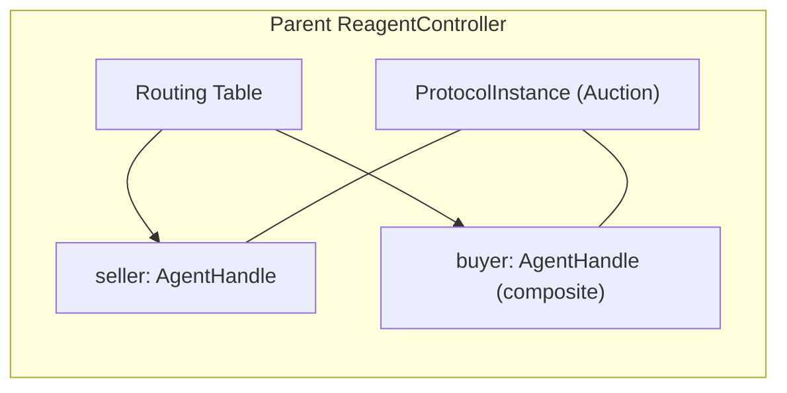
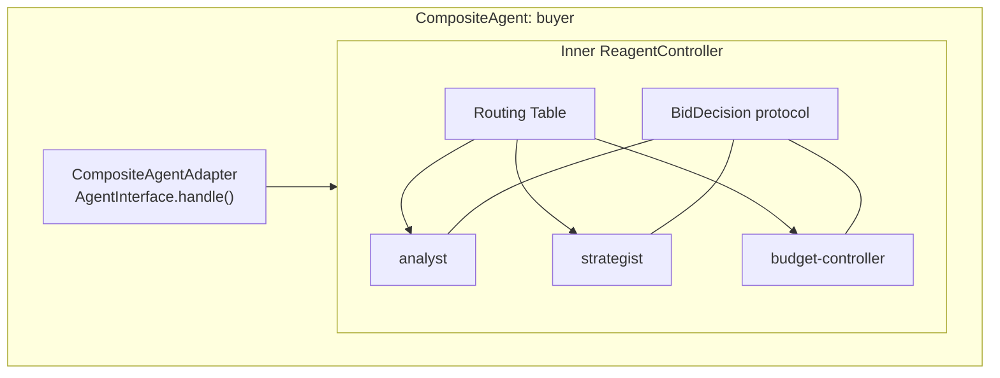
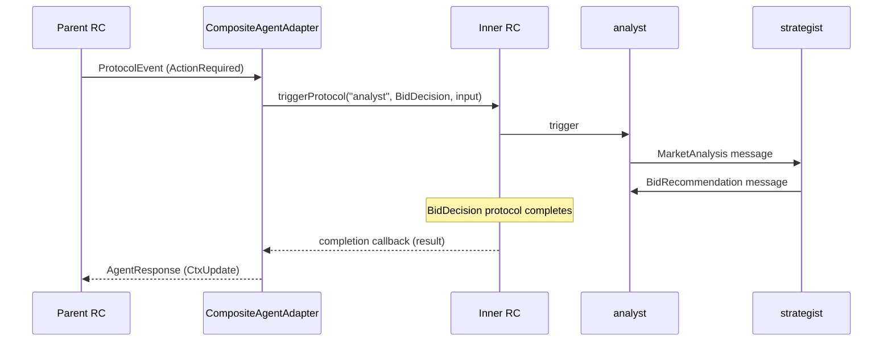

# CompositeAgent (holonic architecture)

Status: RFC | Date: 2026-02-20

---

## 1. Motivation

Reagent agents today are **flat**: each agent is a single unit that participates in protocols
via one of three integration modes (Managed, Custom, Gate). There is no built-in way for an
agent to encapsulate an internal multi-agent system.

Real-world scenarios demand this:

- **CognOS**: `metta` appears as a single agent in coordination protocols, but internally
  it is a team (planner, evaluator, memory-retriever) that deliberates via its own internal
  protocols before producing a response.
- **Hierarchical decision-making**: a "buyer" agent in an auction protocol delegates bid
  strategy to an internal committee of specialized sub-agents (market analyst, risk assessor,
  budget controller).
- **Encapsulated subsystems**: a monitoring agent wraps a fleet of sensor agents, exposing
  a single interface to the rest of the system.

The pattern: an agent that **externally** is a single `AgentHandle` and **internally** runs
its own `ReagentController` with its own agents and protocols.

---

## 2. Concept: holonic architecture

The CompositeAgent follows the **holonic** model (Arthur Koestler, *The Ghost in the Machine*, 1967).
A **holon** is simultaneously a **whole** (self-contained, autonomous) and a **part** (component
of a larger system). A hierarchy of holons is a **holarchy**.

In Reagent terms:

| Perspective | What the CompositeAgent is |
|-------------|---------------------------|
| **As a part** (external) | A single `AgentHandle` registered in the parent RC's routing table. Participates in external protocols. Receives `ProtocolEvent`s, returns `AgentResponse`s. Indistinguishable from any other agent. |
| **As a whole** (internal) | A self-contained `ReagentController` with its own agents, protocols, routing table, interceptors, and registry. Internal agents collaborate via internal protocols to produce decisions. |

This is a **fourth integration strategy** for `AgentInterface`, alongside Managed, Custom, and Gate.
But unlike the others, it is not a new primitive — it is a **pattern built on CustomAgent**.

### Recursive composition

Because the inner RC is a standard `ReagentController`, its inner agents can themselves be
CompositeAgents (CustomAgents with their own inner RCs). Recursive nesting is an emergent
property of the architecture — no special code is needed to support it.

```
Holarchy example:

  RC-top (cluster)
   ├── agent-A (leaf)
   └── agent-B (composite / holon)
        └── inner-RC
             ├── sub-agent-1 (leaf)
             ├── sub-agent-2 (leaf)
             └── sub-agent-3 (composite / holon)
                  └── inner-RC
                       ├── micro-1 (leaf)
                       └── micro-2 (leaf)
```

---

## 3. Architecture

### External view

The parent RC sees a single `AgentHandle`. It does not know (and does not need to know)
that the agent is composite.



### Internal view

Inside the CompositeAgent, a full RC runs with its own agents and protocols.



### Event flow

When the parent RC delivers a `ProtocolEvent` to the composite agent:



---

## 4. Design decisions

### 4.1 Runtime-only pattern (no language changes)

CompositeAgent is implemented using the existing `CustomAgentNode` + `AgentInterface`
infrastructure. The Reagent language, compiler, and IR are unaware of composition.

Rationale:
- The compositionality is an **agent implementation detail**, not a protocol-level concept.
- External protocols are written the same way regardless of whether participants are leaf or composite.
- No parser/IR/fingerprint changes needed.
- Can be implemented incrementally as a library/helper class.

### 4.2 Recursive depth (emergent)

No explicit depth limit. Since each CompositeAgent creates a standard RC, and CustomAgentNode
is a standard RC component, nesting happens naturally. A depth guard (configurable max depth)
can be added as a safety measure, but the architecture does not require one.

### 4.3 `$self` is opaque to parent RC

The parent RC has no access to the composite agent's internal state. `AgentHandle.getSelf()`
returns whatever the facade chooses to expose (e.g., aggregate status, active inner protocols).
Internal agents each have their own `$self` managed by the inner RC.

This is consistent with how Custom and Gate agents already work — `$self` in the Reagent sense
exists only for Managed agents where the RC executes zone code and injects the binding.

### 4.4 Communication strictly through facade

Internal agents are **not addressable** from the parent RC. There is no hierarchical
addressing (`buyer.analyst`). All messages flow through the `CompositeAgentAdapter` facade.

Benefits:
- **Encapsulation**: internal structure can change without affecting external protocols.
- **Security**: parent RC cannot bypass the facade.
- **Simplicity**: parent RC routing table has one entry, not N.

### 4.5 Hot deploy — deferred

How protocol upgrades propagate through holarchy levels is an open question tied to the
general hot deploy strategy (not yet designed). The CompositeAgent receives `ProtocolUpgraded`
events like any CustomAgent; what it does internally is its own responsibility.

---

## 5. API sketch

### TypeScript

```typescript
import {
  ReagentController, CustomAgentNode, AgentInterface,
  ProtocolEvent, AgentResponse,
} from "@reagent/runtime";

class CompositeAgentAdapter implements AgentInterface {
  private innerRC: ReagentController;
  private pendingResponses = new Map<string, (r: AgentResponse) => void>();

  constructor(private config: CompositeAgentConfig) {
    // Inner RC is a full ReagentController
    const innerNode = new CustomAgentNode({
      roleToAgent: config.innerRoleToAgent,
      agentFactory: config.innerAgentFactory,
    });
    this.innerRC = new ReagentController({
      nodeId: `${config.parentAgentName}-inner`,
      agentNode: innerNode,
    });
  }

  async start(): Promise<void> {
    // Register inner agents, load inner IR
    for (const reg of this.config.innerAgents) {
      this.innerRC.registerAgent(reg.name, reg.roleIR, reg.graphs);
    }
    await this.innerRC.start();
  }

  async handle(event: ProtocolEvent): Promise<AgentResponse> {
    // Route external event to inner protocol
    const route = this.config.eventRouter(event);

    if (route.type === "trigger") {
      // Start an inner protocol, wait for completion
      return new Promise((resolve) => {
        const instanceId = `inner-${Date.now()}`;
        this.pendingResponses.set(instanceId, resolve);
        this.innerRC.triggerProtocol(route.initiator, {
          instanceId,
          protocolName: route.protocolName,
          input: route.input,
          roleToAgent: route.roleToAgent,
        });
      });
    }

    if (route.type === "passthrough") {
      // Forward to a running inner protocol instance
      return route.response;
    }

    return { type: "noop" };
  }

  async stop(): Promise<void> {
    await this.innerRC.stop();
  }
}

// Usage: register as a CustomAgent in the parent RC
const parentNode = new CustomAgentNode({
  roleToAgent: { "Auction.buyer": "BuyerTeam" },
  agentFactory: (agentName, roleIR) => {
    const composite = new CompositeAgentAdapter({
      parentAgentName: agentName,
      innerRoleToAgent: { /* ... */ },
      innerAgentFactory: (name, role) => { /* ... */ },
      innerAgents: [ /* ... */ ],
      eventRouter: (event) => { /* ... */ },
    });
    composite.start();
    return composite;
  },
});
```

### Python

```python
from reagent_runtime import ReagentController, CustomAgentNode, AgentInterface

class CompositeAgentAdapter(AgentInterface):
    def __init__(self, config):
        inner_node = CustomAgentNode(
            role_to_agent=config["inner_role_to_agent"],
            agent_factory=config["inner_agent_factory"],
        )
        self.inner_rc = ReagentController(
            node_id=f"{config['parent_agent_name']}-inner",
            agent_node=inner_node,
        )
        self.event_router = config["event_router"]

    async def start(self):
        for reg in self.config["inner_agents"]:
            self.inner_rc.register_agent(reg["name"], reg["role_ir"], reg["graphs"])
        await self.inner_rc.start()

    async def handle(self, event: dict) -> dict:
        route = self.event_router(event)

        if route["type"] == "trigger":
            instance_id = f"inner-{id(event)}"
            self.inner_rc.trigger_protocol(route["initiator"], {
                "instanceId": instance_id,
                "protocolName": route["protocol_name"],
                "input": route["input"],
                "roleToAgent": route["role_to_agent"],
            })
            # Wait for inner protocol completion
            agent = self.inner_rc.get_agent(route["initiator"])
            await agent.wait_for_completion(expected_count=1, timeout_s=30)
            return {"ctx": agent.get_self()}

        return {}

    async def stop(self):
        await self.inner_rc.stop()
```

### Key components

| Component | Role |
|-----------|------|
| `CompositeAgentAdapter` | Implements `AgentInterface`. Facade between parent RC and inner RC. |
| `eventRouter` | User-provided function mapping `ProtocolEvent` to inner RC action (trigger a protocol, forward a message, return immediately). |
| Inner `ReagentController` | Standard RC with its own routing, registry, interceptors. |
| Inner agents | Standard agents (Managed, Custom, Gate, or nested Composite). |

---

## 6. Observability

### OTel trace propagation

The inner RC should create child spans linked to the parent trace context:

```
Parent RC span: "Auction instance-42"
  └── buyer handle(ActionRequired)
       └── Inner RC span: "BidDecision inner-1701234567"
            ├── analyst: MarketAnalysis
            └── strategist: BidRecommendation
```

Implementation: pass the parent `SpanContext` through the `CompositeAgentAdapter` into
the inner RC's interceptor chain (e.g., via `extras` or a dedicated `traceParent` config).

### VSCode cluster tree

When the inner RC connects to the same ROS (or exposes its status via a discovery protocol),
the cluster tree can render composite agents as expandable nodes:

```
Cluster
 ├── seller (leaf)
 └── buyer (composite)
      ├── analyst
      ├── strategist
      └── budget-controller
```

This requires either:
- Inner RC registers with ROS as a sub-node (adds complexity).
- Composite agent exposes an introspection endpoint (simpler, on-demand).

### Debug

Two approaches:

| Approach | Description |
|----------|-------------|
| **Flat** | Debug session sees only the parent-level protocol. Composite agent is opaque. Simple. |
| **Telescopic** | Debug session can "step into" the composite agent and inspect the inner protocol. Requires DAP extension to handle nested RC debug sessions. |

Start with flat (no changes needed). Telescopic debug is a future enhancement.

---

## 7. Relationship to existing features

### Spawns redesign (M10 Phase 4)

`spawns` creates new **role instances** at runtime. A spawned role instance could itself be
a CompositeAgent — the spawn creates the outer AgentHandle, the CompositeAgentAdapter
creates the inner RC. These are orthogonal: spawns is about lifecycle, composite is about
internal structure.

### Triggers

Inner protocols can use triggers. For example, the inner RC could have an event bus where
the facade publishes events, and inner protocols activate via `trigger on event`. This is
a natural fit — the facade is the bridge between external ProtocolEvents and internal triggers.

### Message Gate

A CompositeAgent could itself be behind a Gate transport (the parent RC communicates with
the facade via WS/stdio). The inner RC runs in the same process as the facade. This enables
a standalone composite agent process that connects to the cluster via Gate.

### Rust RC (Wave 4)

A Rust `ProtocolEngine` for inner RCs would significantly improve performance for deeply
nested holarchies. The inner RC could use `reagent-core` (Rust) while the outer facade
remains in TS/Python. This is a key synergy with Wave 4.

---

## 8. Open questions

1. **Language-level support (future)**: should there be a `composite` modifier on roles
   or agents? E.g., `agent BuyerTeam [composite] runs BuyerRole using ./buyer-team.rg`.
   This would let the compiler generate the facade automatically. Deferred — runtime-only
   pattern is sufficient for now.

2. **Inner agent lifecycle policies**: when the parent protocol completes, should inner
   agents be stopped? Always? Configurable? Default: stop inner RC when the composite
   agent is destroyed. Persistent inner agents (surviving across protocol instances) need
   explicit lifecycle configuration.

3. **Inner protocol selection strategy**: the `eventRouter` function is user-defined.
   Should there be a standard set of routing strategies (one-protocol-per-event,
   persistent-inner-protocol, event-bus-dispatch)? Likely yes, as library helpers.

4. **Cross-holon event propagation**: can inner agents emit events that bubble up
   through the facade to the parent RC's event bus? This would enable bottom-up
   signaling in deep holarchies. Needs design alongside the event bus system (see `rc-spec.md` §8).

5. **Conformance**: should the conformance suite (R4) cover composite agents?
   At minimum, verify that a composite agent produces the same external behavior
   as an equivalent leaf agent.

---

## 9. Dependencies and placement

| Dependency | Status | Blocking? |
|------------|--------|-----------|
| `CustomAgentNode` (TS) | Done | No |
| `CustomAgentNode` (Py) | Done | No |
| `AgentInterface` | Done | No |
| `ProtocolEngine` | Done | No |
| Triggers (M10 Phase 2-3) | Phase 2 done, Phase 3 pending | No (triggers useful but not required) |
| Rust RC (Wave 4) | Not started | No (enhances perf, not required) |
| Hot deploy strategy | Not designed | No (deferred) |

**Placement**: long-horizon (see `backlog.md`, runtime platform roadmap). The runtime-only pattern can be
prototyped at any time on existing infrastructure, but the full vision (observability,
telescopic debug, Rust inner RC) aligns with Wave 4 themes.

**Minimum viable implementation**: ~500-800 lines of TS code for `CompositeAgentAdapter` +
helper classes. No compiler, language, or IR changes.
