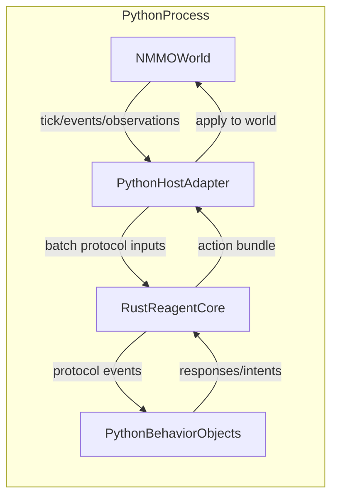

# NMMO Python Host With Embedded Rust Core

Status: RFC draft | Date: 2026-03-13

---

## 1. Purpose

This document defines the target runtime shape for running Reagent orchestration inside a
Python-hosted simulation such as NMMO.

The goal is not "better Python parity" as a second full runtime line.
The goal is:

- one real protocol engine in Rust
- embedded directly in the Python simulation process
- Python remaining authoritative for world state and simulation APIs
- Python-backed agent behaviors attached to the embedded Rust orchestration core

This document is the design anchor for the NMMO simulation use case in
`../current/09-e2e-usecases.md`.

---

## 2. Problem

NMMO and similar simulators already own:

- the world state
- the tick loop
- observation extraction
- action application
- domain APIs for entities, maps, combat, inventory, rewards

If Reagent runs as a separate Python runtime or as an external Rust process, the integration
quickly becomes inefficient:

- world state gets mirrored or serialized repeatedly
- every tick crosses an IPC boundary
- orchestration and simulation drift into separate ownership domains
- spawned/resolved runtime identities stop matching the simulation's own entity lifecycle

For simulation workloads, especially many-agent ticked worlds, this is the wrong boundary.

---

## 3. Design decisions

| Decision | Choice | Rationale |
|---|---|---|
| Runtime core | Embedded Rust `reagent-core` | Avoid maintaining a second Python execution engine |
| Process topology | In-process inside the Python simulator | No IPC on the hot path |
| World ownership | Python host remains authoritative | NMMO APIs and state already live there |
| Agent execution | Python-hosted behavior callbacks over Rust orchestration | Keep domain logic near the simulation |
| Data boundary | Tick snapshots, observations, intents, protocol payloads only | Avoid copying the entire world across FFI |
| Cluster story | Single-process first | NMMO use case is local simulation, not cluster orchestration |

---

## 4. Non-goals

- Building a second full Python Reagent runtime
- Reproducing the entire TS runtime surface natively in Python
- Running the simulation world inside Rust
- General-purpose cross-process Python/Rust transport for every runtime mode
- Replacing the current TS runtime before `reagent-core` exists

---

## 5. Core architecture

### 5.1 One engine, two ownership domains

The right split is:

- Rust owns protocol orchestration
- Python owns the simulation world



### 5.2 What Rust owns

The embedded Rust core should own:

- protocol graphs / compiled IR
- `RoleRun` / protocol execution
- message routing
- trigger dispatch
- resolve / spawn semantics
- runtime registry of live participant instances
- protocol-local state and message history

### 5.3 What Python owns

The Python simulator should own:

- authoritative world state
- tick scheduling
- per-entity simulation APIs
- observation extraction
- action application
- domain behavior code for player/NPC policies

This is not a "split runtime". It is one runtime core with one host process.

---

## 6. Python integration model

### 6.1 Python is a host, not a second engine

Python should expose behavior objects to Rust, not reimplement protocol execution.

Conceptually:

```python
class NmmoBehavior:
    def on_action(self, event): ...
    def on_message(self, event): ...
    def on_lifecycle(self, event): ...
```

Rust drives the protocol and invokes Python only when participant behavior is needed.

### 6.2 `PyO3` binding surface

The minimal host API should look like:

- create embedded RC/core handle
- register protocol artifacts
- register or spawn Python-backed participant instances
- feed trigger events or tick inputs
- drive one scheduling step or one full protocol advancement cycle
- return outbound action/message bundles

This binding should stay intentionally narrow and protocol-oriented.

### 6.3 No hot-path IPC

There should be no mandatory:

- subprocess per Python agent
- JSON-over-stdio hop per event
- socket hop per tick

Those boundaries are acceptable for remote gates, not for dense in-process simulation.

---

## 7. Runtime instance model

### 7.1 Registry

The Rust core should keep the live runtime registry even when hosted inside Python.

That registry stores:

- instance identity
- role
- `agent type`
- liveness
- metadata/tags/capabilities
- host-owned attachment handles

Python behaviors are registered into the Rust registry as local live instances.

### 7.2 Resolve

`resolve` should remain Rust-side orchestration logic.

For the NMMO case, that means:

- resolve scans Rust-side runtime registrations
- registrations may point to Python-backed behaviors
- role/type compatibility is checked before the behavior is invoked

### 7.3 Spawn

`spawn` should not create a new Python runtime.

Instead it should:

1. allocate a new runtime instance record in Rust
2. invoke a Python-side factory callback
3. attach the resulting Python behavior object to the new runtime instance
4. make it visible to subsequent routing and resolve paths

This matches simulation semantics much better than process spawning.

---

## 8. Tick-loop integration

### 8.1 Recommended shape

The NMMO host should drive Reagent from the simulation tick loop.

Per tick:

1. Python extracts the minimal protocol-relevant snapshot
2. Python submits one or more trigger/event inputs to embedded Rust
3. Rust advances orchestration for the affected instances
4. Python behavior callbacks are invoked as needed
5. Rust returns a compact bundle of intents/results
6. Python applies those intents to the world

### 8.2 Batch boundary

The important optimization is batching.

Bad boundary:

- Rust repeatedly asks Python for individual world fields
- every send/receive does several tiny FFI calls

Good boundary:

- Python builds coarse-grained snapshots/observations
- Rust advances protocol logic over those snapshots
- Python receives coarse-grained action bundles or behavior events

This is the key to keeping the embedding efficient.

---

## 9. Performance principles

### 9.1 Keep world state in Python

Do not mirror the full NMMO world into Rust.

Rust should see:

- compact observations
- protocol payloads
- stable ids
- action/intention objects

### 9.2 Keep orchestration in Rust

Do not replicate:

- protocol FSM execution
- resolve/spawn semantics
- protocol-local routing
- per-run bookkeeping

in Python.

### 9.3 Keep FFI crossings coarse-grained

FFI should happen:

- per tick batch
- per behavior event
- per spawn/attach operation

not per field access or tiny helper operation.

---

## 10. Relationship to `agent type`

This design works naturally with the `agent type` direction.

For this use case:

- `agent type` describes the semantic surface of participant zones or behavior expectations
- Rust checks role/participant compatibility
- Python hosting is an implementation detail of the runtime attachment path

This means a Python-backed participant does **not** imply a separate Python protocol engine.
It only means the participant's behavior is hosted by Python.

---

## 11. Why this replaces deferred Python runtime parity

The old parity framing assumed that Python should gradually acquire:

- a matching protocol engine
- matching cluster/state-store features
- matching managed-path execution
- matching conformance as a separate runtime line

For the simulation use case, that is the wrong optimization target.

What we actually want is:

- one runtime core in Rust
- language bindings into Python
- Python-hosted behaviors inside the simulation process

This gives the NMMO case what it needs without multiplying engines.

---

## 12. Rollout sketch

### Phase 1

- build Rust `reagent-core` with local single-process execution
- expose Python bindings via `PyO3`
- support registration of Python-backed behavior objects

### Phase 2

- support `resolve` and `spawn` against Python-backed registrations
- support tick-batch submission and action-batch return

### Phase 3

- optimize batch data shapes and callback overhead
- add observability/debugging for embedded simulation runs

### Phase 4

- optionally align other Python-hosted use cases on the same embedding path

---

## 13. Relationship to other documents

| Document | Relationship |
|---|---|
| `agent-types.md` | Provides the language-level model for participant/role typing independent of host selection. |
| `backlog.md` | Tracks the shift away from a separate deferred Python runtime toward embedded Rust-core Python hosts. |
| `../current/09-e2e-usecases.md` | Contains the NMMO simulation use case that this document makes concrete. |
| `../archive/process-model.md` | Defines process/lifecycle semantics that embedded Rust-core hosts should follow. Current docs: `../current/03-runtime-core.md §9`. |

---

## 14. Open questions

- What is the minimal Python callback trait/object surface for participant behaviors?
- Should tick advancement be "advance until idle" or "advance one scheduling quantum" from Python's point of view?
- Where should Python-backed runtime instance config live once `agent ... runs ...` disappears from the core language?
- How much of observation shaping belongs in Python host code versus future declarative protocol forms?
