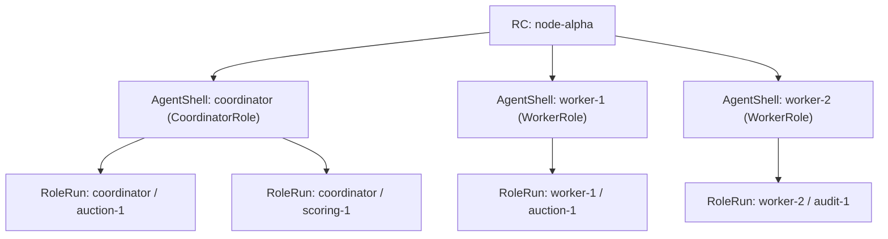
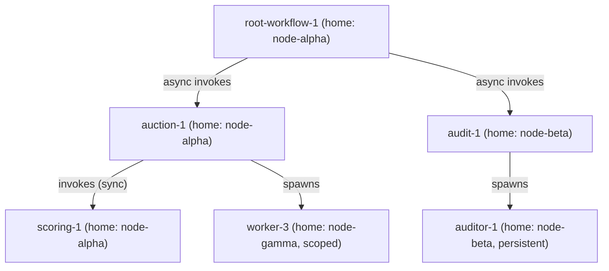
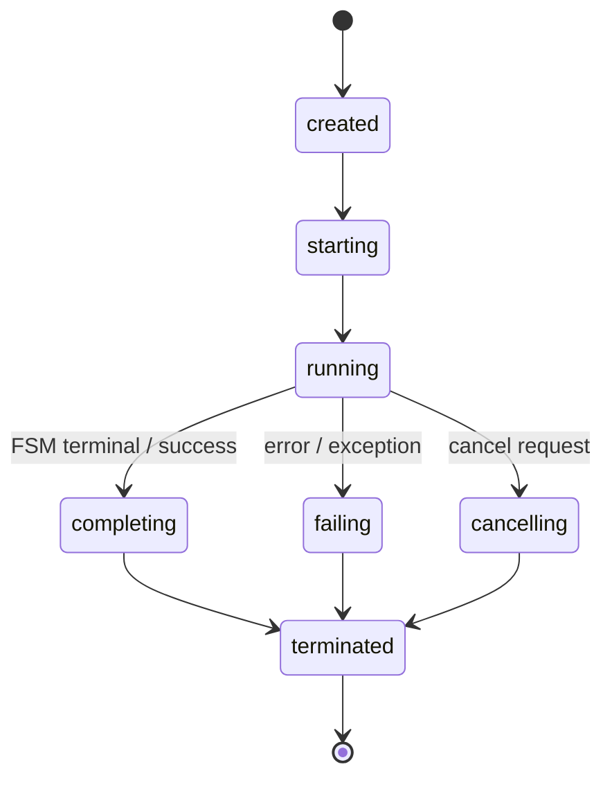
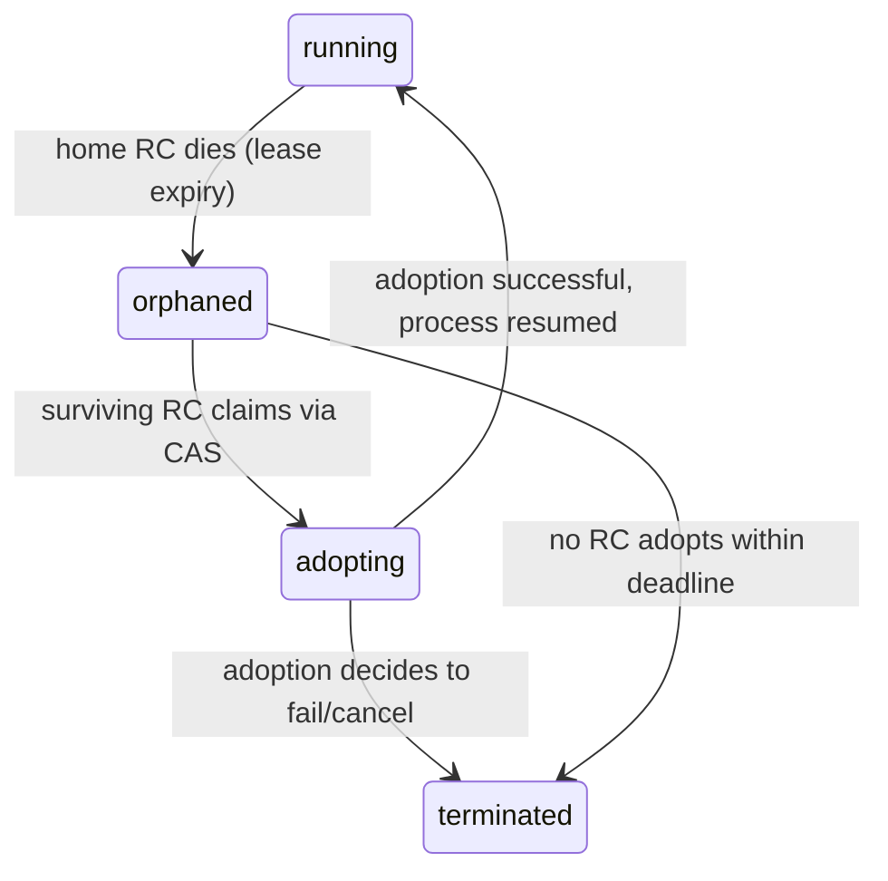
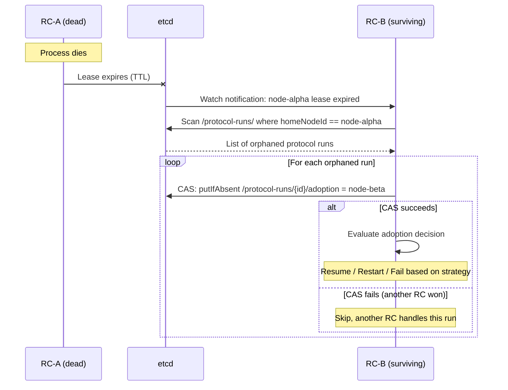

# Unified Process Model

Status: RFC draft | Date: 2026-03-13

---

## 1. Purpose

This document defines the **operational process model** for the Reagent runtime.

It answers a single question: how do protocols and agents relate as processes —
who creates whom, who owns whom, what happens when something fails, and how does
the cluster recover.

The [R1 Runtime Antientropy](r1-runtime-antientropy.md) document defines **what things are**
(AgentShell, RoleRun, AgentRecord). This document defines **how they behave as processes** —
ownership, lifecycle coupling, supervision, and fault propagation.

### Scope

- Process kinds and their relationships
- Node-local and cluster-wide process trees
- Ownership semantics and lifecycle coupling
- Unified process lifecycle state machine
- Supervision model (four layers)
- Fault propagation rules (local and distributed)
- Process identity and lineage
- Cancellation semantics
- RC failure and protocol re-homing
- Root protocol concept

### Non-goals

- Concrete implementation plan or code changes
- Wire protocol for distributed cancellation messages
- Saga / compensation pattern specification (covered by backlog L1)
- Hot deploy / rolling upgrade strategy (covered by backlog W5, W6)

### Design decisions

| Decision | Choice | Rationale |
|----------|--------|-----------|
| RC topology | Peer — all RCs equal, coordination through etcd | Matches current implementation; no single point of failure |
| Protocol ownership | Initiator-homed — the RC that fired the trigger owns the ProtocolRun | Simple, deterministic; ownership persisted in etcd for observability and re-homing |
| Supervision scope | Full — restart strategies, cascading failures, orphan cleanup | Required for production reliability; partial models create false safety |

---

## 2. Process Kinds

### 2.1 Protocol Process

A **protocol process** is a distributed process. It spans one or more nodes.
It is represented by correlated `RoleRun` instances across participating agents.

Properties:

- Has a globally unique `instanceId`
- Has a `protocolName` identifying its specification
- Has a **home RC** — the RC whose initiator agent fired the trigger
- Has zero or more child protocol processes (via `invokes` / `async invokes`)
- Has zero or more spawned agent processes (via `spawns`)
- Its lifecycle is tracked both locally (in the home RC's memory) and globally (in etcd)

A protocol process is **not** a single in-memory object. There is no `ProtocolRun` class.
The distributed identity exists as:

- A `ProtocolRunRef` (`instanceId` + `protocolName`) shared by all participants
- An etcd record at `/protocol-runs/{instanceId}` (for cluster-wide coordination)
- A set of local `RoleRun` fibers, one per participating agent

### 2.2 Agent Process

An **agent process** is a local process. It runs on exactly one node.
It is represented by a single `AgentShellImpl` instance inside a `ReagentController`.

Properties:

- Has a unique `agentName` (globally unique within the cluster)
- Is bound to exactly **one role**. The role defines the agent's behavioral
  contract and may `plays` multiple protocols. An agent can participate in
  any protocol its role declares a `plays` binding for.
- If an agent needs to combine bindings from several protocols, a new role
  is declared on the cluster that aggregates the required `plays` declarations
  (role inheritance supports this).
- Has a single optional `AgentBehavior` (attached/detached)
- Has persistent `$self` state surviving across protocol runs
- Hosts zero or more `RoleRun` fibers concurrently — these fibers may belong
  to different protocols that the agent's role plays
- Its lifecycle is projected as an `AgentRecord` in the registry

### 2.3 RoleRun (Fiber)

A **RoleRun** is not a standalone process. It is a **fiber** — a lightweight
execution context inside an agent process, participating in one protocol process.

Properties:

- Bound to exactly one agent process (its host shell)
- Bound to exactly one protocol process (its distributed correlation)
- Has its own `$ctx` (local protocol context)
- Has its own FSM state (`RoleEngine`)
- Has its own message inbox and completion callbacks
- Cannot outlive its host agent process

The key insight: an agent process is the **execution host**, a protocol process is
the **coordination scope**, and a RoleRun is the **intersection** of the two.

Because a role can `plays` multiple protocols, a single agent may simultaneously
host fibers for different protocol types — e.g. an agent whose role plays both
`Auction` (as `seller`) and `Scoring` (as `evaluator`) can run fibers from
both protocols concurrently.

```
┌─────────────────────────────────────────────────────────────┐
│ Agent Process (AgentShell: coordinator)                      │
│ Role: CoordinatorRole (plays Auction/seller, Scoring/eval)  │
│                                                             │
│  ┌─────────────────┐  ┌─────────────────┐                  │
│  │ RoleRun          │  │ RoleRun          │                  │
│  │ auction-1/seller │  │ scoring-1/eval  │                  │
│  │ (protocol fiber) │  │ (protocol fiber) │                  │
│  └────────┬─────────┘  └────────┬─────────┘                  │
│           │                     │                            │
│      participates in       participates in                   │
│           │                     │                            │
│  ┌────────▼─────────┐  ┌───────▼──────────┐                 │
│  │ Protocol Process  │  │ Protocol Process  │                 │
│  │ Auction:inst-1    │  │ Scoring:inst-1    │                 │
│  │ (distributed)     │  │ (distributed)     │                 │
│  └───────────────────┘  └──────────────────┘                 │
└─────────────────────────────────────────────────────────────┘
```

---

## 3. Process Tree

The process tree exists at two levels that serve different purposes.

### 3.1 Node-Local Tree

Each RC maintains a **node-local process tree**. This tree is always consistent —
it lives in one memory space, one OS process.



Ownership edges in the local tree:

- RC → AgentShell: **strong**. Shell cannot outlive RC.
- AgentShell → RoleRun: **hosting**. RoleRun cannot outlive its shell.

The local tree does not track cross-node relationships. It does not know
that `auction-1` also has a RoleRun on `node-beta`.

### 3.2 Cluster-Wide Protocol Tree

The cluster-wide tree is a **logical** structure tracked in etcd. It represents
the parent-child relationships between protocol processes and their spawned agents,
regardless of which node they run on.



Properties of the cluster-wide tree:

- **Eventually consistent** — it is a projection of etcd state. Nodes can disagree temporarily.
- **Rooted** at one or more root protocols (see §11).
- Each edge carries **ownership semantics** (see §4).
- Each node in the tree carries a **home RC** that is responsible for supervision.

### 3.3 Why Two Trees

The node-local tree and cluster-wide tree overlap but are not isomorphic:

| Aspect | Node-local | Cluster-wide |
|--------|-----------|--------------|
| Scope | One node | Entire cluster |
| Granularity | Down to RoleRun fibers | Protocol processes and agent processes |
| Consistency | Strong (in-memory) | Eventually consistent (etcd) |
| Purpose | Execution, routing, dispatch | Supervision, ownership, re-homing |
| Lifetime | Dies with RC | Survives individual RC failures |

A local RC reads the cluster-wide tree to determine its supervision obligations.
It writes to it when creating or completing processes.

---

## 4. Ownership Semantics

Every edge in the process tree is an ownership relationship. Each relationship
has four properties:

- **Creator** — who instantiates the child
- **Owner** — who is responsible for the child's lifecycle
- **Coupling** — how tightly the child's lifecycle depends on the parent
- **Detach** — can the child survive its parent

### 4.1 Ownership Table

| Parent | Child | Coupling | On parent complete | On parent fail | On home RC dies |
|--------|-------|----------|-------------------|----------------|-----------------|
| RC | AgentShell | **strong** | `shell.stop()` | shell dies with RC | shell dies with RC |
| AgentShell (initiator) | ProtocolRun | **trigger** | run continues independently | run continues independently | run orphaned (§9) |
| ProtocolRun | child ProtocolRun (sync `invokes`) | **strong** | n/a — child finishes first by definition | cancel child, propagate error | child orphaned |
| ProtocolRun | child ProtocolRun (async `invokes`) | **scoped** | cancel child | cancel child | child orphaned |
| ProtocolRun | spawned Agent (non-persistent) | **scoped** | destroy agent | destroy agent | agent orphaned |
| ProtocolRun | spawned Agent (`persistent`) | **detached** | agent survives | agent survives | agent survives |

### 4.2 Coupling Kinds

**Strong coupling.** Child cannot outlive parent. Parent waits for child to finish
before completing. If parent fails, child is cancelled immediately.

**Scoped coupling.** Child's lifetime is bounded by parent's lifetime. When parent
completes (success or failure), all scoped children are cancelled/destroyed.
Parent does not wait for scoped children before completing — it triggers their
cleanup as a side effect of its own completion.

**Trigger coupling.** The initiator agent creates the protocol process via a trigger.
After creation, the agent has no lifecycle authority over the protocol — the
protocol's lifetime is self-determined (it runs until its FSM reaches a terminal
state). The agent merely hosts one RoleRun fiber.

**Detached.** No lifecycle dependency. The child is a fully independent process
that happens to have been created by the parent. The `persistent` flag on
`spawns` produces this coupling.

---

## 5. Process Lifecycle

### 5.1 Unified State Machine

All process kinds share a base lifecycle state machine:



### 5.2 Additional States for Distributed Processes

Protocol processes have extra states that reflect their distributed nature:



- **orphaned** — home RC died. The process has no active supervisor. Its local
  RoleRuns on surviving nodes continue running but have no coordinator.
- **adopting** — a surviving RC has claimed ownership via etcd CAS and is
  evaluating the process state to decide: resume, restart, or fail.

### 5.3 Agent Process Lifecycle

Agent processes have the existing lifecycle from R1:

```
declared → runtime_attached → ready → detached → destroyed
```

With one addition for supervision:

- **orphaned** — the agent was spawned (non-persistent) by a protocol that is
  now orphaned. The agent continues to exist but its lifecycle owner is unknown
  until the protocol is adopted or times out.

### 5.4 RoleRun Lifecycle

RoleRun fibers retain their existing lifecycle:

```
idle → running → completed | failed
```

No additional states. A RoleRun dies with its host shell. Cancellation of a
RoleRun manifests as an immediate transition to `failed` with a cancellation
reason.

---

## 6. Supervision Model

Supervision is organized in four layers, from broadest to narrowest scope.

### 6.1 Layer 1: Cluster Supervisor

**Scope:** entire cluster.
**Implementation:** etcd lease watches + orphan adoption protocol.

The cluster supervisor is not a single process. It is an **emergent behavior**
of all surviving RCs cooperating through etcd. When a node's lease expires,
every surviving RC becomes aware and can participate in orphan adoption.

Responsibilities:

- Detect RC failure via etcd lease expiry
- Scan for orphaned protocol processes homed on the dead RC
- Claim orphaned processes via CAS (exactly one RC wins per process)
- Execute the adoption decision (resume, restart, or fail)

This layer has no configurable strategy — it always runs.

### 6.2 Layer 2: RC (Node Supervisor)

**Scope:** one node.
**Implementation:** `ReagentController`.

The RC supervises all agent processes on its node.

Responsibilities:

- Create and destroy agent shells
- Monitor agent behavior health (future: heartbeat, watchdog)
- Apply agent restart policy on behavior failure
- Propagate `stop()` to all shells on RC shutdown

Current state: RC creates/destroys agents but has no restart policy.
Agent failure (behavior throws) is recorded but not handled.

### 6.3 Layer 3: Protocol Supervisor

**Scope:** one protocol process (distributed).
**Implementation:** home RC of the protocol.

The protocol supervisor manages the child processes owned by one protocol instance.

Responsibilities:

- Track child protocol processes and spawned agents
- Apply supervision strategy on child failure
- Execute scoped cleanup on protocol completion
- Propagate cancellation to all children

### 6.4 Layer 4: Agent Supervisor (future)

**Scope:** one agent process.
**Implementation:** within AgentShell.

A self-healing agent that can restart its own behavior on failure,
re-attach to in-progress RoleRuns, and maintain `$self` state across restarts.

This layer is deferred. It requires stateful behavior detach/re-attach
that the current AgentShell supports structurally but does not exploit.

### 6.5 Supervision Strategies

Each protocol process can declare a supervision strategy for its children.
The default is **scoped**.

| Strategy | On child fail | On parent complete |
|----------|--------------|-------------------|
| **one-for-one** | Restart failed child only | Cancel remaining children |
| **all-for-one** | Cancel all siblings, restart all | Cancel all children |
| **scoped** | Notify parent (lifecycle handler), do not restart | Cancel/destroy all scoped children |
| **detached** | No action — child is independent | No action |

The strategy applies to all non-detached children uniformly. Per-child
strategy overrides are a possible future extension.

---

## 7. Fault Propagation

### 7.1 Local Faults

These faults occur within a single node and are handled by the node-local tree.

**Agent behavior throws during zone execution:**

1. `RoleRun` catches the exception in `handleActionResult`
2. If the run has a `try/catch` block, the catch path executes
3. If no catch, the RoleRun transitions to `failed`
4. `AgentShellImpl.handleRunComplete(run, "failed")` fires
5. Agent lifecycle handlers for `protocolFailed` execute
6. The protocol process is notified (the home RC records partial failure)

**RoleRun reaches terminal state with error:**

1. `handleRunComplete` removes the run from `activeRuns`, adds to `finishedRuns`
2. Completion callbacks fire
3. If this was the initiator RoleRun, the home RC marks the protocol process as failing
4. Scoped children are cancelled/destroyed

**AgentShell stops (explicit or RC shutdown):**

1. All active RoleRuns are aborted (transition to `failed`)
2. The shell detaches its behavior
3. The shell's status callback notifies the RC
4. The RC updates the AgentRecord to `detached` / `destroyed`
5. All protocol processes that had a RoleRun on this shell detect participant loss

### 7.2 Distributed Faults

These faults involve multiple nodes and require cluster-wide coordination.

**RC dies (process crash, node failure, network partition):**



**Participant node dies while protocol is running:**

1. The home RC (if alive) detects that messages to a participant are undeliverable
2. The home RC checks etcd — the participant's node lease has expired
3. The home RC applies the protocol's fault strategy:
   - **retry**: re-resolve the participant role to a different agent, re-materialize the RoleRun
   - **fail**: mark the protocol as `failing`, cascade to children
   - **compensate**: execute the protocol's compensation path (future, requires saga support)

**Home RC dies while protocol has active children:**

1. Child protocol processes become orphaned
2. Surviving RCs adopt children independently (each child is a separate etcd entry)
3. An adopted child discovers its parent is also orphaned
4. The adopting RC walks up the tree to find the nearest living ancestor
5. If no living ancestor exists, the child becomes a new root (effectively detached)

### 7.3 Fault Propagation Direction

Faults propagate in two directions:

**Downward (parent → children):** Parent failure cascades to scoped children.
The home RC cancels/destroys children when the parent fails or completes.

**Upward (child → parent):** Child failure notifies the parent via lifecycle
handler (`protocolFailed` event). The parent's supervision strategy determines
the response. The parent does not automatically fail when a child fails —
the strategy decides.

**Lateral (sibling → sibling):** Only under `all-for-one` strategy.
One sibling's failure triggers cancellation and restart of all siblings.

---

## 8. Process Identity

### 8.1 Structure

Every process has a structured identity that encodes its kind, location, and lineage.

**Agent process identity:**

```
{nodeId}/{agentName}
```

Examples: `node-alpha/coordinator`, `node-gamma/worker-3`

**Protocol process identity:**

```
{protocolName}:{instanceId}
```

The `instanceId` is a globally unique string (UUID or timestamp-based).
The `protocolName` is for human readability and type identification.

**Lineage encoding:**

The parent-child relationship is stored as a field on the child, not encoded
in the identity string. Each protocol process record contains:

```typescript
type ProtocolProcessRecord = {
  instanceId: string;
  protocolName: string;
  homeNodeId: string;
  parentInstanceId: string | null;   // null for root protocols
  status: ProcessStatus;
  supervisionStrategy: SupervisionStrategy;
  participants: ParticipantEntry[];
  createdAt: number;
  updatedAt: number;
};
```

### 8.2 Etcd Schema

Protocol process records are stored at:

```
/protocol-runs/{instanceId}          → ProtocolProcessRecord (JSON)
/protocol-runs/{instanceId}/adoption → adopting nodeId (CAS-guarded)
```

Agent process records (already exist):

```
/agents/{agentName}                  → AgentRecord (JSON)
```

The ownership tree is reconstructed by reading `/protocol-runs/` and following
`parentInstanceId` links. This is an on-demand operation, not a pre-materialized
tree.

### 8.3 Current State

Today, `instanceId` is generated as `{protocolName}-{timestamp}` or a UUID.
There is no `ProtocolProcessRecord` in etcd — protocol runs exist only as
in-memory state within AgentShell's `activeRuns` / `finishedRuns` maps.

The `_parentInstanceId` metadata on spawned agents is the only existing
lineage link, and it is informational only.

---

## 9. Cancellation

### 9.1 Local Cancellation

A cancellation request targets a specific protocol process by `instanceId`.

On the home RC:

1. The protocol process transitions to `cancelling`
2. The home RC iterates over all local RoleRuns for this `instanceId`
3. Each RoleRun is interrupted: its FSM transitions to `failed` with reason `cancelled`
4. Scoped child protocol processes receive cancellation recursively
5. Scoped spawned agents are destroyed

### 9.2 Distributed Cancellation

When a protocol process has participants on multiple nodes:

1. The home RC writes `status: cancelling` to `/protocol-runs/{instanceId}` in etcd
2. All participating RCs watch this key (or the prefix)
3. On observing the status change, each RC cancels its local RoleRuns for this instance
4. Each RC reports local cancellation status back to etcd (or via message plane)
5. The home RC considers cancellation complete when all participants have acknowledged

### 9.3 Cancellation Triggers

Cancellation can be triggered by:

- **External request** — admin API / `ProtocolRunTracker.cancelRun()`
- **Parent failure** — scoped coupling propagates cancellation downward
- **Timeout** — a protocol-level timeout expires (future: `timeout` directive in `.rg`)
- **Supervision decision** — the supervisor strategy decides to cancel

### 9.4 Cancellation vs. Compensation

Cancellation is a **hard stop** — it interrupts execution and cleans up resources.
It does not undo side effects that have already occurred.

Compensation is a **semantic rollback** — it runs compensating actions to undo
the effects of already-completed steps. This is the domain of saga patterns
and is out of scope for this document (see backlog L1: distributed try/catch, and `distributed-try-catch.md`).

---

## 10. RC Failure and Protocol Re-homing

This is the most complex failure scenario. It requires coordinated action
by surviving RCs using etcd as the coordination substrate.

### 10.1 Detection

RC failure is detected via **etcd lease expiry**.

Each RC holds an etcd lease (configurable TTL, default 10s). The lease is
refreshed by a keep-alive loop. When the RC dies, the keep-alive stops, and
the lease expires after TTL.

All surviving RCs watch the membership prefix (`/nodes/`). When a node entry
disappears (lease-bound key deleted), the surviving RCs know that node is gone.

### 10.2 Orphan Identification

After detecting a dead RC, each surviving RC scans `/protocol-runs/` for entries
where `homeNodeId` matches the dead node and `status` is not `terminated`.

These are the **orphaned protocol processes**.

Additionally, agents on the dead node are already gone (their etcd entries,
being lease-bound, have also expired). Surviving RCs do not need to explicitly
identify orphaned agents — they are implicitly gone.

### 10.3 Adoption Protocol

For each orphaned protocol process:

1. **Claim**: A surviving RC attempts `putIfAbsent` on `/protocol-runs/{id}/adoption`
   with its own `nodeId`. Exactly one RC wins the CAS.

2. **Evaluate**: The adopting RC reads the orphaned process's `ProtocolProcessRecord`
   and its child tree. It evaluates the supervision strategy:

   - **Strategy is `scoped` or `all-for-one`** → cancel all remnants, optionally restart
   - **Strategy is `one-for-one`** → attempt to resume by re-resolving lost participants
   - **No strategy specified** → default to `scoped` (cancel and mark failed)

3. **Resume or Restart**: If resuming:
   - Re-resolve all participants using the resolve pipeline
   - For participants that were on the dead node, find new agents or spawn new ones
   - Re-send any pending messages (requires message journaling, which is a future feature)
   - If resumption is not possible (state lost), fall back to restart or fail

4. **Update**: Write the new `homeNodeId` and updated `status` to etcd.

5. **Cascade**: For child processes also orphaned, adoption cascades — the adopting
   RC becomes responsible for the entire sub-tree.

### 10.4 State Loss

When an RC dies, the following state is lost:

| State | Location | Recoverable? |
|-------|----------|-------------|
| `$self` (agent persistent state) | In-memory only | **No** — unless checkpointed to etcd |
| `$ctx` (protocol run context) | In-memory only | **No** — unless checkpointed |
| `activeRuns` map | In-memory only | **No** |
| `finishedRuns` map | In-memory only | **No** |
| RoleRun FSM position | In-memory only | **No** — unless checkpointed |
| `ProtocolProcessRecord` | etcd | **Yes** |
| `AgentRecord` | etcd | **Yes** (but lease-bound copy expires) |

This means that **stateful re-homing** (transferring `$ctx` and FSM state) is
only possible if the runtime implements **checkpointing** — periodic persistence
of run state to etcd or another durable store.

Without checkpointing, adoption can only offer:

- **Restart**: re-run the protocol from the beginning
- **Fail**: mark as failed, cascade to children, notify parent
- **Compensate**: run compensation logic (future)

Checkpointing is a significant feature that is not in scope for the initial
process model implementation. The model is designed to accommodate it as a
future extension.

### 10.5 Open Questions

- **Checkpoint granularity**: Per-state-transition? Per-message? Per-timeout interval?
- **Checkpoint storage**: etcd (small state only, <1MB)? External store?
- **Split-brain**: What if the "dead" RC is actually partitioned but alive? Fencing via etcd lease revision can prevent dual-ownership.

---

## 11. Root Protocol

### 11.1 Definition

A **root protocol** is a protocol process with no parent — `parentInstanceId` is null.

It is the top of a cluster-wide process tree. There can be multiple root protocols
in a cluster (e.g., one per independent workflow).

### 11.2 Ownership

A root protocol has no parent process to supervise it. Its owner is the
**cluster itself**, represented by its etcd record.

The home RC of a root protocol acts as its local supervisor, but if the home RC
dies, the root protocol is subject to adoption like any other orphaned process.

### 11.3 Bootstrap

A root protocol is started by one of:

- **External trigger** — admin API / invoke call from outside the cluster
- **Cron trigger** — periodic trigger fires on the cron leader RC
- **Event trigger** — an event on the event bus (e.g., from a gate/MCP integration)
- **Cluster bootstrap** — a declared "autostart" protocol that runs when the cluster forms

The cluster bootstrap case is new. It requires:

- A deployment manifest declaring which protocols auto-start
- The first RC to start (or a leader-elected RC) fires the triggers
- The protocol process record is written to etcd immediately
- If the starting RC dies before the protocol is fully initialized, another RC adopts

### 11.4 Root Protocol Re-homing

When a root protocol's home RC dies:

1. The root protocol becomes orphaned (detected via lease expiry)
2. A surviving RC adopts it via the standard adoption protocol (§10.3)
3. The adopting RC becomes the new home RC
4. If no RC adopts within the deadline, the root protocol is marked `terminated`
   with reason `orphan-timeout`

When the cluster restarts from scratch (all RCs died):

1. The new first RC reads `/protocol-runs/` from etcd (if etcd survived)
2. All non-terminated root protocols are candidates for re-adoption
3. The RC re-adopts them and applies their supervision strategy
4. If etcd is also lost, the cluster starts clean — autostart protocols are
   re-triggered from the deployment manifest

---

## 12. Relationship to Existing Work

### Extends

- **[R1 Runtime Antientropy](r1-runtime-antientropy.md)** — adds operational
  semantics (ownership, supervision, fault propagation) on top of the ontology.

### Subsumes

- **[Resolve Policy](resolve-policy.md) §7.3** — spawn lifecycle (persistent vs.
  scoped) is now a special case of ownership coupling (detached vs. scoped).
- **`cleanupSpawnedAgents()` in RC** — the existing method is the seed of scoped
  cleanup; this model defines when and why it must be called.

### Informs

- **[Agent Types](agent-types.md)** — the process model defines the lifecycle
  context in which agent types are materialized and supervised.
- **Backlog F6** (exception/compensation semantics) — this model defines fault
  propagation; F6 adds compensation on top.
- **Backlog F7** (trigger supervision) — trigger retry/throttle is a special case
  of the protocol supervisor layer.
- **Backlog L1** (distributed try/catch) — requires the distributed cancellation
  and fault propagation defined here.

### New Primitives Required

| Primitive | Purpose | Exists today? |
|-----------|---------|--------------|
| `ProtocolProcessRecord` | etcd-persisted protocol process state | No |
| `/protocol-runs/` etcd prefix | cluster-wide protocol tree | No |
| Adoption CAS protocol | orphan re-homing | No |
| `SupervisionStrategy` type | per-protocol failure policy | No |
| `ProcessStatus` type | unified lifecycle state | Partially (`RoleRunStatus` exists) |
| `cancelRun()` implementation | process cancellation | Interface exists, no implementation |
| Cluster supervisor loop | lease watch + orphan scan | No (lease watch exists for membership) |
| Checkpoint API | durable run state for stateful re-homing | No |

### Current Implementation Mapping

| This model | Current code | Gap |
|-----------|-------------|-----|
| Agent process | `AgentShellImpl` | No supervision, no restart policy |
| Protocol process | Implicit — correlated `RoleRun` instances | No etcd record, no distributed coordination |
| RoleRun fiber | `RoleRun` class | No cancellation support |
| Home RC | `ReagentController` | No ownership tracking beyond `spawnedAgents` map |
| Cluster supervisor | `EtcdMembership` (lease management) | Detects membership changes but does not adopt orphans |
| Process tree | `spawnedAgents: Map<instanceId, Set<agentName>>` | Flat, local-only, no protocol-to-protocol links |
| Scoped cleanup | `cleanupSpawnedAgents()` | Exists but never called |
| Cancellation | `ProtocolRunTracker.cancelRun()` | Interface only, no implementation |
