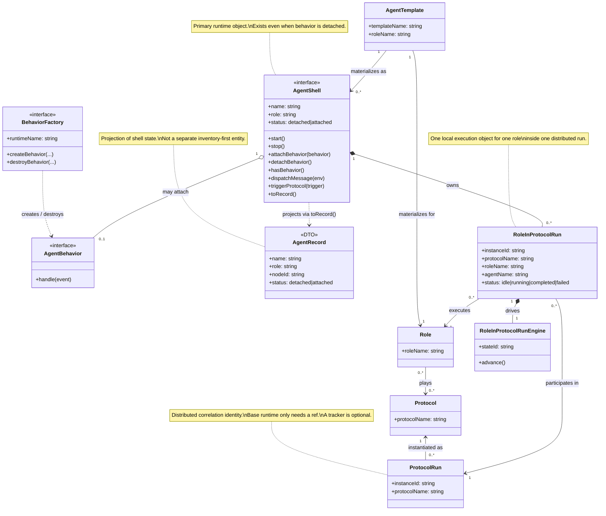
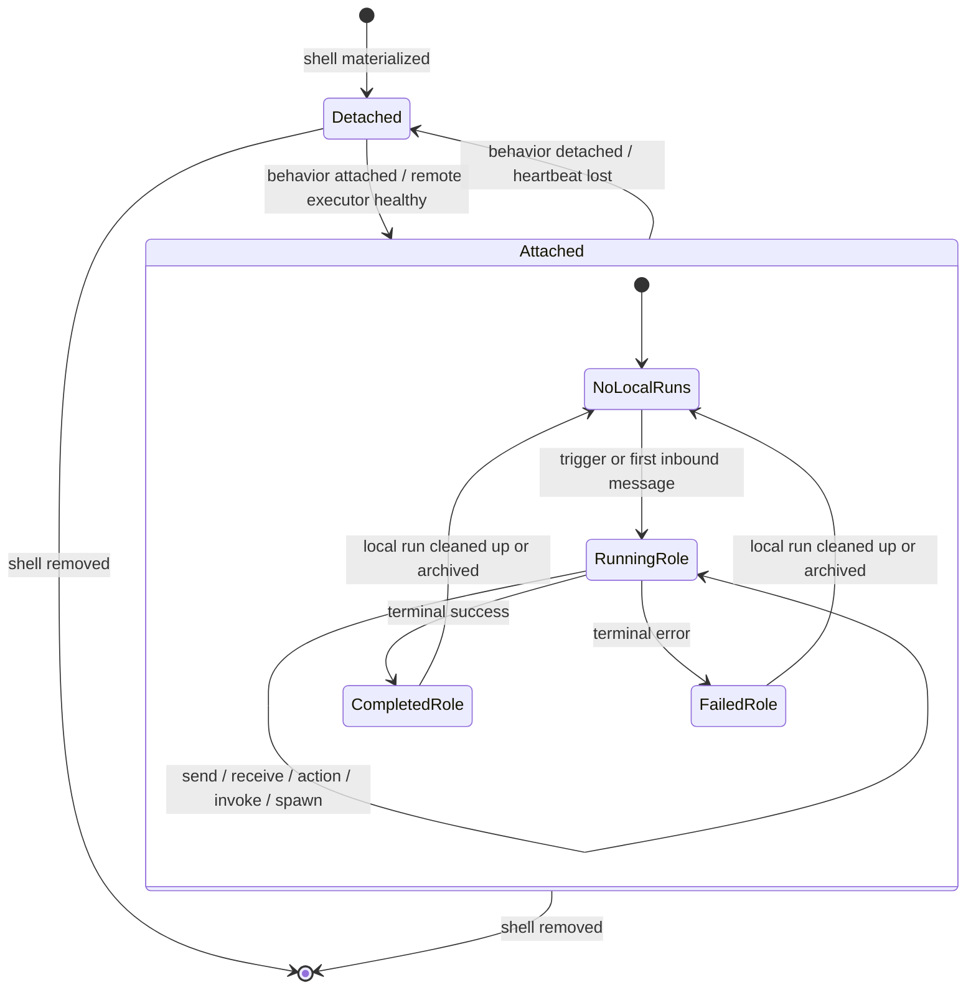
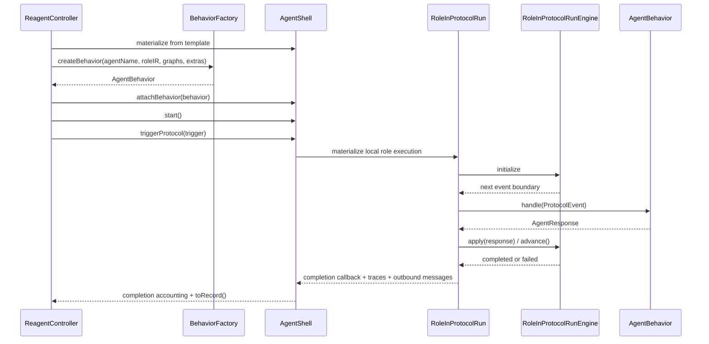

# R1 Runtime Antientropy

Status: RFC | Date: 2026-03-12

---

## 1. Purpose

This document defines the **TO BE runtime ontology** for `R1`.

Its goal is to remove semantic drift between:

- current managed runtime terminology
- current custom/gate/MCP execution model
- the actual distributed nature of Reagent protocol execution

The core correction is:

- a distributed protocol execution is a `ProtocolRun`
- one local participant in that distributed execution is a `RoleInProtocolRun`
- an agent exists at runtime as an `AgentShell`
- the pluggable behavior object is `AgentBehavior`
- cluster-visible agent state is represented by `AgentRecord` as a projection of the shell

This document is intentionally ontology-first.
It is meant to make the later implementation rewrite less ambiguous.

---

## 2. Problem Statement

The current model mixes three different things:

1. protocol as specification
2. protocol execution as a distributed run
3. one local runtime object that executes one role of that run

In current code, names such as `ProtocolInstance` and `ProtocolEngine` blur these levels.

The main semantic mismatch is:

- a distributed protocol run is **not** one in-memory object
- it is represented by several local execution objects across participating agents/nodes

So the new ontology must distinguish:

- the **distributed run**
- the **local role execution**
- the **logical agent identity**
- the **live runtime shell**

There is also a deeper architectural problem behind the naming drift:

- the repo currently has **two independent interpreters**
- `ProtocolInstance` is a monolithic managed-path executor
- `ProtocolEngine` is a passive event-driven executor used by custom-style paths

If `R1` only renames these layers without collapsing them into one execution model,
the entropy remains.

### Architectural decision for `R1`

`R1` should converge to **one passive engine model**:

- one local run object
- one passive engine under it
- one pluggable `AgentBehavior` above it
- one `AgentShell` per agent identity, with attachable/detachable behavior

Target loop:

```text
AgentShell -> RoleRun.advance() -> ProtocolEvent -> AgentBehavior.handle() -> AgentResponse -> RoleRun.apply()
```

In other words:

- managed execution should stop being a separate interpreter
- managed/custom/MCP/gate should differ by adapter, not by state-machine semantics
- `ProtocolInstance` should be treated as migration debt to be absorbed into the shared local run model

---

## 3. Naming Layers

This RFC keeps **full conceptual names** for ontology precision, but `R1` should
allow shorter **code-facing names** for day-to-day implementation.

| Conceptual name | Preferred code name | Notes |
|---|---|---|
| `ProtocolRun` | `ProtocolRun` | already short and clear |
| `RoleInProtocolRun` | `RoleRun` | code-friendly alias for local role execution |
| `RoleInProtocolRunEngine` | `RoleEngine` | code-friendly alias for passive engine |
| `AgentShell` | `AgentShell` | keep as-is |
| `AgentBehavior` | `AgentBehavior` | better than `AgentInterface` for an executable object |
| `BehaviorFactory` | `BehaviorFactory` | better than `AgentNode` for a behavior-construction boundary |

---

## 4. TO BE Ontology

### 4.1 Core entities

| Type | Meaning | Scope | Persistence |
|---|---|---|---|
| `Protocol` | Choreography/specification | global / static | compiled artifact |
| `Role` | Behavioral contract that may play multiple protocols | global / static | compiled artifact |
| `ProtocolRun` | One logical distributed execution identified by `instanceId` | distributed | transient/logical |
| `RoleInProtocolRun` | One local execution of one role inside one `ProtocolRun` | local to one shell | transient/runtime |
| `AgentTemplate` | Create-spec for a materializable agent | node-local + deploy state | semi-static |
| `AgentShell` | Live mailbox/session container for one agent identity; owns `$self`, runs, and optional behavior | local runtime | transient/runtime |
| `AgentBehavior` | Executable behavior object that may be attached to a shell | local runtime | transient/runtime |
| `AgentRecord` | Cluster-visible projection of shell state | controller/cluster | transient/published state |
| `BehaviorFactory` | Runtime-kind factory for creating behavior objects | node-local | host-level runtime |

### 4.2 Key semantic rule

One `ProtocolRun` may contain many `RoleInProtocolRun` objects.

Those local objects:

- may live on different nodes
- may be hosted by different runtime modes
- may materialize lazily on first inbound message
- are correlated by the same `instanceId`

So:

- `ProtocolRun` is a **distributed identity**
- `RoleInProtocolRun` is a **local runtime object**

---

## 5. Ontology UML Views

### 5.1 Static structure



### 5.2 Lifecycle semantics



### 5.3 Unified execution flow



---

## 6. Definitions And Invariants

### 6.1 `Protocol`

`Protocol` is the choreography definition.

It contains:

- participants
- messages
- control flow
- trigger declarations
- projection into per-role IR graphs

It is **not** a live runtime object.

### 6.2 `Role`

`Role` is the behavioral contract bound to one participant identity in one or more protocols.

A role may:

- `plays` multiple protocols
- define how behavior interacts with agent-local state exposed through `$self`
- define lifecycle handlers

`Role` is static.
It is not a live execution.

### 6.3 `ProtocolRun`

`ProtocolRun` is one distributed execution of a protocol.

Identity:

- `instanceId`
- `protocolName`

Properties:

- it is a correlation identity, not one object
- it spans several local participants
- different local runtime objects may join it at different times
- the minimal runtime representation is a `ProtocolRunRef`

Invariant:

- `ProtocolRun` must never be modeled as if one process owns the whole execution object

Implementation stance:

- core runtime requires only a `ProtocolRunRef`
- if the system needs whole-run aggregation, it should introduce an **optional**
  `ProtocolRunTracker`
- tracker concerns include global status, cancellation fan-out, debug views, and run-level wait semantics

So in practice:

- `ProtocolRun` is the conceptual distributed entity
- `ProtocolRunRef` is the mandatory runtime primitive
- `ProtocolRunTracker` is the optional aggregation extension point

### 6.4 `RoleInProtocolRun`

`RoleInProtocolRun` is one local execution object for:

- one `roleName`
- one `protocolName`
- one `instanceId`
- one `AgentShell`

It owns:

- per-run local `$ctx`
- current control position
- role-local receive/send progression
- local message buffering for that role execution
- the explicit message inbox API used by the shell

It does **not** own:

- long-lived `$self`
- cluster identity
- whole distributed run semantics

Invariant:

- a `RoleInProtocolRun` is local and per-role
- it is not “the” distributed instance
- it should be the same runtime abstraction for managed, custom, MCP, and gate paths

### 6.5 `AgentTemplate`

`AgentTemplate` is the node-local create-spec that says how an agent can be materialized.

It points to:

- a role
- compiled graphs
- optional extras/config

It can exist without any live runtime attached.

### 6.6 `AgentShell`

`AgentShell` is the live runtime shell for one agent identity.

It is the primary runtime-facing object.

It owns:

- persistent `$self`
- active/completed local run registry
- mailbox / inbox identity
- transport or session binding
- an optional attached `AgentBehavior`
- receive-side run materialization
- run completion notifications
- shell-local lifecycle integration

Why `Shell`:

- it wraps one logical agent
- it owns persistent `$self`
- it hosts local `RoleInProtocolRun` objects
- it may carry behavior or temporarily exist without it
- it is not a platform for many unrelated agents

Invariant:

- one attached shell belongs to one logical agent identity
- one shell belongs to one logical agent identity
- one shell may host many `RoleInProtocolRun` objects over time

Lifecycle model:

- `detached` means the shell exists as mailbox/session container but has no executable behavior bound
- `attached` means executable behavior is present and the shell may participate in new runs
- this is especially important for `message gate` and `MCP` agents, where heartbeat/session health may determine attach state

Steady-state relation to records:

- when a shell is live, it should be able to project itself to `AgentRecord`
- if no shell exists, no core-runtime `AgentRecord` needs to exist either

### 6.7 `AgentRecord`

`AgentRecord` is not a peer runtime object.
It is a **DTO / projection** used for:

- cluster publication
- remote resolution
- attach-state visibility
- heartbeat / capability publication

Important distinction:

- `AgentShell` is the runtime object
- `AgentRecord` is the cluster projection of shell state

`R1` should simplify the record shape to match shell reality:

- if shell exists and has behavior, record is `attached`
- if shell exists without behavior, record is `detached`
- no `declared` state is required in the core runtime ontology

### 6.8 `AgentBehavior`

`AgentBehavior` is the executable behavior object plugged into a shell.

This name is intentionally better than `AgentInterface`:

- it describes a concrete runtime object, not a TypeScript language construct
- it matches what the object actually does
- it aligns managed/custom/MCP/gate behavior under one term

### 6.9 `BehaviorFactory`

`BehaviorFactory` replaces `AgentNode` in the ontology.

It is responsible for creating behavior objects by runtime kind.

It should not own shell semantics.

`BehaviorFactory` is responsible for:

- runtime-kind-specific behavior construction
- optional cleanup of behavior resources
- hiding runtime-specific behavior wiring from RC

Preferred `R1` direction:

- RC materializes one shared shell model
- `BehaviorFactory` only supplies the behavior object
- managed/custom/MCP/gate differ mainly in behavior implementations, not in shell structure

---

## 7. Interface Sketches

These are **ontology interfaces**, not exact implementation signatures.
They describe responsibility boundaries for `R1`.

### 7.1 `ProtocolRunRef`

```ts
interface ProtocolRunRef {
  instanceId: string
  protocolName: string
}
```

Purpose:

- distributed correlation identity
- stable handle shared by all local role executions of one run

### 7.2 `ProtocolRunTracker`

```ts
interface ProtocolRunTracker {
  getRun(ref: ProtocolRunRef): ProtocolRunSnapshot | undefined
  onRunUpdated(cb: (snapshot: ProtocolRunSnapshot) => void): void
  cancelRun(ref: ProtocolRunRef): Promise<void>
}
```

Purpose:

- optional whole-run aggregation
- debug / UI / cancellation extension point
- intentionally not required for the base local execution model

### 7.3 `RoleInProtocolRunIdentity`

```ts
interface RoleInProtocolRunIdentity extends ProtocolRunRef {
  roleName: string
  agentName: string
}
```

Purpose:

- identify one local role execution inside one distributed run

### 7.4 `RoleInProtocolRunEngine`

```ts
interface RoleInProtocolRunEngine {
  readonly identity: RoleInProtocolRunIdentity
  getStatus(): "idle" | "running" | "completed" | "failed"
  getCurrentStateId(): string
  getGraph(): IRGraph
  getCtx(): Record<string, unknown>
  setCtx(ctx: Record<string, unknown>): void
  getSelfRef(): Record<string, unknown>
  dispatchMessage(env: MessageEnvelope): void
  advance(): Promise<ProtocolEvent>
  apply(response: AgentResponse): void
  setReturnValue(value: unknown): void
}
```

Purpose:

- pure FSM/state-machine core
- no transport ownership
- no cluster ownership
- no direct host integration assumptions
- no monkey-patching of inbox state by the shell

Explicit requirement:

- message delivery must happen through `dispatchMessage()`
- the custom path should stop reaching into `_messageInbox` or `_messageResolvers`

### 7.5 `RoleInProtocolRun`

```ts
interface RoleInProtocolRun {
  readonly identity: RoleInProtocolRunIdentity
  readonly engine: RoleInProtocolRunEngine

  dispatchMessage(env: MessageEnvelope): void
  run(): Promise<void>

  onComplete(cb: (status: "completed" | "failed") => void): void
  getTraces(): TraceEvent[]
  getReturnValue(): { has: boolean; value: unknown }
}
```

Purpose:

- local runtime object for one role in one run
- wraps engine + buffering + orchestration hooks
- is the object that shells index in their active/completed run registries

### 7.6 `AgentShell`

```ts
interface AgentShell {
  readonly name: string
  readonly role: string
  readonly status: "detached" | "attached"

  start(): Promise<void>
  stop(): Promise<void>
  attachBehavior(behavior: AgentBehavior): void
  detachBehavior(): void
  hasBehavior(): boolean

  getSelf(): Record<string, unknown>
  getActiveRuns(): Map<string, RoleInProtocolRun>
  getCompletedRuns(): RoleRunResult[]
  triggerProtocol(trigger: ProtocolTrigger): void
  dispatchMessage(env: MessageEnvelope): void
  onRunCompleted(cb: (run: RoleInProtocolRun, status: "completed" | "failed") => void): void
  toRecord(nodeId: string): AgentRecord
}
```

Purpose:

- live runtime shell for one logical agent
- owns `$self`
- owns local run registry
- owns mailbox/session identity
- owns receive-side run materialization
- may temporarily have no behavior attached
- can project itself into cluster-visible `AgentRecord`

Non-goal:

- `waitForCompletion()` should not be part of the core architectural contract
- test helpers may layer it on top of completion notifications

### 7.7 `AgentRecord`

```ts
interface AgentRecord {
  name: string
  role: string
  nodeId: string
  status: "detached" | "attached"
  heartbeatAt?: number
  capabilities?: string[]
  metadata: Record<string, unknown>
}
```

Purpose:

- cluster projection DTO
- not the primary runtime object
- avoid split-brain lifecycle modeling inside the record
- reflect live shell state rather than inventory-only declarations

### 7.8 `AgentBehavior`

```ts
interface AgentBehavior {
  handle(event: ProtocolEvent): Promise<AgentResponse>
}
```

Purpose:

- executable behavior contract
- shell/runtime mode delegates execution into this object

### 7.9 `BehaviorFactory`

```ts
interface BehaviorFactory {
  readonly runtimeName: string

  createBehavior(
    agentName: string,
    roleIR: RoleIR,
    graphs: Map<string, IRGraph>,
    extras?: Record<string, unknown>,
  ): AgentBehavior

  destroyBehavior?(behavior: AgentBehavior): Promise<void>
}
```

Purpose:

- runtime-kind-specific behavior construction
- not a shell factory
- not a second runtime hierarchy

---

## 8. Runtime Mode Realizations

The ontology is shared.
Shell semantics should also be shared, with gate/MCP using detach/attach more explicitly.

### 8.1 Managed mode

| Ontology type | Realization |
|---|---|
| `AgentShell` | managed TS shell, replacing `AgentRunner` |
| `RoleInProtocolRun` | managed local run object, absorbing the useful behavior from `ProtocolInstance` |
| `RoleInProtocolRunEngine` | the same passive engine used by every runtime mode |
| `AgentBehavior` | `ManagedBehavior` / managed adapter |
| `BehaviorFactory` | creates managed behavior objects |
| `AgentRecord` | projected DTO for cluster state |

Behavior:

- shell owns `$self`
- per-run object owns `$ctx`
- behavior object executes zones
- shell is typically attached immediately and remains attached for its lifetime
- managed path must not retain a separate interpreter once `R1` lands

### 8.2 Custom mode

| Ontology type | Realization |
|---|---|
| `AgentShell` | custom shell, currently closest to `CustomAgentHandle` |
| `RoleInProtocolRun` | custom local run object driven by the shell |
| `RoleInProtocolRunEngine` | same passive engine as managed path |
| `AgentBehavior` | user behavior implementation |
| `BehaviorFactory` | wraps user behavior construction |
| `AgentRecord` | projected DTO for cluster state |

Behavior:

- shell hosts engine-driven runs
- user code only sees `ProtocolEvent` / `AgentResponse`
- shell is typically attached immediately and remains attached for its lifetime
- no monkey-patching of engine internals for inbox delivery

### 8.3 Message Gate mode

| Ontology type | Realization |
|---|---|
| `AgentShell` | gate shell, currently closest to `MessageGateHandle` |
| `RoleInProtocolRun` | one gate-side local run/session per role in one distributed run |
| `RoleInProtocolRunEngine` | same passive engine where local execution remains RC-side; otherwise a thin proxy with the same contract |
| `AgentBehavior` | gate proxy behavior |
| `BehaviorFactory` | creates gate-backed proxy behavior |
| `AgentRecord` | projected DTO for cluster state |

Behavior:

- shell manages transport/session state and mailbox identity
- behavior is proxied through gate transport
- shell may remain `detached` while waiting for remote attach / heartbeat recovery

### 8.4 MCP Gate mode

| Ontology type | Realization |
|---|---|
| `AgentShell` | MCP shell on the RC side |
| `RoleInProtocolRun` | RC-side local role execution object |
| `RoleInProtocolRunEngine` | same passive engine as other modes |
| `AgentBehavior` | MCP behavior / adapter |
| `BehaviorFactory` | creates MCP-backed behavior |
| `AgentRecord` | projected DTO for cluster state |

Behavior:

- engine/shell stay RC-side
- zone events are surfaced to MCP client
- client returns `AgentResponse`
- shell may remain `detached` while the MCP peer is unavailable and later re-attach on heartbeat/session recovery

---

## 9. Rename Map

### 9.1 Conceptual map

| Current name | TO BE name | Reason |
|---|---|---|
| `ProtocolInstance` | `RoleInProtocolRun` | current term wrongly sounds like whole distributed instance |
| `ProtocolEngine` | `RoleInProtocolRunEngine` / `RoleEngine` | current term hides the fact that it is per-role and per-run |
| `AgentRunner` | `ManagedAgentShell` | it is the managed shell for one agent, not a generic "runner" concept |
| `CustomAgentHandle` | `CustomAgentShell` | better aligns with one-shell-per-agent ontology |
| `MessageGateHandle` | `GateAgentShell` | makes it a mode-specific shell under the same ontology |
| `AgentInterface` | `AgentBehavior` | runtime object, not a TS-language interface concept |
| `ManagedAgentAdapter` | `ManagedBehavior` | behavior naming aligned with ontology |
| `McpAgentAdapter` | `McpBehavior` | behavior naming aligned with ontology |
| `AgentNode` | `BehaviorFactory` | factory for behavior objects, not shells |
| `AgentRuntime` | `AgentShell` | if and when the repo wants one explicit live-runtime term |

Important note on shell renames:

- `ManagedAgentShell`, `CustomAgentShell`, and `GateAgentShell` are **migration aliases**
- they help explain which legacy implementation is being collapsed
- they are **not** the target class taxonomy for `R1`
- the target runtime model should converge on one shared `AgentShell`

The key rename is not just lexical.
It also implies structural collapse:

- `ProtocolInstance` does **not** survive as a second interpreter
- its valuable semantics are ported into the shared `RoleRun` layer
- the passive engine model becomes the only execution core

### 9.2 Migration stance

For `R1`, the implementation should move toward the TO BE vocabulary directly.

Compatibility wrappers are acceptable for transition, but:

- docs should reason in TO BE terms
- new shared runtime primitives should use TO BE names
- old names should be treated as legacy migration labels

---

## 10. Antientropy Rules

This ontology should be used as a consistency filter during `R1`.

### Rule 1

Do not use `ProtocolInstance` to mean the whole distributed run.

Use:

- `ProtocolRun` for distributed identity
- `RoleInProtocolRun` for one local execution object

### Rule 2

Do not use `AgentRecord` to mean live execution.

Use:

- `AgentShell` for live execution
- `AgentRecord` for cluster projection

### Rule 3

Do not use `AgentBehavior` to mean a mere TS interface declaration.

Use:

- `AgentBehavior` for the concrete runtime behavior object
- `BehaviorFactory` for constructing behavior objects

### Rule 4

Keep `$self` and `$ctx` separated by ontology:

- `$self` belongs to the shell/agent level
- `$ctx` belongs to `RoleInProtocolRun`

### Rule 5

Keep distributed and local state clearly separated:

- `ProtocolRun` is distributed/logical
- `RoleInProtocolRun` is local/runtime

### Rule 6

Do not keep two interpreters after `R1`.

Use:

- one passive `RoleEngine`
- one `RoleRun` orchestration object
- one pluggable `AgentBehavior` contract

### Rule 7

No shell may reach into engine private fields for inbox delivery.

Use:

- `dispatchMessage()` on the engine or role-run boundary
- explicit APIs for waiting, buffering, and resuming

### Rule 8

Do not treat `AgentRecord` as a peer runtime object next to `AgentShell`.

Use:

- `AgentShell` as the primary runtime-facing object
- `AgentRecord` as DTO/projection for cluster state

### Rule 9

Do not introduce `declared` as a core runtime shell state.

Use:

- shell existence as the declaration that the runtime agent exists
- `detached` / `attached` as the core operational states
- `AgentTemplate` for pre-runtime declaration of what can be materialized

---

## 11. Consequences For R1

If `R1` follows this document, then the rewrite should aim for:

1. one ontology across managed, custom, gate, and MCP
2. one shell-level abstraction for mailbox/session-carrying live agents
3. one local role-run abstraction for per-run execution
4. one passive engine under those local role-run objects
5. optional run-level tracker instead of pretending `ProtocolRun` is one object everywhere
6. one behavior object model across runtime kinds
7. `AgentRecord` treated as projection/DTO, not as a peer runtime entity
8. `AgentShell` using `detached` / `attached` as the core operational lifecycle
9. legacy names treated as migration artifacts, not as the primary model

This is the intended antientropy effect:

- fewer ambiguous names
- fewer duplicated mental models
- fewer runtime branches that use different semantics for the same language features
- no second hidden interpreter surviving under new names

---

## 12. Summary

The TO BE runtime ontology is:

- `Protocol`
- `Role`
- `ProtocolRun`
- `RoleInProtocolRun`
- `AgentTemplate`
- `AgentShell`
- `AgentBehavior`

Supporting projection/factory types:

- `AgentRecord`
- `BehaviorFactory`

The most important conceptual distinction is:

- `ProtocolRun` is distributed and logical
- `RoleInProtocolRun` is local and executable

The most important live-runtime distinction is:

- `AgentShell` is the primary live runtime object
- `AgentBehavior` is attachable/detachable executable capability
- `AgentRecord` is the projected cluster DTO

The most important architectural decision is:

- one passive engine model across all runtime modes
- no `R1` outcome in which both `ProtocolInstance` and `ProtocolEngine` survive as peers under new names

This document should be treated as the naming and responsibility baseline for `R1`.
